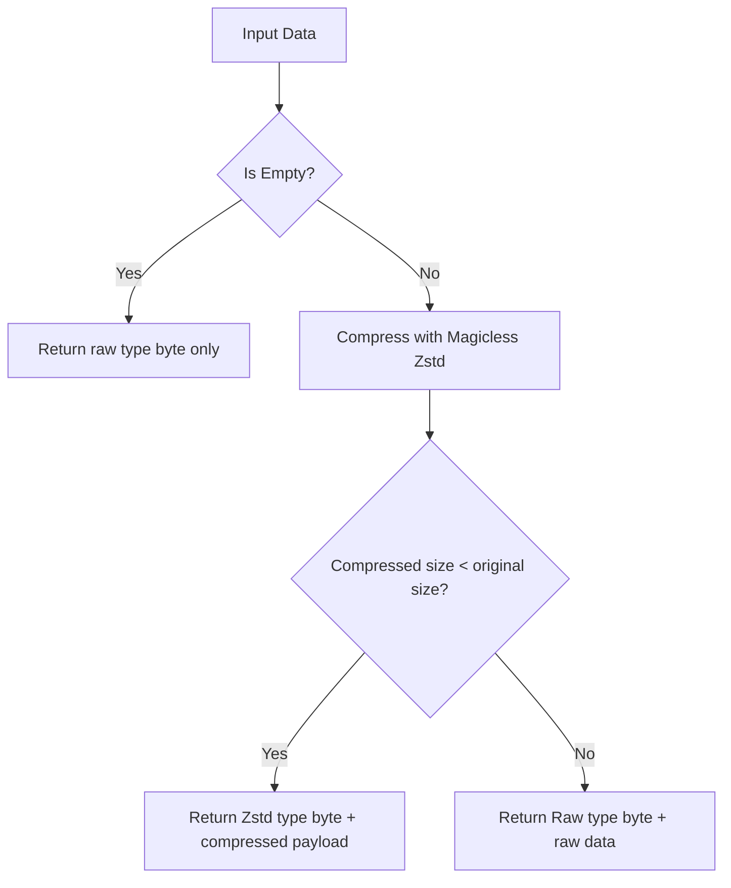

# autozstd : High performance Zstd envelope compression with fallback

## Overview
High-performance Zstandard (Zstd) compression wrapper for Rust using the envelope pattern. Automatically falls back to raw storage when compressed output size is larger than or equal to original data size, ensuring optimal storage footprint for tiny or uncompressible payloads. Strips Zstd frame magic headers using native magicless zstd configurations for byte-level bandwidth savings.

## Usage
```rust
  use autozstd::{encode, decode};

  let data = b"hello world".repeat(100);
  let encoded = encode(&data, None).unwrap();
  let decoded = decode(&encoded).unwrap();
  assert_eq!(decoded, data);
```

## Features
- **Envelope Pattern:** Prepends single byte to distinguish raw payload from compressed payload.
- **Automatic Fallback:** Prevents payload size growth by falling back to uncompressed storage if compression yields no size reduction.
- **Native Magicless Format:** Directly configures Zstd to skip generating and expecting the 4-byte magic number (`[0x28, 0xB5, 0x2F, 0xFD]`), optimizing bandwidth.
- **Single Heap Allocation:** Employs `std::io::Cursor` over `Vec` to offset output, guaranteeing exactly one allocation in the entire compression path.
- **100% Safe Rust Wrapper:** Completely safe wrapper around the official C Zstd bindings.

## Design


## Tech Stack
- **Zstandard (zstd):** High-performance compression engine linking to the official C Zstd library.
- **thiserror:** Clean and safe error modeling and transparent forwarding.
- **Standard Library Features:** `std::io::Cursor` and `zstd::stream::Decoder` for zero-allocation stream decoding.

## Directory Structure
```text
.
├── Cargo.toml
├── src/
│   ├── decode.rs
│   ├── encode.rs
│   ├── error.rs
│   └── lib.rs
└── tests/
    └── main.rs
```

## API Docs
- **encode(data: &[u8], level: Option<i32>) -> Result<Vec<u8>>**
  Compresses slice using Zstd magicless format. Automatically falls back to raw encoding if compression doesn't decrease data size.
- **decode(data: &[u8]) -> Result<Vec<u8>>**
  Decompresses envelope-encoded slice. Supports both raw and magicless zstd variants.
- **DEFAULT_LEVEL: i32**
  Default compression level (3).
- **Type**
  Type of data payload.
  - `Raw = 0`
  - `Zstd = 1`
- **Error**
  Error types.
  - `Empty`
  - `InvalidType(u8)`
  - `Zstd(std::io::Error)`
- **Result<T>**
  Convenient alias for `Result<T, Error>`.

## History & Background
Yann Collet created LZ4 in 2011 to optimize for extreme decompression speeds. In 2014, he implemented Finite State Entropy (FSE) based on Jarek Duda's Asymmetric Numeral Systems (ANS). FSE was a major breakthrough as it bridged the gap between Huffman coding's speed and arithmetic coding's compression ratio. Zstandard, released in 2016 by Facebook, integrated these concepts into a single robust tool, allowing developers to scale dynamically between speed and compression ratio. `autozstd` extends this powerful tool by resolving the "small payload expansion" problem through envelope framing.