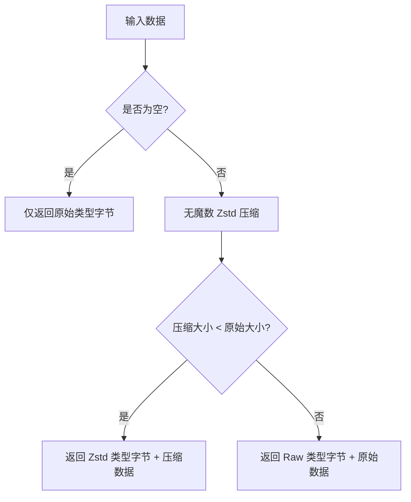

# autozstd : 基于信封模式与回退机制的高性能 Zstd 压缩

## 项目功能介绍

基于信封模式的高性能 Rust Zstd 压缩封装库。如果压缩后的数据大小大于或等于原始大小（如小文本），则自动回退并以原始数据存储，从而保证小载荷不发生膨胀。使用原生的无魔数（magicless）配置剥离 Zstd 的 4 字节魔数头部，节省每一字节的传输带宽。

## 使用演示

```rust
  use autozstd::{encode, decode};

  let data = b"hello world".repeat(100);
  let encoded = encode(&data, None).unwrap();
  let decoded = decode(&encoded).unwrap();
  assert_eq!(decoded, data);
```

## 特性介绍

- **信封模式：** 首字节标志区分原始载荷和压缩载荷。
- **自动回退：** 若压缩后数据量反胜，自动以降级 RAW 方式存储，避免数据膨胀。
- **原生无魔数配置：** 直接指示 Zstd 忽略魔数生成与校验，在字节级别上节省传输开销。
- **单次堆内存分配：** 通过 `std::io::Cursor` 封装 `Vec` 进行偏移写入，确保整个压缩链路只有一次内存分配。
- **100% 安全：** 基于官方 C Zstd 绑定之上封装，全程 100% Safe Rust。

## 设计思路



## 技术堆栈

- **Zstandard (zstd):** 官方 Meta C Zstd 高效压缩引擎。
- **thiserror:** 规范安全的自定义错误建模。
- **标准库工具：** 利用 `std::io::Cursor` 实现偏移压缩，利用 `zstd::stream::Decoder` 实现流式解压。

## 目录结构

```text
.
├── Cargo.toml
├── src/
│   ├── decode.rs
│   ├── encode.rs
│   ├── error.rs
│   └── lib.rs
└── tests/
    └── main.rs
```

## API 说明

- **encode(data: &[u8], level: Option<i32>) -> Result<Vec<u8>>**
  使用 Zstd 无魔数格式压缩切片。若压缩未减小体积，则自动回退为原始数据存储。
- **decode(data: &[u8]) -> Result<Vec<u8>>**
  解压信封编码的切片。支持原始与无魔数 Zstd 两种模式。
- **DEFAULT_LEVEL: i32**
  默认压缩级别 (3)。
- **Type**
  载荷类型。
  - `Raw = 0`
  - `Zstd = 1`
- **Error**
  错误类型。
  - `Empty`
  - `InvalidType(u8)`
  - `Zstd(std::io::Error)`
- **Result<T>**
  `Result<T, Error>` 的简易别名。

## 技术背景与历史故事

Zstandard 的创作者 Yann Collet 最初是在为 HP 48 计算器开发游戏时接触到数据压缩的。2011 年他发布了极速解压的 LZ4。2014 年，他基于 Jarek Duda 的非对称数字系统（ANS）理论，实现了有限状态熵（FSE）。这一算法的突破在于它以接近霍夫曼编码的极高速度，实现了算术编码级别的压缩率。2016 年 Yann Collet 带着这些成果在 Facebook 发布了 Zstandard，成为了现代压缩的行业标准。`autozstd` 正是通过信封协议，解决极小数据在 Zstd 帧结构下由于帧头膨胀的问题，使该顶尖算法在微服务和网络数据包传输中更加完美。
