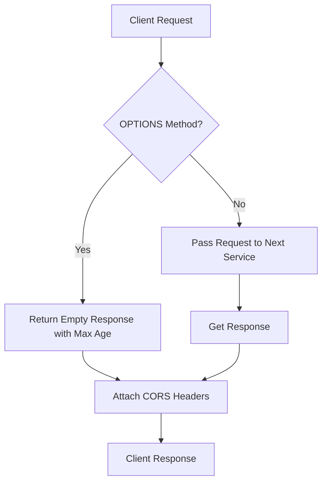
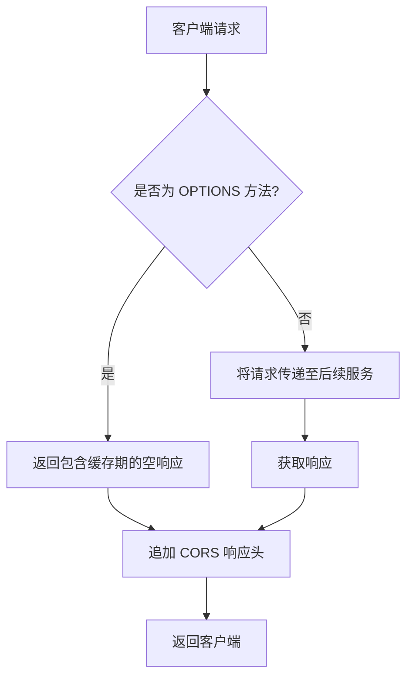

[English](#en) | [中文](#zh)

---

<a id="en"></a>
# axum_cors : Zero-copy CORS middleware for Axum

- [axum_cors : Zero-copy CORS middleware for Axum](#axum_cors-zero-copy-cors-middleware-for-axum)
  - [Introduction](#introduction)
  - [Usage](#usage)
  - [Features](#features)
  - [Design](#design)
  - [Tech Stack](#tech-stack)
  - [Directory Structure](#directory-structure)
  - [API Reference](#api-reference)
    - [`cors`](#cors)
  - [Background & History](#background-history)
  - [About](#about)

## Introduction
Lightweight, high-performance CORS (Cross-Origin Resource Sharing) middleware for Axum framework. Features zero-copy header cloning and safe panic-free execution.

## Usage
Add to Axum router as middleware:
```rust
use axum::{
  Router,
  routing::get,
  middleware,
  response::IntoResponse,
};
use axum_cors::cors;

async fn handler() -> impl IntoResponse {
  "Hello, CORS!"
}

#[tokio::main]
async fn main() -> aok::Result<()> {
  let app = Router::new()
    .route("/", get(handler))
    .layer(middleware::from_fn(cors));

  let listener = tokio::net::TcpListener::bind("127.0.0.1:3000").await?;
  axum::serve(listener, app).await?;
  Ok(())
}
```

## Features
- Zero heap allocation: Direct cloning of HeaderValue to leverage internal reference counting.
- Safe execution: Free from unwraps and potential panic conditions.
- Auto header passthrough: Extracts and returns client-requested headers via Access-Control-Request-Headers.

## Design
The middleware intercepts HTTP requests, checks headers, and wraps the response lifecycle.


## Tech Stack
- Rust 2024
- Axum 0.8
- Tokio 1.52

## Directory Structure
```
.
├── Cargo.toml
├── README.mdt
├── src/
│   └── lib.rs
├── tests/
│   └── main.rs
└── examples/
    └── demo.rs
```

## API Reference

### `cors`
```rust
pub async fn cors(req: Request<Body>, next: Next) -> impl IntoResponse
```
Middleware handler function processing incoming requests and injecting CORS headers.
- `req`: Incoming request envelope.
- `next`: Remaining routing service chain.
- Returns modified response containing CORS headers.

## Background & History
CORS (Cross-Origin Resource Sharing) originated as W3C recommendation to resolve restrictive Same-Origin Policy (SOP) introduced by Netscape Navigator 2.0 in 1995. Early web platforms used JSONP (JSON with Padding) for cross-domain queries by exploiting script tag exceptions, creating structural security vulnerabilities. CORS standardized modern HTTP handshake headers in 2009, enabling secure cross-origin communication. This middleware provides low-overhead implementation matching standard Axum request lifecycles.


## About

This library is developed by [WebC.site](https://webc.site).

[WebC.site](https://webc.site): A new paradigm of web development for AI


---

<a id="zh"></a>
# axum_cors : 基于 Axum 的零拷贝跨域资源共享中间件

- [axum_cors : 基于 Axum 的零拷贝跨域资源共享中间件](#axum_cors-基于-axum-的零拷贝跨域资源共享中间件)
  - [项目功能介绍](#项目功能介绍)
  - [使用演示](#使用演示)
  - [特性介绍](#特性介绍)
  - [设计思路](#设计思路)
  - [技术堆栈](#技术堆栈)
  - [目录结构](#目录结构)
  - [API 说明](#api-说明)
    - [`cors`](#cors)
  - [历史背景](#历史背景)
  - [关于](#关于)

## 项目功能介绍
基于 Axum 框架的高性能跨域资源共享 (CORS) 中间件。通过零拷贝克隆头部信息，提供无 panic 风险的安全跨域处理。

## 使用演示
在 Axum 路由中注册中间件：
```rust
use axum::{
  Router,
  routing::get,
  middleware,
  response::IntoResponse,
};
use axum_cors::cors;

async fn handler() -> impl IntoResponse {
  "Hello, CORS!"
}

#[tokio::main]
async fn main() -> aok::Result<()> {
  let app = Router::new()
    .route("/", get(handler))
    .layer(middleware::from_fn(cors));

  let listener = tokio::net::TcpListener::bind("127.0.0.1:3000").await?;
  axum::serve(listener, app).await?;
  Ok(())
}
```

## 特性介绍
- 零堆分配：直接克隆 HeaderValue，利用其底层引用计数，避免字符串分配。
- 安全运行：移除所有 unwrap 显式调用，保证服务无 panic 风险。
- 请求头自适应：自动解析客户端请求的 `Access-Control-Request-Headers` 并予以放行。

## 设计思路
中间件拦截 HTTP 请求，分析请求头部，并包装响应生命周期。


## 技术堆栈
- Rust 2024
- Axum 0.8
- Tokio 1.52

## 目录结构
```
.
├── Cargo.toml
├── README.mdt
├── src/
│   └── lib.rs
├── tests/
│   └── main.rs
└── examples/
    └── demo.rs
```

## API 说明

### `cors`
```rust
pub async fn cors(req: Request<Body>, next: Next) -> impl IntoResponse
```
处理请求并注入 CORS 头部信息的中间件函数。
- `req`: 传入的 HTTP 请求上下文。
- `next`: 后续路由服务链。
- 返回附加跨域相关头部的响应体。

## 历史背景
跨域资源共享 (CORS) 诞生自 W3C 推荐标准，用以解决 1995 年 Netscape Navigator 2.0 引入的同源策略 (SOP) 带来的跨域限制。早期 Web 开发多采用 JSONP (JSON with Padding) 等绕过浏览器限制的非标准化技术，存在严重安全隐患。2009 年 W3C 正式发布 CORS 工作草案以标准化浏览器跨域行为。本中间件提供对 Axum 框架无缝适配的轻量化现代实现。


## 关于

本库由 [WebC.site](https://webc.site) 开发。

[WebC.site](https://webc.site) : 面向人工智能的网站开发新范式

