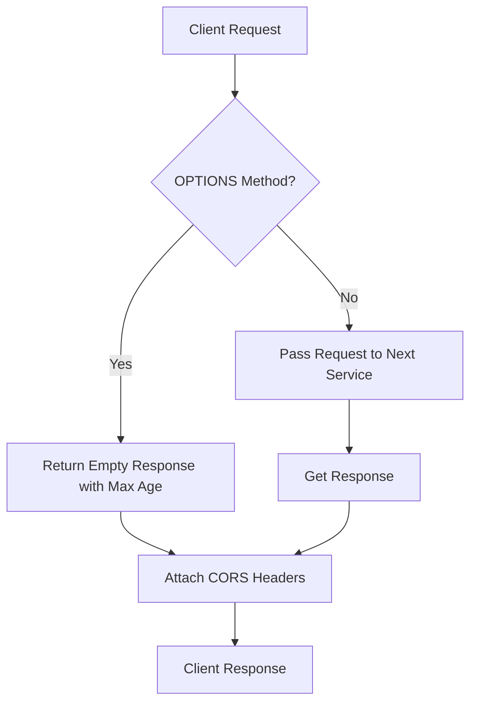

# axum_cors : Zero-copy CORS middleware for Axum

## Introduction

Lightweight, high-performance CORS (Cross-Origin Resource Sharing) middleware for Axum framework. Features zero-copy header cloning and safe panic-free execution.

## Usage

Add to Axum router as middleware:

```rust
use axum::{
  Router,
  routing::get,
  middleware,
  response::IntoResponse,
};
use axum_cors::cors;

async fn handler() -> impl IntoResponse {
  "Hello, CORS!"
}

#[tokio::main]
async fn main() -> aok::Result<()> {
  let app = Router::new()
    .route("/", get(handler))
    .layer(middleware::from_fn(cors));

  let listener = tokio::net::TcpListener::bind("127.0.0.1:3000").await?;
  axum::serve(listener, app).await?;
  Ok(())
}
```

## Features

- Zero heap allocation: Direct cloning of HeaderValue to leverage internal reference counting.
- Safe execution: Free from unwraps and potential panic conditions.
- Auto header passthrough: Extracts and returns client-requested headers via Access-Control-Request-Headers.

## Design

The middleware intercepts HTTP requests, checks headers, and wraps the response lifecycle.



## Tech Stack

- Rust 2024
- Axum 0.8
- Tokio 1.52

## Directory Structure

```
.
├── Cargo.toml
├── README.mdt
├── src/
│   └── lib.rs
├── tests/
│   └── main.rs
└── examples/
    └── demo.rs
```

## API Reference

### `cors`

```rust
pub async fn cors(req: Request<Body>, next: Next) -> impl IntoResponse
```

Middleware handler function processing incoming requests and injecting CORS headers.

- `req`: Incoming request envelope.
- `next`: Remaining routing service chain.
- Returns modified response containing CORS headers.

## Background & History

CORS (Cross-Origin Resource Sharing) originated as W3C recommendation to resolve restrictive Same-Origin Policy (SOP) introduced by Netscape Navigator 2.0 in 1995. Early web platforms used JSONP (JSON with Padding) for cross-domain queries by exploiting script tag exceptions, creating structural security vulnerabilities. CORS standardized modern HTTP handshake headers in 2009, enabling secure cross-origin communication. This middleware provides low-overhead implementation matching standard Axum request lifecycles.
