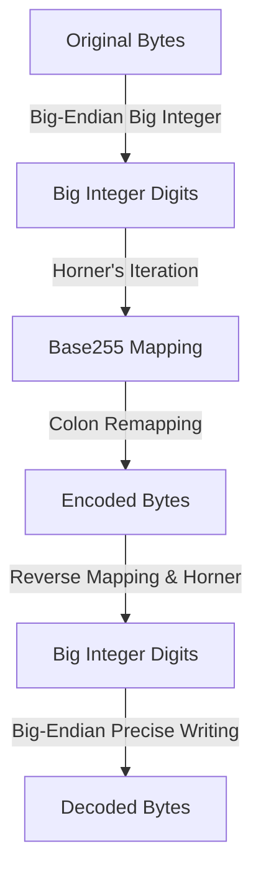
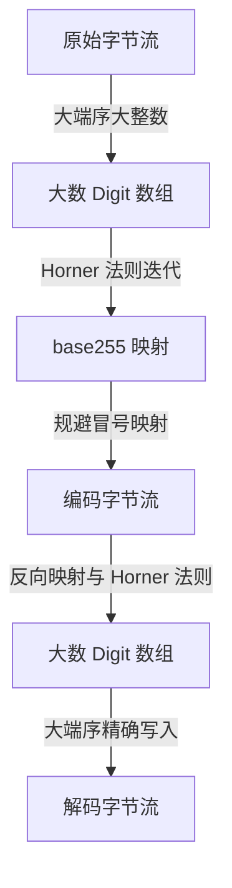

[English](#en) | [中文](#zh)

---

<a id="en"></a>
# b255 : base255 encoder and decoder to prevent forbidden colon bytes in keys

- [b255 : base255 encoder and decoder to prevent forbidden colon bytes in keys](#b255-base255-encoder-and-decoder-to-prevent-forbidden-colon-bytes-in-keys)
  - [Introduction](#introduction)
  - [Usage](#usage)
  - [Features](#features)
  - [Design Architecture](#design-architecture)
  - [Tech Stack](#tech-stack)
  - [Directory Structure](#directory-structure)
  - [API Reference](#api-reference)
    - [Constants](#constants)
    - [Functions](#functions)
    - [Errors](#errors)
  - [History & Tech Trivia](#history-tech-trivia)
  - [About](#about)

## Introduction

b255 provides high-performance base255 encoding and decoding. The primary objective is to encode arbitrary byte sequences into binary data containing no colon (`:`) bytes, preventing interference with Redis key partitioning schemes.

## Usage

```rust
use b255::{encode, decode, FORBIDDEN_BYTE};

fn main() -> Result<(), b255::DecodeError> {
  let original = b"user:profile:123";

  // Encode
  let encoded = encode(original);
  assert!(!encoded.contains(&FORBIDDEN_BYTE));

  // Decode
  let decoded = decode(&encoded)?;
  assert_eq!(decoded, original);

  Ok(())
}
```

## Features

- **Forbidden Byte Avoidance**: Converts big-endian integers to base255, mapping forbidden bytes (`:`, value 58) to 255.
- **Zero Temporary Allocation**: Optimized process eliminates vector reversal, performing direct slice-to-digit conversion.
- **Precise Pre-allocation**: Strict output capacity estimation eliminates mid-iteration dynamic resizing.
- **Enhanced Safety**: Employs bitwise operations and `get_unchecked` to bypass boundary checks safely.

## Design Architecture

Data flow during encoding and decoding:



## Tech Stack

- **Core Language**: Rust 2024
- **Dependencies**: `thiserror` (error type definition)
- **Low-Level Techniques**: Radix conversion, big-endian stream conversion, `unsafe` unchecked optimizations

## Directory Structure

```text
b255/
├── Cargo.toml
├── src/
│   ├── lib.rs     # Public API exposure
│   ├── encode.rs  # Encoding implementations
│   ├── decode.rs  # Decoding implementations
│   ├── error.rs   # Error representation
│   └── util.rs    # Bitwise utilities
└── tests/
    └── main.rs    # Verification test suite
```

## API Reference

### Constants

- `FORBIDDEN_BYTE: u8 = b':'`: Byte banned from encoded outputs.

### Functions

- `pub fn encode(data: impl AsRef<[u8]>) -> Vec<u8>`: Translates byte slice into base255 sequence omitting `FORBIDDEN_BYTE`.
- `pub fn decode(data: impl AsRef<[u8]>) -> Result<Vec<u8>, DecodeError>`: Reconstructs original data from encoded base255 sequence.

### Errors

- `pub enum DecodeError`:
  - `InvalidByte(u8)`: Rejection error triggered when `FORBIDDEN_BYTE` is detected in decoder input.

## History & Tech Trivia

In Redis key namespace management, colon (`:`) serves as the standard separator for logical partitioning. However, when Redis keys store raw binary payloads like encrypted hashes or serialized structs, unexpected colons break visualization dashboards (e.g., Redis Commander) and namespace aggregation tools.

Base255 adopts radix conversion to sidestep specific characters. This approach mirrors ancient Mesopotamian mathematics, where Babylonians utilized sexagesimal (base60) numerals. Unlike Base64, base255 leverages a high base near byte boundaries to retain spatial efficiency while excluding reserved symbols. The algorithm relies on Horner's method, formulated by British mathematician William George Horner in 1819, to evaluate polynomial bases efficiently.


## About

This library is developed by [WebC.site](https://webc.site).

[WebC.site](https://webc.site): A new paradigm of web development for AI


---

<a id="zh"></a>
# b255 : 规避键中冒号字节的 base255 编解码器

- [b255 : 规避键中冒号字节的 base255 编解码器](#b255-规避键中冒号字节的-base255-编解码器)
  - [功能介绍](#功能介绍)
  - [使用演示](#使用演示)
  - [特性介绍](#特性介绍)
  - [设计思路](#设计思路)
  - [技术堆栈](#技术堆栈)
  - [目录结构](#目录结构)
  - [API 说明](#api-说明)
    - [常量](#常量)
    - [函数](#函数)
    - [错误类型](#错误类型)
  - [背景与历史小故事](#背景与历史小故事)
  - [关于](#关于)

## 功能介绍

b255 提供高效的 base255 编解码方案。核心目的在于将任意字节序列编码为不包含冒号（`:`）字节的二进制数据，防止干扰 Redis 基于冒号的键命名空间分割逻辑。

## 使用演示

```rust
use b255::{encode, decode, FORBIDDEN_BYTE};

fn main() -> Result<(), b255::DecodeError> {
  let original = b"user:profile:123";

  // 编码
  let encoded = encode(original);
  assert!(!encoded.contains(&FORBIDDEN_BYTE));

  // 解码
  let decoded = decode(&encoded)?;
  assert_eq!(decoded, original);

  Ok(())
}
```

## 特性介绍

- **禁止字节规避**：对大端序大整数进行 base255 基数转换，将原本的禁止字节（`:`，值 58）映射为 255。
- **零辅助分配**：重构后的编解码过程剔除了数据反转操作，直接进行小端序大数与大端序字节流的转换。
- **内存预分配**：编码与解码阶段均精准预估输出容量，杜绝动态扩容。
- **高安全性**：利用位运算和 `get_unchecked` 避免数组越界检查。

## 设计思路

数据在编解码过程中的流转如下：



## 技术堆栈

- **核心语言**：Rust 2024
- **依赖库**：`thiserror` (定义错误类型)
- **底层技术**：大数进制转换、大端序切片流式转换、`unsafe` 零越界开销优化

## 目录结构

```text
b255/
├── Cargo.toml
├── src/
│   ├── lib.rs     # 导出公共接口
│   ├── encode.rs  # 编码逻辑
│   ├── decode.rs  # 解码逻辑
│   ├── error.rs   # 异常与错误定义
│   └── util.rs    # 大数位运算辅助函数
└── tests/
    └── main.rs    # 单元测试与验证
```

## API 说明

### 常量

- `FORBIDDEN_BYTE: u8 = b':'`：被禁止在编码后数据中出现的字节。

### 函数

- `pub fn encode(data: impl AsRef<[u8]>) -> Vec<u8>`：将字节切片转换为不含 `FORBIDDEN_BYTE` 的 base255 字节序列。
- `pub fn decode(data: impl AsRef<[u8]>) -> Result<Vec<u8>, DecodeError>`：将编码后的字节序列还原为原始数据。

### 错误类型

- `pub enum DecodeError`：
  - `InvalidByte(u8)`：输入中包含 `FORBIDDEN_BYTE` 时抛出的解码错误。

## 背景与历史小故事

在 Redis 键名管理中，冒号（`:`）被用作逻辑命名空间的天然分隔符，用于划分业务结构。当键本身包含敏感字节（如 Redis 持久化的二进制 UUID、加密哈希、序列化结构）时，键中的冒号会导致分析监控工具（如 Redis Commander、RDB 分析器）在解析命名空间级关系时产生混乱。

为解决此冲突，进制转换的思想被引入。历史上，巴比伦人在公元前 2000 年左右发明了 60 进制系统。而计算机领域广泛使用的 Base64 则是通过压缩编码将二进制信息转为 ASCII 字符。不同的是，base255 使用了接近字节上限的进制基数（255），通过大整数的进制转化在保留高空间效率的前提下避开单一的保留字节。这一实现利用了 19 世纪英国数学家威廉·乔治·霍纳（William George Horner）提出的霍纳法则（Horner's method），极大地简化了高次多项式的求值运算。


## 关于

本库由 [WebC.site](https://webc.site) 开发。

[WebC.site](https://webc.site) : 面向人工智能的网站开发新范式

