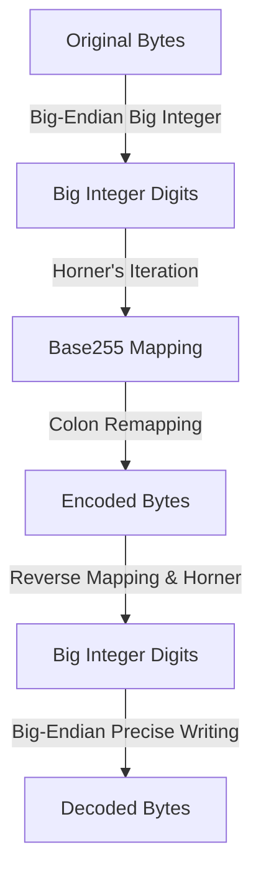

# b255 : base255 encoder and decoder to prevent forbidden colon bytes in keys

## Introduction

b255 provides high-performance base255 encoding and decoding. The primary objective is to encode arbitrary byte sequences into binary data containing no colon (`:`) bytes, preventing interference with Redis key partitioning schemes.

## Usage

```rust
use b255::{encode, decode, FORBIDDEN_BYTE};

fn main() -> Result<(), b255::DecodeError> {
  let original = b"user:profile:123";

  // Encode
  let encoded = encode(original);
  assert!(!encoded.contains(&FORBIDDEN_BYTE));

  // Decode
  let decoded = decode(&encoded)?;
  assert_eq!(decoded, original);

  Ok(())
}
```

## Features

- **Forbidden Byte Avoidance**: Converts big-endian integers to base255, mapping forbidden bytes (`:`, value 58) to 255.
- **Zero Temporary Allocation**: Optimized process eliminates vector reversal, performing direct slice-to-digit conversion.
- **Precise Pre-allocation**: Strict output capacity estimation eliminates mid-iteration dynamic resizing.
- **Enhanced Safety**: Employs bitwise operations and `get_unchecked` to bypass boundary checks safely.

## Design Architecture

Data flow during encoding and decoding:



## Tech Stack

- **Core Language**: Rust 2024
- **Dependencies**: `thiserror` (error type definition)
- **Low-Level Techniques**: Radix conversion, big-endian stream conversion, `unsafe` unchecked optimizations

## Directory Structure

```text
b255/
├── Cargo.toml
├── src/
│   ├── lib.rs     # Public API exposure
│   ├── encode.rs  # Encoding implementations
│   ├── decode.rs  # Decoding implementations
│   ├── error.rs   # Error representation
│   └── util.rs    # Bitwise utilities
└── tests/
    └── main.rs    # Verification test suite
```

## API Reference

### Constants

- `FORBIDDEN_BYTE: u8 = b':'`: Byte banned from encoded outputs.

### Functions

- `pub fn encode(data: impl AsRef<[u8]>) -> Vec<u8>`: Translates byte slice into base255 sequence omitting `FORBIDDEN_BYTE`.
- `pub fn decode(data: impl AsRef<[u8]>) -> Result<Vec<u8>, DecodeError>`: Reconstructs original data from encoded base255 sequence.

### Errors

- `pub enum DecodeError`:
  - `InvalidByte(u8)`: Rejection error triggered when `FORBIDDEN_BYTE` is detected in decoder input.

## History & Tech Trivia

In Redis key namespace management, colon (`:`) serves as the standard separator for logical partitioning. However, when Redis keys store raw binary payloads like encrypted hashes or serialized structs, unexpected colons break visualization dashboards (e.g., Redis Commander) and namespace aggregation tools.

Base255 adopts radix conversion to sidestep specific characters. This approach mirrors ancient Mesopotamian mathematics, where Babylonians utilized sexagesimal (base60) numerals. Unlike Base64, base255 leverages a high base near byte boundaries to retain spatial efficiency while excluding reserved symbols. The algorithm relies on Horner's method, formulated by British mathematician William George Horner in 1819, to evaluate polynomial bases efficiently.
