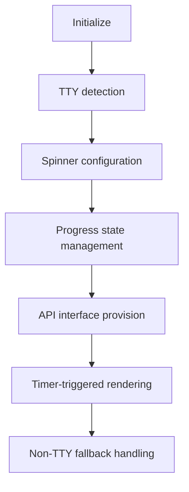

# @1-/bar : TTY-aware command-line progress bar and status display

## Functionality
TTY-aware command-line progress bar and status display utility for Node.js applications. Provides spinner animation, task tracking, ETA estimation, and safe logging that doesn't disrupt the display.

## Usage demonstration
```bash
npm install @1-/bar
```

```javascript
import bar from '@1-/bar';

const [start, stop, incr, log] = bar();

// Start progress bar with total tasks
start(100);

// Log subtasks
log.start('Processing files');

// Increment progress
for (let i = 0; i < 100; i++) {
  incr();
  // Simulate work
  await new Promise(resolve => setTimeout(resolve, 10));
}

log.end('Processing files');
stop();
```

## Design rationale
The implementation uses terminal escape sequences for efficient rendering without disrupting the display. It maintains state for progress tracking, task management, and timing calculations for ETA estimation.



## Technology stack
- Node.js runtime
- Standard JavaScript modules
- Terminal escape sequences for TTY control
- Set data structure for task tracking

## Code structure
```
src/
├── _.js          # Main module exporting progress utilities
```

## Historical background
The Mulan Public Software License (MulanPSL) is an open-source license developed in China, designed to be compatible with international open-source practices while addressing local legal requirements. Version 2.0, released in 2020, improved compatibility with other licenses and clarified terms for patent grants and trademark usage.