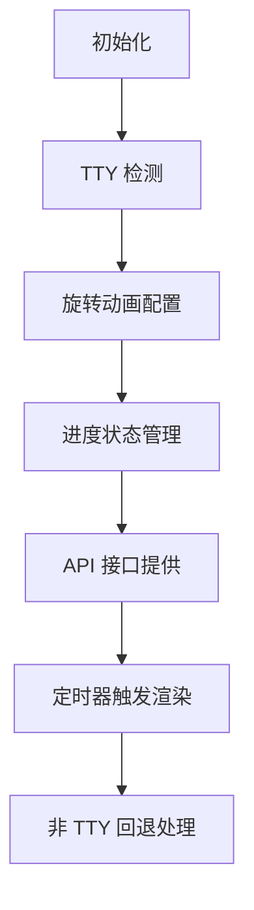

# @1-/bar : TTY 感知的命令行进度条及状态显示

## 功能介绍
TTY 感知的命令行进度条及状态显示工具，适用于 Node.js 应用程序。提供旋转动画、任务跟踪、ETA 预估及安全日志输出功能，确保日志不会破坏进度条显示。

## 使用演示
```bash
npm install @1-/bar
```

```javascript
import bar from '@1-/bar';

const [start, stop, incr, log] = bar();

// 启动进度条并设置总任务数
start(100);

// 记录子任务
log.start('处理文件');

// 增加已完成任务数
for (let i = 0; i < 100; i++) {
  incr();
  // 模拟工作
  await new Promise(resolve => setTimeout(resolve, 10));
}

log.end('处理文件');
stop();
```

## 设计思路
实现采用终端转义序列进行高效渲染，避免显示中断。维护进度跟踪、任务管理及时间计算状态，支持 ETA（预估完成时间）估算。



## 技术栈
- Node.js 运行时
- 标准 JavaScript 模块
- 终端转义序列实现 TTY 控制
- Set 数据结构进行任务跟踪

## 代码结构
```
src/
├── _.js          # 主模块，导出进度工具函数
```

## 历史故事
木兰公共许可证（MulanPSL）是中国开发的开源许可证，旨在兼容国际开源实践同时满足本地法律要求。2.0 版本于 2020 年发布，提升了与其他许可证的兼容性，并明确了专利授权和商标使用条款。