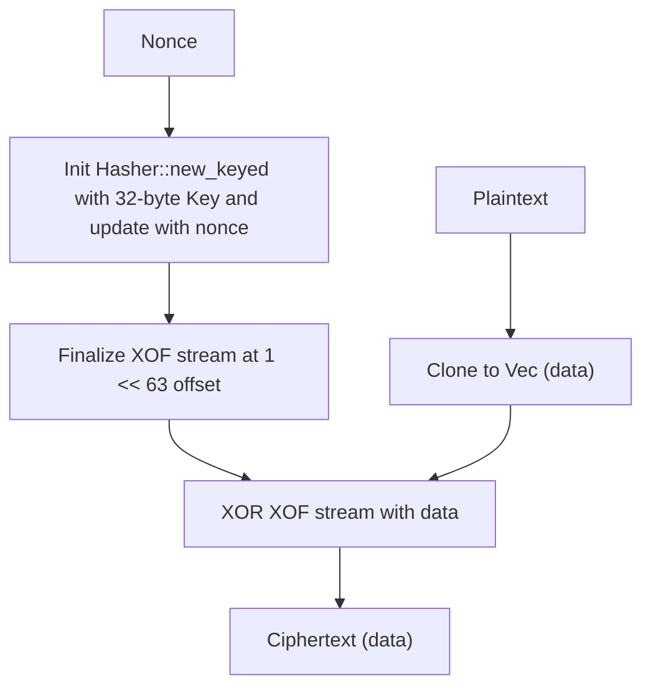

# blake3_cipher : High-performance symmetric encryption using BLAKE3 XOF stream

This library provides fast and memory-efficient symmetric encryption and decryption leveraging the BLAKE3 Extendable Output Function (XOF) as a stream cipher.

## Features

- **Extreme Performance**: Out-of-place and in-place encryption/decryption with zero redundant memory copies.
- **Post-Quantum Ready**: Uses 32-byte (256-bit) keys to withstand Grover's algorithm.
- **Robust Key Derivation**: Automatically hashes inputs using BLAKE3 to derive 32-byte keys if they are not exactly 32 bytes.

## Usage

```rust
use aok::Void;
use blake3_cipher::Cipher;

fn main() -> Void {
  // Initialize cipher with any key.
  // Keys not matching 32 bytes are automatically hashed to 32 bytes.
  let cipher = Cipher::new("my super secret password");
  let plaintext = "secret message".as_bytes();
  let nonce = b"unique nonce";

  // Encrypt
  let encrypted = cipher.encrypt(nonce, plaintext);

  // Decrypt
  let decrypted = cipher.decrypt(nonce, &encrypted);
  assert_eq!(plaintext, decrypted.as_slice());

  Ok(())
}
```

## Design



An extendable BLAKE3 output stream is initialized using the derived key keyed-hash, updated with the user-provided nonce, and positioned at $2^{63}$ bytes offset to separate it from other KDF tasks. The input is then XORed block-by-block with the stream output.

## Technology Stack

- **BLAKE3**: Cryptographic hash function used as a pseudo-random stream generator (XOF).
- **Rust (edition 2024)**: High-performance memory-safe systems programming language.

## Directory Structure

```
.
├── Cargo.toml      # Project manifest
├── src
│   ├── lib.rs      # Library entry point & core traits
│   ├── key.rs      # Key management & type conversions
│   ├── enc.rs      # Encryption logic
│   └── dec.rs      # Decryption logic
└── tests
    └── main.rs     # Integration test suite
```

## API Reference

### Structs

#### `Key`
```rust
pub struct Key(pub [u8; 32]);
```
Wraps the 32-byte symmetric key. Automatically converts from `&[u8]`, `Vec<u8>`, `&str`, `String`, `[u8; N]`, and `&[u8; N]`.
- Converts via raw memory copy if length matches 32.
- Otherwise computes a 32-byte BLAKE3 hash.

#### `Cipher`
```rust
pub struct Cipher {
  pub key: Key,
}
```
Symmetric cipher context.
- `Cipher::new(key: impl Into<Key>) -> Self`: Instantiates the cipher.
- `Cipher::encrypt(&self, nonce: impl AsRef<[u8]>, plaintext: impl AsRef<[u8]>) -> Vec<u8>`: Encrypts the plaintext out-of-place.
- `Cipher::encrypt_in_place(&self, nonce: impl AsRef<[u8]>, data: &mut [u8])`: In-place encryption.
- `Cipher::decrypt(&self, nonce: impl AsRef<[u8]>, ciphertext: impl AsRef<[u8]>) -> Vec<u8>`: Decrypts the ciphertext out-of-place.
- `Cipher::decrypt_in_place(&self, nonce: impl AsRef<[u8]>, data: &mut [u8])`: In-place decryption (aliases `encrypt_in_place`).

---

## History

In 1917, Gilbert Vernam of AT&T invented the XOR stream cipher, later known as the One-Time Pad (OTP) when combined with a truly random, non-repeating key of the same length as the plaintext. The OTP remains mathematically proven to be unbreakable. In modern cryptography, we substitute the infinite physical OTP tape with a pseudo-random bitstream generated by cryptographic hashes. BLAKE3, introduced in 2020 by Jean-Philippe Aumasson and others, brings parallelism through tree hashing, making it possible to generate this pseudo-random stream at memory-bus speeds while ensuring robust cryptographic security.