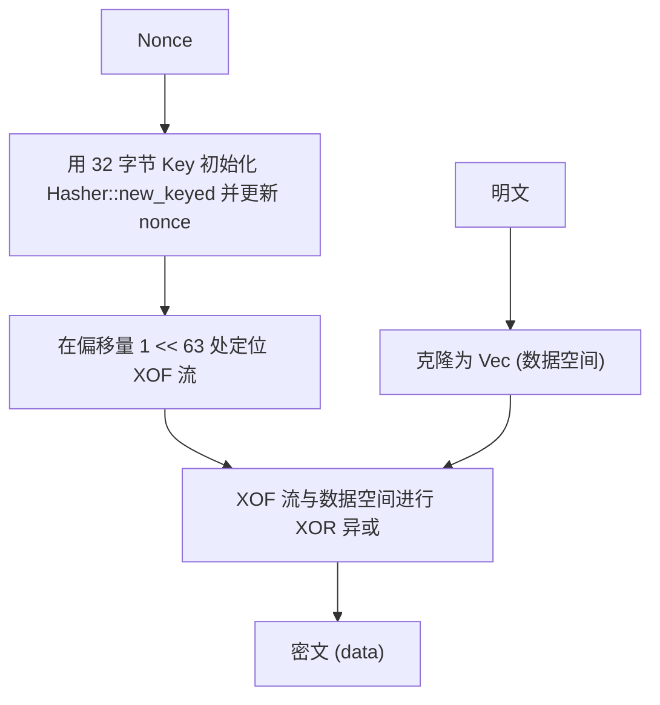

# blake3_cipher : 基于 BLAKE3 XOF 流的高性能对称加密

此库利用 BLAKE3 可延伸输出函数 (XOF) 作为流密码，实现高速、低内存开销的对称加密与解密。

## 特性

- **极致性能**: 支持原地 (in-place) 与非原地加解密，免除冗余内存拷贝。
- **后量子安全**: 采用 32 字节 (256位) 密钥强度，能够有效抵御 Grover 算法的破解。
- **自适应密钥衍生**: 智能识别密钥长度。若非 32 字节，则通过 BLAKE3 运算衍生出 32 字节密钥。

## 使用演示

```rust
use aok::Void;
use blake3_cipher::Cipher;

fn main() -> Void {
  // 用任意密钥构造密码上下文
  // 长度不为 32 字节的密钥会自动哈希为 32 字节
  let cipher = Cipher::new("my super secret password");
  let plaintext = "你好，这是一条我们想要加密的秘密消息！".as_bytes();
  let nonce = b"unique nonce";

  // 加密
  let encrypted = cipher.encrypt(nonce, plaintext);

  // 解密
  let decrypted = cipher.decrypt(nonce, &encrypted);
  assert_eq!(plaintext, decrypted.as_slice());

  Ok(())
}
```

## 设计思路



使用衍生的 32 字节密钥配合 `Hasher::new_keyed` 初始化 BLAKE3 XOF 流，并更新用户传入的 nonce，定位在 $2^{63}$ 字节偏移量处以避免与其他常规密钥衍生用途重叠。最后，明文块逐字节与该流生成的伪随机比特流进行 XOR 异或。

## 技术堆栈

- **BLAKE3**: 密码学哈希函数，用作伪随机流生成器 (XOF)。
- **Rust (edition 2024)**: 系统级高性能安全编程语言。

## 目录结构

```
.
├── Cargo.toml      # 项目清单
├── src
│   ├── lib.rs      # 库入口与核心方法
│   ├── key.rs      # 密钥管理与类型转换
│   ├── enc.rs      # 加密逻辑
│   └── dec.rs      # 解密逻辑
└── tests
    └── main.rs     # 集成测试集
```

## API 说明

### 结构体

#### `Key`
```rust
pub struct Key(pub [u8; 32]);
```
包裹 32 字节对称密钥。支持从 `&[u8]`, `Vec<u8>`, `&str`, `String`, `[u8; N]`, `&[u8; N]` 隐式转换。
- 若输入恰好 32 字节，采用内存指针零拷贝。
- 否则通过 BLAKE3 计算生成 32 字节哈希。

#### `Cipher`
```rust
pub struct Cipher {
  pub key: Key,
}
```
对称加密上下文。
- `Cipher::new(key: impl Into<Key>) -> Self`: 构造密码器实例。
- `Cipher::encrypt(&self, nonce: impl AsRef<[u8]>, plaintext: impl AsRef<[u8]>) -> Vec<u8>`: 非原地加密。
- `Cipher::encrypt_in_place(&self, nonce: impl AsRef<[u8]>, data: &mut [u8])`: 原地加密。
- `Cipher::decrypt(&self, nonce: impl AsRef<[u8]>, ciphertext: impl AsRef<[u8]>) -> Vec<u8>`: 非原地解密。
- `Cipher::decrypt_in_place(&self, nonce: impl AsRef<[u8]>, data: &mut [u8])`: 原地解密（直接映射至 `encrypt_in_place`）。

---

## 历史故事

1917 年，AT&T 的 Gilbert Vernam 发明了 XOR 流密码，与明文等长且完全随机、仅用一次的密钥配合时，即为一次性密码本 (OTP)。OTP 是目前在数学上被证明绝对无法破译的密码体制。在现代密码学中，我们以密码学哈希函数生成的伪随机流代替了无限长的物理随机纸带。2020 年由 Jean-Philippe Aumasson 等人推出的 BLAKE3，通过引入树状哈希实现了高速并行化，使得以接近内存总线的极速生成该随机比特流成为现实，兼顾了高安全度与高吞吐率。