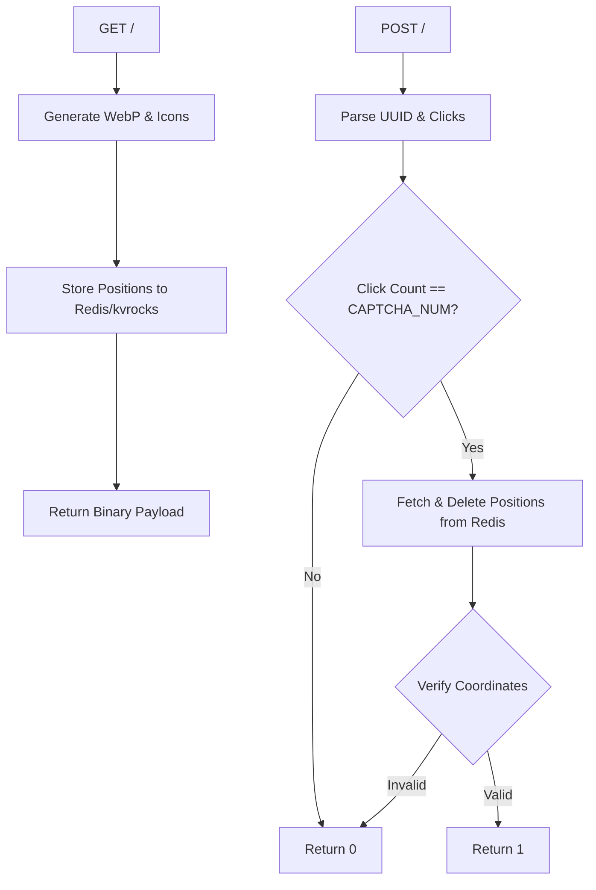

# captcha_srv : High Performance Axum CAPTCHA Service

Behavioral CAPTCHA service built with Axum framework and Redis/kvrocks. Features target icon click verification, WebP image rendering, zero-copy binary encoding, and graceful restart support.

## Overview

- Image Generation: Renders WebP background images alongside target icon characters.
- Coordinate Storage: Serializes target coordinates using bitcode into Redis/kvrocks with 300-second expiration.
- Behavior Verification: Validates click coordinates and deletes Redis keys upon read to prevent replay attacks.
- High Performance Encoding: Utilizes custom Varint encoding and binary payloads to eliminate JSON serialization overhead.
- Graceful Restart: Integrates axum_graceful_restart for seamless zero-downtime service reloads.

## Usage

### Server Initialization

```rust
use captcha_srv::run;

#[tokio::main]
async fn main() -> captcha_srv::Result<()> {
  run().await?;
  Ok(())
}
```

### Variable Byte Encoding & Key Generation

```rust
use captcha_srv::{R_CAPTCHA, captcha_key};

fn demo() {
  let mut buf = Vec::new();
  vb::e(300, &mut buf);
  assert_eq!(buf, vec![172, 2]);

  let id = [1u8; 16];
  let key = captcha_key(&id);
  assert_eq!(&key[..8], R_CAPTCHA);
  assert_eq!(&key[8..24], &id);
}
```

## Features

- Zero-Copy Design: Optimizes buffer creation by removing WebP memory reallocations.
- Stack Memory Allocation: Employs fixed-size stack arrays for click verification to bypass heap allocations.
- Early Rejection: Rejects invalid click lengths before querying Redis to reduce I/O load.
- Zero-Cost Abstractions: Leverages Rust type systems and compile-time optimizations.

## Design

### GET & POST Binary Protocols

GET Binary Response Format (Content-Type: application/octet-stream):
- 0..16 bytes: 16-byte UUID identifier.
- Varint Encoded Section: CAPTCHA_NUM target icon lengths encoded via Varint (vb::e).
- Icon Characters Section: UTF-8 bytes of target icons.
- Image Data Section: WebP background image binary payload.

POST Binary Request Format (Content-Type: application/octet-stream):
- 0..16 bytes: 16-byte UUID identifier.
- 16..28 bytes: CAPTCHA_NUM * 4 bytes click coordinate data, containing CAPTCHA_NUM coordinate pairs (x: u16, y: u16) in little-endian byte order.

POST Response Format (Content-Type: text/json):
- "1": Verification succeeded (HTTP 200 OK).
- "0": Verification failed or invalid payload (HTTP 200 OK).

### Workflow Diagram



## Tech Stack

- Web Framework: Axum
- Async Runtime: Tokio
- Cache & Storage: Redis / kvrocks (xkv / fred)
- Serialization & Encoding: bitcode / vb / uuid
- Captcha Rendering: svg_captcha
- Memory Allocator: mimalloc
- Logging: log / loginit

## Directory Structure

```text
captcha_srv/
├── Cargo.toml
├── src/
│   ├── error.rs    Error types and Axum IntoResponse implementation
│   ├── init.rs     Unified initialization for logging and xboot
│   ├── lib.rs      Public API re-exports and constants
│   ├── main.rs     Application entrypoint
│   ├── r.rs        Redis key construction
│   ├── run.rs      Router configuration and server runner
│   └── url/
│       ├── consts.rs  CAPTCHA constants
│       ├── get.rs     GET request handler
│       ├── mod.rs     url module re-exports
│       └── post.rs    POST request handler
└── tests/
    └── main.rs     Unit tests
```

## API Reference

### Constants

- R_CAPTCHA: Key prefix slice (b"captcha:").
- EXPIRE_S: Redis expiration timeout in seconds (300).
- CAPTCHA_W: Default image width in pixels (350).
- CAPTCHA_H: Default image height in pixels (350).
- CAPTCHA_NUM: Number of target click icons (3).
- JSON_H: Response header array for JSON endpoints ([(CONTENT_TYPE, "text/json")]).
- OK: Successful response Result<([(HeaderName, &'static str); 1], &'static str)>.
- ERR: Failed response Result<([(HeaderName, &'static str); 1], &'static str)>.

### Data Structures & Types

- Error: Centralized error enum wrapping AxumGracefulRestart, Redis, SvgCaptcha, Io, and Anyhow errors with IntoResponse implementation.
- Result<T>: Type alias for std::result::Result<T, Error>.

### Functions

- init() -> Result<()>: Initializes logging and xboot runtime components.
- run() -> Result<Router>: Initializes service, binds listening port, configures graceful restart, and returns Axum Router instance.
- get() -> Result<impl IntoResponse>: Generates CAPTCHA image, stores positions in Redis, and returns binary payload.
- post(body: Bytes) -> Result<impl IntoResponse>: Verifies click coordinates and cleans up Redis storage.
- captcha_key(id_bytes: &[u8; 16]) -> [u8; 24]: Constructs 24-byte Redis key without heap allocation.

## Historical Background

CAPTCHA stands for "Completely Automated Public Turing test to tell Computers and Humans Apart". Developed in 2000 by Luis von Ahn and collaborators at Carnegie Mellon University, early CAPTCHAs prevented spam and automated registrations. Von Ahn later created reCAPTCHA, leveraging user validation inputs to digitize physical archives such as historical editions of The New York Times. Modern behavioral and click-based CAPTCHAs remain fundamental security defenses across web services.