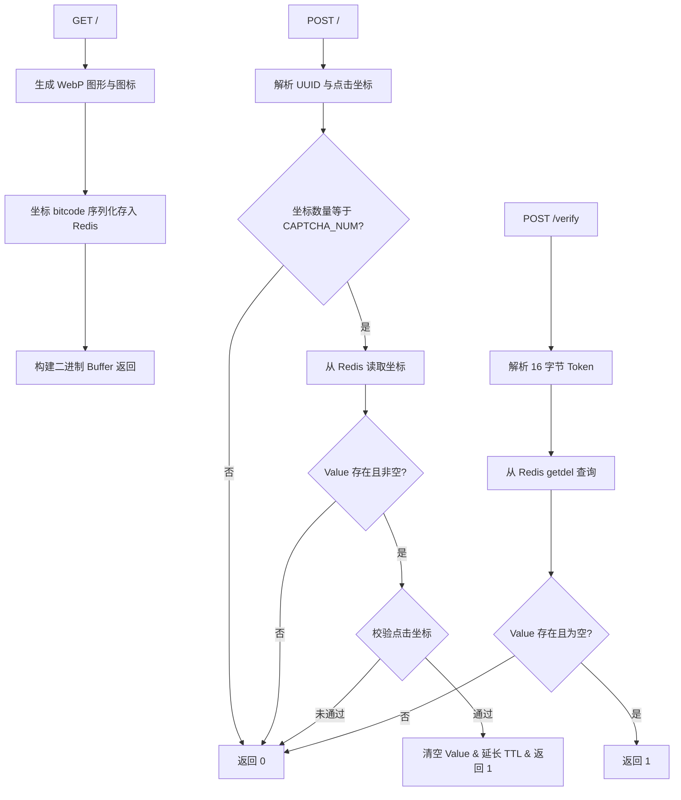

# captcha_srv : 高性能 Axum 验证码服务

基于 Axum 框架与 Redis/kvrocks 的行为验证码服务端。支持图形点选、WebP 图像生成、零拷贝二进制协议传输与无缝优雅重启。

## 项目功能介绍

- 验证码生成：随机生成 WebP 图形与目标字符图标。
- 坐标存储：使用 bitcode 序列化坐标数据存入 Redis/kvrocks，设置 300 秒过期时间。
- 行为校验：校验点选坐标，校验成功后清空 value 并重置 300 秒 TTL，返回 `"1"`（前端复用 GET 获取的验证码 Token）。
- 二次验证：提供 /verify 接口供后台校验 token 有效性并一次性销毁。

- 高性能传输：自定义 Varint 变长编码与二进制协议，消除 JSON 序列化开销。
- 优雅重启：集成 axum_graceful_restart，无缝重启保障服务高可用。

## 使用演示

### 启动服务

```rust
use captcha_srv::run;

#[tokio::main]
async fn main() -> captcha_srv::Result<()> {
  run().await?;
  Ok(())
}
```

### 变长编码与键构造

```rust
use captcha_srv::{R_CAPTCHA, captcha_key};

fn demo() {
  let mut buf = Vec::new();
  vb::e(300, &mut buf);
  assert_eq!(buf, vec![172, 2]);

  let id = [1u8; 16];
  let key = captcha_key(&id);
  assert_eq!(&key[..8], R_CAPTCHA);
  assert_eq!(&key[8..24], &id);
}
```

## 特性介绍

- 零拷贝设计：优化响应构建过程，消除 WebP 内存二次分配。
- 栈内存解析：校验逻辑采用定长栈数组解析坐标，避免堆内存分配开销。
- 早期拦截：坐标数量不匹配或 token 为空时在 Redis/解码处理前直接拦截退回，节省 IO 与 CPU 资源。
- 零成本抽象：利用 Rust 静态类型与编译期优化。

## 设计思路

### GET、POST 与 /verify 二进制协议

GET `/` 二进制响应结构（Content-Type: application/octet-stream）：
- 0..16 字节：16 字节 UUID 验证码标识符。
- 变长编码区：CAPTCHA_NUM 目标图标长度，采用 Varint (vb::e) 变长编码。
- 图标字符区：目标图标 UTF-8 字符字节。
- 图像数据区：WebP 格式验证码背景图二进制数据。

POST `/` 二进制请求结构（Content-Type: application/octet-stream）：
- 0..16 字节：16 字节 UUID 验证码标识符。
- 16..28 字节：CAPTCHA_NUM * 4 字节点击坐标数据，包含 CAPTCHA_NUM 坐标 (x: u16, y: u16)，以小端序字节存储。

POST `/` 响应结构（Content-Type: text/json）：
- `"1"`：校验成功，清空 Value 并重置 300 秒 TTL。
- `"0"`：校验失败或请求非法。

POST `/verify` 请求结构（Content-Type: application/octet-stream）：
- 0..16 字节：16 字节二进制 token。

POST `/verify` 响应结构（Content-Type: text/json）：
- `"1"`：Token 校验存在且有效（一次性弹出销毁）。
- `"0"`：Token 无效或已销毁。

### 业务流程图




## 技术堆栈

- Web 框架：Axum
- 异步运行时：Tokio
- 缓存与存储：Redis / kvrocks (xkv / fred)
- 序列化与编码：bitcode / vb / uuid
- 验证码渲染：svg_captcha
- 内存分配器：mimalloc
- 日志系统：log / loginit

## 目录结构

```text
captcha_srv/
├── Cargo.toml
├── src/
│   ├── error.rs    错误定义与 Axum 响应转换
│   ├── init.rs     日志与 xboot 统一初始化逻辑
│   ├── lib.rs      导出公共接口与常量
│   ├── main.rs     服务入口
│   ├── r.rs        Redis 键构造逻辑
│   ├── run.rs      服务路由与启动逻辑
│   └── url/
│       ├── consts.rs  验证码常量定义
│       ├── get.rs     GET 处理函数
│       ├── mod.rs     url 模块导出
│       └── post.rs    POST & /verify 处理函数
└── tests/
    └── main.rs     单元测试
```

## API 说明

### 常量

- R_CAPTCHA: Redis 键前缀字节数组 (b"captcha:")。
- EXPIRE_S: 验证码 Redis 过期时间（300 秒）。
- CAPTCHA_W: 图像默认宽度（350 像素）。
- CAPTCHA_H: 图像默认高度（350 像素）。
- CAPTCHA_NUM: 目标点选图标数量（3）。
- OCTET_H: 二进制响应 Header 数组 ([(CONTENT_TYPE, "application/octet-stream")])。
- JSON_H: JSON 响应 Header 数组 ([(CONTENT_TYPE, "text/json")])。
- OK: 成功响应 Result<([(HeaderName, &'static str); 1], &'static str)>。
- ERR: 失败响应 Result<([(HeaderName, &'static str); 1], &'static str)>。

### 数据结构与类型

- Error: 统一错误枚举，支持 AxumGracefulRestart, Redis, SvgCaptcha, Io, Anyhow 透明转发，并实现 IntoResponse。
- Result<T>: std::result::Result<T, Error> 类型别名。

### 函数

- init() -> Result<()>: 初始化日志配置与 xboot 组件。
- run() -> Result<Router>: 初始化服务并启动端口监听与优雅重启，返回 Axum 路由实例。
- get() -> Result<impl IntoResponse>: 处理 GET 请求，生成验证码图像存入 Redis，返回二进制 Payload。
- post(body: Bytes) -> Result<impl IntoResponse>: 处理 POST 请求，校验点击坐标，成功则清空 value 延长 TTL 并返回 "1"。

- verify(body: Bytes) -> Result<impl IntoResponse>: 处理 POST /verify 请求，给网站后台校验 token 存在且为空并销毁。
- captcha_key(id_bytes: &[u8; 16]) -> [u8; 24]: 零堆分配构造 24 字节 Redis 键。

## 历史小故事


验证码（CAPTCHA）全称“区分计算机和人类的全自动公共图灵测试”（Completely Automated Public Turing test to tell Computers and Humans Apart）。概念于 2000 年由卡内基梅隆大学 Luis von Ahn 等人提出。早期的验证码用于防止垃圾邮件与恶意注册。随后 Luis von Ahn 创办 reCAPTCHA，将文字识别难题与古籍及历史报纸扫描件的数字化工作结合，利用全球网民填写的验证码协助完成海量纸质文献电子化。如今点选与行为验证码已演变为互联网安全防御体系核心组件。