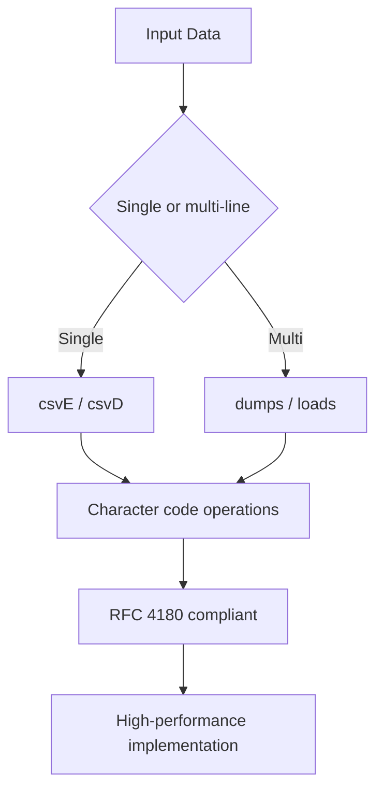
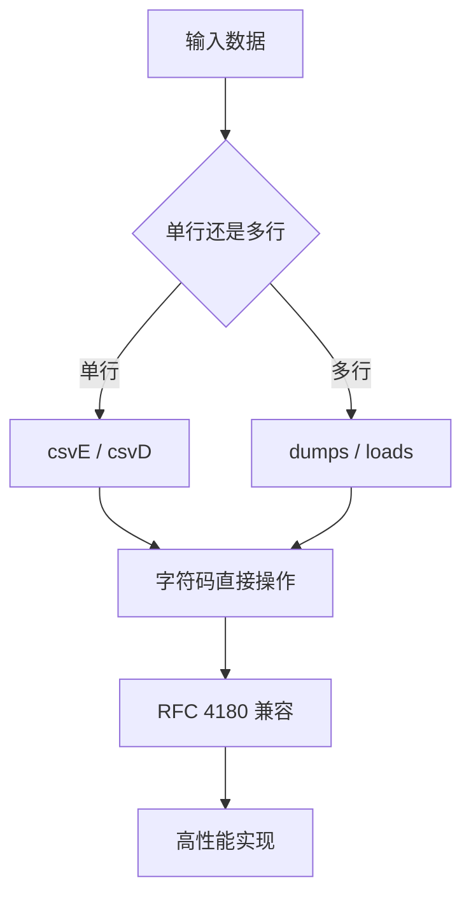

[English](#en) | [中文](#zh)

---

<a id="en"></a>

# @1-/csv : A minimalist and ultra-fast CSV encoder and decoder package

- [@1-/csv : A minimalist and ultra-fast CSV encoder and decoder package](#1-csv-a-minimalist-and-ultra-fast-csv-encoder-and-decoder-package)
  - [Features](#features)
  - [Usage](#usage)
    - [Installation](#installation)
    - [Single-line encode](#single-line-encode)
    - [Single-line decode](#single-line-decode)
    - [Multi-line encode](#multi-line-encode)
    - [Multi-line decode](#multi-line-decode)
  - [Design Principles](#design-principles)
  - [Tech Stack](#tech-stack)
  - [Code Structure](#code-structure)
  - [Historical Note](#historical-note)
  - [About](#about)

## Features

Zero-dependency, high-performance CSV serialization/deserialization. Supports both single-line and multi-line CSV processing with full RFC 4180 compliance and real-world fault tolerance.

## Usage

### Installation

```bash
bun add @1-/csv
```

### Single-line encode

```javascript
import csvE from "@1-/csv/csvE.js";

const data = ["Name", "Age", "20"];

const csv = csvE(data);
// Output: Name,Age,20
```

### Single-line decode

```javascript
import csvD from "@1-/csv/csvD.js";

const csv = "Name,Age,20";
const data = csvD(csv);
// Output: ["Name", "Age", "20"]
```

### Multi-line encode

```javascript
import dumps from "@1-/csv/dumps.js";

const data = [
  ["Name", "Age"],
  ["John", "25"],
  ["Jane", "30"]
];

const csv = dumps(data);
// Output: Name,Age\nJohn,25\nJane,30
```

### Multi-line decode

```javascript
import loads from "@1-/csv/loads.js";

const csv = "Name,Age\nJohn,25\nJane,30";
const data = loads(csv);
// Output: [["Name", "Age"], ["John", "25"], ["Jane", "30"]]
```

## Design Principles

Pure functional implementation using character code operations. Supports RFC 4180 and real-world variants:

- Null/undefined handling (converted to empty string)
- Quote escaping (`""` → `"`)
- Cross-platform line endings (`\n`, `\r`, `\r\n`)
- Fault-tolerant parsing (handles incomplete lines, trailing commas, etc.)
- Multi-line CSV batch processing



## Tech Stack

- Runtime: ECMAScript 2023+
- Build: No build step
- Testing: `mitata`
- License: MulanPSL-2.0

## Code Structure

```
src/
├── csvD.js     # Single-line decoder, RFC 4180 compatible, fault-tolerant
├── csvE.js     # Single-line encoder, auto quoting/escaping
├── dumps.js    # Multi-line encoder, convert array of arrays to CSV string
├── loads.js    # Multi-line decoder, parse CSV string to array of arrays
├── dump.js     # File writer, write data to CSV file
├── load.js     # File reader, read data from CSV file
├── csvD.d.ts   # Type declarations
├── csvE.d.ts   # Type declarations
├── dumps.d.ts  # Type declarations
├── loads.d.ts  # Type declarations
├── dump.d.ts   # Type declarations
└── load.d.ts   # Type declarations
```

## Historical Note

CSV originated in 1970s IBM System/360. Lotus 1-2-3 (1983) established it as de facto standard. RFC 4180 (2005) attempted standardization, but permissiveness remains a challenge. This project achieves dual compatibility through extreme minimalism while providing both single-line and multi-line processing capabilities.

## About

This library is developed by [WebC.site](https://webc.site).

[WebC.site](https://webc.site): A new paradigm of web development for AI

---

<a id="zh"></a>

# @1-/csv : 极简、极速的 CSV 编码与解码工具包

- [@1-/csv : 极简、极速的 CSV 编码与解码工具包](#1-csv-极简极速的-csv-编码与解码工具包)
  - [功能介绍](#功能介绍)
  - [使用演示](#使用演示)
    - [安装](#安装)
    - [单行编码](#单行编码)
    - [单行解码](#单行解码)
    - [多行编码](#多行编码)
    - [多行解码](#多行解码)
  - [设计思路](#设计思路)
  - [技术栈](#技术栈)
  - [代码结构](#代码结构)
  - [历史故事](#历史故事)
  - [关于](#关于)

## 功能介绍

提供零依赖、高性能的 CSV 序列化与反序列化功能。支持单行与多行 CSV 处理，完全兼容 RFC 4180 标准，同时具备现实世界容错能力。

## 使用演示

### 安装

```bash
bun add @1-/csv
```

### 单行编码

```javascript
import csvE from "@1-/csv/csvE.js";

const data = ["姓名", "年龄", "20"];

const csv = csvE(data);
// 输出: 姓名,年龄,20
```

### 单行解码

```javascript
import csvD from "@1-/csv/csvD.js";

const csv = "姓名,年龄,20";
const data = csvD(csv);
// 输出: ["姓名", "年龄", "20"]
```

### 多行编码

```javascript
import dumps from "@1-/csv/dumps.js";

const data = [
  ["姓名", "年龄"],
  ["张三", "25"],
  ["李四", "30"]
];

const csv = dumps(data);
// 输出: 姓名,年龄\n张三,25\n李四,30
```

### 多行解码

```javascript
import loads from "@1-/csv/loads.js";

const csv = "姓名,年龄\n张三,25\n李四,30";
const data = loads(csv);
// 输出: [["姓名", "年龄"], ["张三", "25"], ["李四", "30"]]
```

## 设计思路

采用纯函数式实现，基于字符码直接操作。支持 RFC 4180 及常见变体：

- 空值与 null/undefined 处理（转换为空字符串）
- 双引号转义（`""` → `"`）
- 跨平台换行符（`\n`, `\r`, `\r\n`）
- 容错解析（处理不完整行、尾随逗号等）
- 多行 CSV 批量处理



## 技术栈

- 运行时：ECMAScript 2023+
- 构建：无构建步骤
- 测试：`mitata`
- 许可证：MulanPSL-2.0

## 代码结构

```
src/
├── csvD.js     # 单行解码器，RFC 4180 兼容，容错
├── csvE.js     # 单行编码器，自动 quoting/escaping
├── dumps.js    # 多行编码器，将数组的数组转换为 CSV 字符串
├── loads.js    # 多行解码器，将 CSV 字符串解析为数组的数组
├── dump.js     # 文件写入器，将数据写入 CSV 文件
├── load.js     # 文件读取器，从 CSV 文件读取数据
├── csvD.d.ts   # 类型声明
├── csvE.d.ts   # 类型声明
├── dumps.d.ts  # 类型声明
├── loads.d.ts  # 类型声明
├── dump.d.ts   # 类型声明
└── load.d.ts   # 类型声明
```

## 历史故事

CSV 格式源于 1970 年代 IBM System/360。1983 年 Lotus 1-2-3 确立其为事实标准。RFC 4180（2005）尝试标准化，但宽松性仍是挑战。本项目以极致精简实现双重兼容，同时提供单行与多行处理能力。

## 关于

本库由 [WebC.site](https://webc.site) 开发。

[WebC.site](https://webc.site) : 面向人工智能的网站开发新范式
