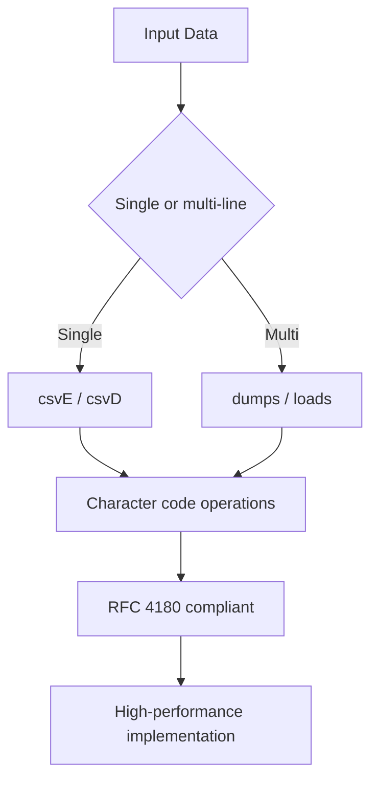

# @1-/csv : A minimalist and ultra-fast CSV encoder and decoder package

## Features

High-performance CSV serialization/deserialization. Supports both single-line and multi-line CSV processing with full RFC 4180 compliance and real-world fault tolerance. Implements character-code based operations for maximum performance.

## Usage

### Installation

```bash
bun add @1-/csv
```

### Single-line encode

```javascript
import csvE from "@1-/csv/csvE";

const data = ["Name", "Age", "20"];

const csv = csvE(data);
// Output: Name,Age,20
```

### Single-line decode

```javascript
import csvD from "@1-/csv/csvD";

const csv = "Name,Age,20";
const data = csvD(csv);
// Output: ["Name", "Age", "20"]
```

### Multi-line encode

```javascript
import dumps from "@1-/csv/dumps";

const data = [
  ["Name", "Age"],
  ["John", "25"],
  ["Jane", "30"]
];

const csv = dumps(data);
// Output: Name,Age\nJohn,25\nJane,30
```

### Multi-line decode

```javascript
import loads from "@1-/csv/loads";

const csv = "Name,Age\nJohn,25\nJane,30";
const data = loads(csv);
// Output: [["Name", "Age"], ["John", "25"], ["Jane", "30"]]
```

### File I/O

```javascript
import dump from "@1-/csv/dump";
import load from "@1-/csv/load";

// Write CSV file
await dump("data.csv", [
  ["Name", "Age"],
  ["John", "25"],
  ["Jane", "30"]
]);

// Read CSV file
const data = await load("data.csv");
```

## Design Principles

Pure functional implementation using character code operations (ASCII 34=", 44=,, 10=\n, 13=\r). Supports RFC 4180 and real-world variants:

- Null/undefined handling (converted to empty string)
- Quote escaping (`""` → `"`)
- Cross-platform line endings (`\n`, `\r`, `\r\n`)
- Fault-tolerant parsing (handles incomplete lines, trailing commas, etc.)
- Multi-line CSV batch processing
- Zero build step, runs directly on ECMAScript 2023+ environments



## Tech Stack

- Runtime: ECMAScript 2023+
- Dependencies: `@1-/read` (for file reading only)
- Testing: `mitata`
- License: MulanPSL-2.0

## Code Structure

```
src/
├── csvD.js     # Single-line decoder, RFC 4180 compatible, fault-tolerant
├── csvE.js     # Single-line encoder, auto quoting/escaping
├── dumps.js    # Multi-line encoder, convert array of arrays to CSV string
├── loads.js    # Multi-line decoder, parse CSV string to array of arrays
├── dump.js     # File writer, write data to CSV file
├── load.js     # File reader, read data from CSV file
├── csvD.d.ts   # Type declarations: (str: string) => string[]
├── csvE.d.ts   # Type declarations: (row: any[]) => string
├── dumps.d.ts  # Type declarations: (li: any[][]) => string
├── loads.d.ts  # Type declarations: (str: string) => string[][]
├── dump.d.ts   # Type declarations: (path: string, li: any[][]) => Promise<void>
└── load.d.ts   # Type declarations: (path: string) => Promise<string[][]>
```

## Historical Note

CSV originated in 1970s IBM System/360. Lotus 1-2-3 (1983) established it as de facto standard. RFC 4180 (2005) attempted standardization, but permissiveness remains a challenge. This project achieves dual compatibility through extreme minimalism while providing both single-line and multi-line processing capabilities.