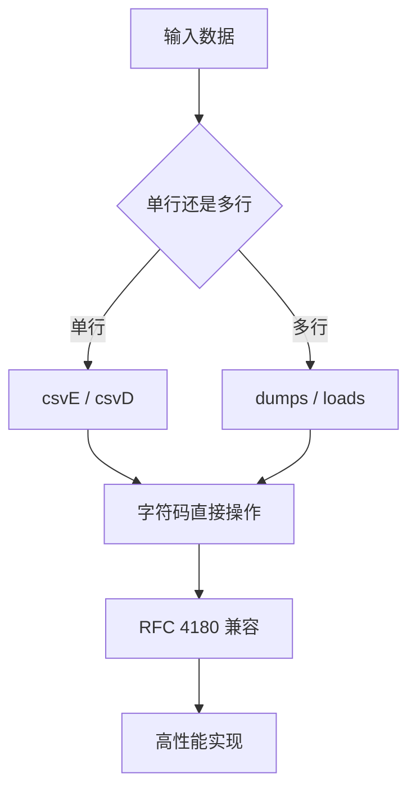

# @1-/csv : 极简、极速的 CSV 编码与解码工具包

## 功能介绍

提供高性能的 CSV 序列化与反序列化功能。支持单行与多行 CSV 处理，完全兼容 RFC 4180 标准，同时具备现实世界容错能力。基于字符码直接操作实现极致性能。

## 使用演示

### 安装

```bash
bun add @1-/csv
```

### 单行编码

```javascript
import csvE from "@1-/csv/csvE";

const data = ["姓名", "年龄", "20"];

const csv = csvE(data);
// 输出: 姓名,年龄,20
```

### 单行解码

```javascript
import csvD from "@1-/csv/csvD";

const csv = "姓名,年龄,20";
const data = csvD(csv);
// 输出: ["姓名", "年龄", "20"]
```

### 多行编码

```javascript
import dumps from "@1-/csv/dumps";

const data = [
  ["姓名", "年龄"],
  ["张三", "25"],
  ["李四", "30"]
];

const csv = dumps(data);
// 输出: 姓名,年龄\n张三,25\n李四,30
```

### 多行解码

```javascript
import loads from "@1-/csv/loads";

const csv = "姓名,年龄\n张三,25\n李四,30";
const data = loads(csv);
// 输出: [["姓名", "年龄"], ["张三", "25"], ["李四", "30"]]
```

### 文件读写

```javascript
import dump from "@1-/csv/dump";
import load from "@1-/csv/load";

// 写入 CSV 文件
await dump("data.csv", [
  ["姓名", "年龄"],
  ["张三", "25"],
  ["李四", "30"]
]);

// 读取 CSV 文件
const data = await load("data.csv");
```

## 设计思路

采用纯函数式实现，基于字符码直接操作（ASCII 34=", 44=,, 10=\n, 13=\r）。支持 RFC 4180 及常见变体：

- 空值与 null/undefined 处理（转换为空字符串）
- 双引号转义（`""` → `"`）
- 跨平台换行符（`\n`, `\r`, `\r\n`）
- 容错解析（处理不完整行、尾随逗号等）
- 多行 CSV 批量处理
- 零构建步骤，直接运行于 ECMAScript 2023+ 环境



## 技术栈

- 运行时：ECMAScript 2023+
- 依赖：`@1-/read`（用于文件读取）
- 测试：`mitata`
- 许可证：MulanPSL-2.0

## 代码结构

```
src/
├── csvD.js     # 单行解码器，RFC 4180 兼容，容错解析
├── csvE.js     # 单行编码器，自动 quoting/escaping
├── dumps.js    # 多行编码器，将数组的数组转换为 CSV 字符串
├── loads.js    # 多行解码器，将 CSV 字符串解析为数组的数组
├── dump.js     # 文件写入器，将数据写入 CSV 文件
├── load.js     # 文件读取器，从 CSV 文件读取数据
├── csvD.d.ts   # 类型声明：(str: string) => string[]
├── csvE.d.ts   # 类型声明：(row: any[]) => string
├── dumps.d.ts  # 类型声明：(li: any[][]) => string
├── loads.d.ts  # 类型声明：(str: string) => string[][]
├── dump.d.ts   # 类型声明：(path: string, li: any[][]) => Promise<void>
└── load.d.ts   # 类型声明：(path: string) => Promise<string[][]>
```

## 历史故事

CSV 格式源于 1970 年代 IBM System/360。1983 年 Lotus 1-2-3 确立其为事实标准。RFC 4180（2005）尝试标准化，但宽松性仍是挑战。本项目以极致精简实现双重兼容，同时提供单行与多行处理能力。
