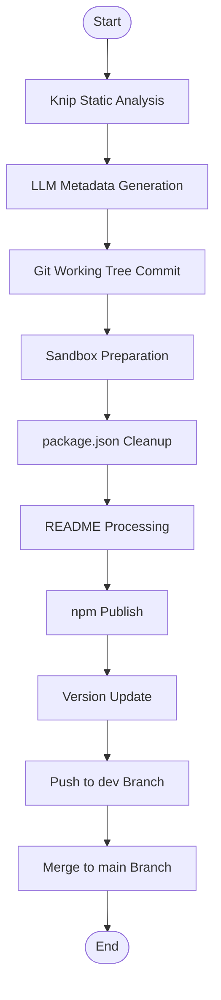
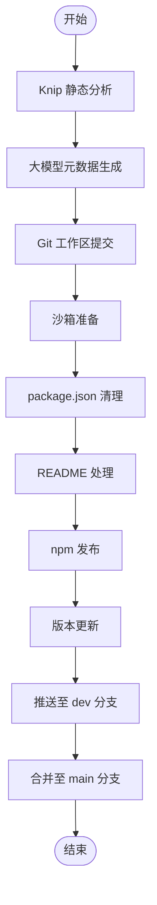

[English](#en) | [中文](#zh)

---

<a id="en"></a>
# @1-/dist : Monorepo package publishing and Git synchronization automation

- [@1-/dist : Monorepo package publishing and Git synchronization automation](#1-dist-monorepo-package-publishing-and-git-synchronization-automation)
  - [Functionality](#functionality)
  - [Usage demo](#usage-demo)
  - [Design rationale](#design-rationale)
  - [Tech stack](#tech-stack)
  - [Code structure](#code-structure)
  - [Historical story](#historical-story)
  - [About](#about)

## Functionality

- **Knip static analysis**
  Execute Knip before publishing to detect unused exports, missing declarations, redundant dependencies, and other issues across 23 issue categories including `files`, `dependencies`, `exports`, `types`, and `duplicates`.

- **LLM-powered metadata generation**
  Detect missing `description` or `keywords` in `package.json`.
  Use Cersei LLM service with OpenAI-compatible API configuration to generate documentation and complete metadata.
  Load prompts from `src/prompt/readme.md` and `src/prompt/package.md`.

- **Git working tree management**
  Use `simple-git` to inspect repository status.
  Automatically commit unstaged modifications via `gci` before publishing.

- **Sandboxed publishing environment**
  Create isolated temporary directory using `os.tmpdir()` with cryptographically random name.
  Copy only `src` directory contents recursively.
  Clean `package.json` by removing `devDependencies`, `scripts`, `files`, and `lint-staged` fields.
  Rewrite relative paths in `exports`, `bin`, `main`, `module`, and `types` fields using `srcReplace`.

- **Mermaid diagram processing**
  Extract Mermaid diagrams from `README.mdt` files.
  Render diagrams to SVG format and upload to S3 storage.
  Replace diagram blocks with CDN URLs in generated Markdown.

- **Automated npm publishing**
  Execute `npm publish --access public` in temporary directory.
  Increment patch version (e.g., `1.2.3` → `1.2.4`) upon successful release.
  Open npm package page in default browser using platform-appropriate commands (`open`, `cmd.exe`, or `xdg-open`).

- **Multi-branch Git synchronization**
  Commit and push changes to `dev` branch with version commit message `"v1.2.4"`.
  Use `git clone --shared` for efficient, safe merging.
  Clone local repository to temporary path, checkout `main`, pull latest, merge `dev`, then push to remote.

## Usage demo

Specify target package folder name under monorepo:

```bash
dist <pkg_folder>
```

Example:

```bash
dist walk
```

The CLI uses yargs for argument parsing and requires exactly one positional argument specifying the package directory name.

## Design rationale



The workflow follows strict sequential execution with error handling at each stage. Knip failures cause immediate process exit with detailed error reporting. All temporary directories are cleaned up in `finally` blocks.

## Tech stack

- **Bun**: Runtime and package manager (replaces Node.js)
- **Simple Git**: Git operations library
- **Knip**: Static analysis tool for JavaScript/TypeScript projects
- **Yargs**: Command-line argument parsing
- **AWS S3 SDK**: Cloud storage integration for diagram hosting
- **Mermaid**: Diagram rendering engine
- **Cersei**: LLM service wrapper for OpenAI-compatible APIs
- **Simple Git**: Git operations library

## Code structure

```text
src/
├── dist.js          # CLI entry point with yargs parsing
├── exec.js          # Subprocess command executor for shell commands
├── gci.js           # Git working tree inspector using simple-git
├── gitMerge.js      # Shared clone git merger with .tmp directory isolation
├── gitSync.js       # Git branch synchronization controller
├── knip.js          # Knip static analysis controller with 23 issue category detection
├── pkgJsonClean.js  # Cleans package.json and rewrites export paths
├── prep.js          # Sandboxed folder preprocessor with crypto.randomUUID()
├── publish.js       # npm publisher with cross-platform browser opening
├── readme.js        # Markdown renderer and Mermaid processor
├── readmeGen.js     # LLM documentation generator with Cersei integration
├── run.js           # Release process main controller
├── srcReplace.js    # Relative path rewriter for package.json fields
└── svg.js           # SVG renderer and uploader for Mermaid diagrams
```

## Historical story

Early Node.js package publishing relied on `npm publish` uploading entire directories, causing frequent leaks of sensitive files like `.env`, credentials, and test artifacts. While `.npmignore` and `files` arrays provided mitigation, configuration remained manual and error-prone.

Monorepo Git workflows required developers to manually manage multi-branch synchronization with `git checkout`, `pull`, `merge`, and `push` commands. Uncommitted local changes complicated these operations, increasing merge conflict risks and introducing dirty commits.

This tool addresses both challenges through Git shared clones (`git clone --shared`) and sandboxed publishing. Temporary directory isolation prevents accidental file inclusion, while automated Git synchronization ensures consistent, zero-configuration releases. The architecture evolved from simple shell script wrappers to a modular Bun-based system with dedicated modules for each concern, enabling reliable monorepo publishing at scale.

## About

This library is developed by [WebC.site](https://webc.site).

[WebC.site](https://webc.site): A new paradigm of web development for AI


---

<a id="zh"></a>
# @1-/dist : Monorepo 包发布与 Git 同步自动化

- [@1-/dist : Monorepo 包发布与 Git 同步自动化](#1-dist-monorepo-包发布与-git-同步自动化)
  - [功能介绍](#功能介绍)
  - [使用演示](#使用演示)
  - [设计思路](#设计思路)
  - [技术栈](#技术栈)
  - [代码结构](#代码结构)
  - [历史故事](#历史故事)
  - [关于](#关于)

## 功能介绍

- **Knip 静态分析**
  发布前执行 Knip 静态分析，检测无用导出、缺失声明、冗余依赖及其他问题，覆盖 `files`、`dependencies`、`exports`、`types`、`duplicates` 等 23 类问题。

- **大语言模型元数据生成**
  检测 `package.json` 中 `description` 与 `keywords` 字段缺失。
  使用 Cersei 大语言模型服务，通过 OpenAI 兼容 API 配置生成文档并补全元数据。
  加载 `src/prompt/readme.md` 与 `src/prompt/package.md` 中的提示模板。

- **Git 工作区管理**
  使用 `simple-git` 检测仓库状态。
  发布前自动提交未暂存修改。

- **沙箱化发布环境**
  使用 `os.tmpdir()` 创建隔离临时目录，名称包含密码学随机标识符。
  仅递归复制 `src` 目录内容。
  清理 `package.json`，移除 `devDependencies`、`scripts`、`files`、`lint-staged` 字段。
  使用 `srcReplace` 重写 `exports`、`bin`、`main`、`module`、`types` 字段中的相对路径。

- **Mermaid 图表处理**
  解析 `README.mdt` 文件中的 Mermaid 图表。
  渲染为 SVG 格式并上传至 S3 存储服务。
  在生成的 Markdown 中替换图表块为 CDN 链接。

- **自动化 npm 发布**
  在临时目录中执行 `npm publish --access public`。
  发布成功后自动递增修补版本号（例如 `1.2.3` → `1.2.4`）。
  使用平台适配命令在默认浏览器中打开 npm 包页面（`open`、`cmd.exe` 或 `xdg-open`）。

- **多分支 Git 同步**
  提交并推送变更至 `dev` 分支，提交信息为 `"v1.2.4"`。
  使用 `git clone --shared` 实现高效、安全的合并操作。
  将本地仓库克隆至临时路径，检出 `main` 分支，拉取最新代码，合并 `dev` 分支，最后推送至远程仓库。

## 使用演示

命令行指定要发布的包目录名称：

```bash
dist <pkg_folder>
```

示例：

```bash
dist walk
```

CLI 使用 yargs 进行参数解析，要求且仅接受一个位置参数，指定包目录名称。

## 设计思路



工作流遵循严格的顺序执行，每个阶段均有错误处理。Knip 检查失败将立即终止进程并输出详细错误报告。所有临时目录均在 `finally` 块中清理。

## 技术栈

- **Bun**: 运行时与包管理器（替代 Node.js）
- **Simple Git**: Git 操作库
- **Knip**: JavaScript/TypeScript 项目静态分析工具
- **Yargs**: 命令行参数解析
- **AWS S3 SDK**: 云存储集成，用于图表托管
- **Mermaid**: 图表渲染引擎
- **Cersei**: OpenAI 兼容 API 的大语言模型服务封装
- **Simple Git**: Git 操作库

## 代码结构

```text
src/
├── dist.js          # CLI 入口，使用 yargs 参数解析
├── exec.js          # 子进程命令执行器，用于 shell 命令
├── gci.js           # Git 工作区检查器，基于 simple-git
├── gitMerge.js      # 共享克隆 Git 合并器，使用 .tmp 目录隔离
├── gitSync.js       # Git 分支同步控制器
├── knip.js          # Knip 静态分析控制器，支持 23 类问题检测
├── pkgJsonClean.js  # 清理 package.json 并重写导出路径
├── prep.js          # 沙箱目录预处理器，使用 crypto.randomUUID()
├── publish.js       # npm 发布器，支持跨平台浏览器打开
├── readme.js        # Markdown 渲染器与 Mermaid 处理器
├── readmeGen.js     # 大语言模型文档生成器，集成 Cersei
├── run.js           # 发布流程主控制器
├── srcReplace.js    # 相对路径重写器，用于 package.json 字段
└── svg.js           # SVG 渲染器与上传器，用于 Mermaid 图表
```

## 历史故事

早期 Node.js 包发布依赖 `npm publish` 上传整个目录，频繁导致 `.env` 敏感配置、凭证文件及测试资源泄露。尽管 `.npmignore` 和 `files` 白名单机制提供了缓解方案，但配置过程仍需手动操作且易出错。

Monorepo 架构下的 Git 工作流要求开发者手动管理多分支同步，包括 `git checkout`、`pull`、`merge` 和 `push` 等命令。未提交的本地修改使这些操作更加复杂，增加了合并冲突风险和污染提交历史的可能性。

本工具通过 Git 共享克隆（`git clone --shared`）与沙箱化发布解决上述挑战。临时目录隔离从根本上杜绝了意外文件包含，而自动化的 Git 同步流水线确保了零配置的安全发布体验。架构从简单的 Shell 脚本包装器演变为模块化的 Bun 系统，各关注点分离，支持大规模 Monorepo 的可靠发布。

## 关于

本库由 [WebC.site](https://webc.site) 开发。

[WebC.site](https://webc.site) : 面向人工智能的网站开发新范式

