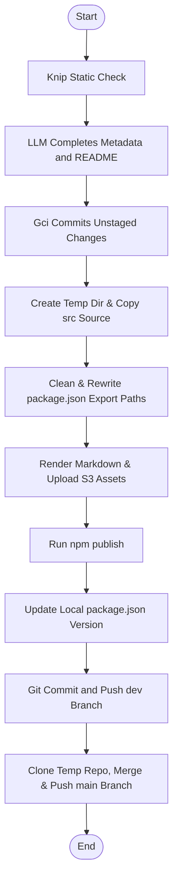
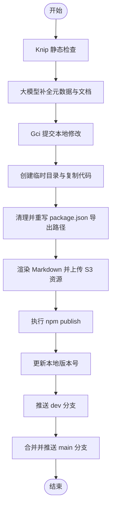

[English](#en) | [中文](#zh)

---

<a id="en"></a>

# @1-/dist : Minimalist monorepo package publishing and git sync tool

- [@1-/dist : Minimalist monorepo package publishing and git sync tool](#1-dist-minimalist-monorepo-package-publishing-and-git-sync-tool)
  - [Features](#features)
  - [Usage](#usage)
  - [Design](#design)
  - [Tech Stack](#tech-stack)
  - [Code Structure](#code-structure)
  - [History](#history)
  - [About](#about)

## Features

- **Static Analysis & Risk Control**
  Runs Knip static analysis before publishing to detect unused code, missing declarations, and redundant dependencies.

- **Metadata & Documentation Auto-Completion**
  Detects missing `description` or `keywords` in `package.json`.
  Invokes `opencode` LLM service to complete metadata and generate or update `README.md`.

- **Automatic Workspace Commit**
  Inspects Git working tree status.
  Automatically commits unstaged modifications via `gci` prior to publishing.

- **Publish Directory Sandbox Restructuring**
  Creates temporary directory under OS temp path.
  Copies only `src` source files.
  Strips development metadata (`devDependencies`, `scripts`, `files`, `lint-staged`) from `package.json`.
  Rewrites relative paths in fields like `exports`, `bin`, `main`, `module`, and `types`.

- **Mermaid Diagram SVG Rendering & CDN Hosting**
  Extracts Mermaid diagrams from `README.mdt`.
  Renders diagrams to SVG, uploads assets to S3 storage, and replaces diagram blocks with CDN URLs.
  Generates standard `README.md` locally and HTML-compatible Markdown with embedded SVG URLs in release directory.

- **Automated npm Publishing & Browser Preview**
  Executes public package publishing.
  Increments local patch version upon successful release.
  Automatically opens package release page in default browser.

- **Safe Multi-Branch Git Synchronization**
  Commits and pushes changes to `dev` branch.
  Clones local repository to a temporary path via `git clone --shared`.
  Merges branch safely to `main` and pushes updates to remote.

## Usage

Specify target package folder name under monorepo:

```bash
dist <pkg_folder>
```

Example:

```bash
dist walk
```

## Design



## Tech Stack

- **Bun**: JS runtime and package manager
- **Simple Git**: Git command executor
- **Knip**: Unused exports and dependencies analyzer
- **Yargs**: Command-line parser
- **AWS S3 SDK**: Cloud storage client

## Code Structure

```text
src/
├── dist.js          # CLI entry point
├── exec.js          # Subprocess command executor
├── gci.js           # Git working tree inspector and committer
├── gitMerge.js      # Shared clone git merger
├── gitSync.js       # Git branch synchronization controller
├── knip.js          # Knip static analysis controller
├── pkgJsonClean.js  # Cleans package.json and rewrites export paths
├── prep.js          # Sandboxed folder preprocessor
├── publish.js       # npm publisher and browser opener
├── readme.js        # Markdown renderer and Mermaid processor
├── readmeGen.js     # LLM documentation and metadata generator
├── run.js           # Release process main controller
├── srcReplace.js    # Relative path rewriter
└── svg.js           # SVG renderer and uploader
```

## History

In the early ecosystem of Node.js, `npm publish` packaged and uploaded the entire directory by default. This frequently caused accidental leaks of configuration files like `.env`, local credentials, private test files, and redundant build cache. Although features like `.npmignore` and the `files` array in `package.json` were introduced, configuring them remains manual, tedious, and error-prone.

Regarding version control, managing multi-branch synchronization in monorepos typically requires developers to manually run checkout, pull, merge, and push operations. Active development tasks with uncommitted local changes further complicate these commands, increasing risk of merge conflicts and dirty commits.

This tool resolves these issues by utilizing Git shared clones (`git clone --shared`) and sandboxed publish directory restructuring. By compiling code into temporary structures, it eliminates the risk of publishing local files, while automating the git workflow to ensure a zero-configuration, secure release pipeline.

## About

This library is developed by [WebC.site](https://webc.site).

[WebC.site](https://webc.site): A new paradigm of web development for AI

---

<a id="zh"></a>

# @1-/dist : 极简 Monorepo 包发布与 Git 同步工具

- [@1-/dist : 极简 Monorepo 包发布与 Git 同步工具](#1-dist-极简-monorepo-包发布与-git-同步工具)
  - [功能介绍](#功能介绍)
  - [使用演示](#使用演示)
  - [设计思路](#设计思路)
  - [技术栈](#技术栈)
  - [代码结构](#代码结构)
  - [历史故事](#历史故事)
  - [关于](#关于)

## 功能介绍

- **静态分析与风险控制**
  发布前运行 Knip 静态分析，检测无用代码、缺失声明与冗余依赖，降低发布风险。

- **元数据与文档自动补全**
  检测 `package.json` 中的 `description` 与 `keywords` 字段。
  字段缺失时调用 `opencode` 大模型服务进行补全，并自动生成或更新 `README.md`。

- **工作区自动提交**
  检测 Git 工作区状态。
  发布前自动调用 `gci` 提交未暂存修改。

- **发布目录沙箱重构**
  在系统临时目录重构包结构。
  仅复制 `src` 源码，剔除 `package.json` 中的 `devDependencies`、`scripts`、`files` 及 `lint-staged` 等开发字段。
  重写 `exports`、`bin`、`main`、`module`、`types` 等相对路径，防范敏感配置文件泄露。

- **Mermaid 图表 SVG 渲染与托管**
  解析 `README.mdt` 中的 Mermaid 流程图，渲染为 SVG 格式，上传至 S3 存储服务，并自动替换为 CDN 链接，提升文档在各平台兼容性与加载速度。
  在本地生成标准 `README.md`，并在发布目录生成内嵌 SVG 链接的 `README.md`。

- **自动发布与页面预览**
  执行 npm 公开发布。
  发布成功后自动递增本地修补版本号（patch）。
  在支持的终端环境中，使用默认浏览器自动打开已发布 npm 包的预览页面。

- **安全的多分支 Git 同步**
  提交并推送当前 `dev` 分支。
  利用 `git clone --shared` 创建本地共享仓库，将修改安全合并至 `main` 分支并推送到远端仓库。

## 使用演示

命令行指定要发布的包目录名称：

```bash
dist <pkg_folder>
```

示例：

```bash
dist walk
```

## 设计思路



## 技术栈

- **Bun**：JS 运行时与包管理器
- **Simple Git**：Git 版本控制工具
- **Knip**：无用依赖与导出静态分析器
- **Yargs**：命令行参数解析器
- **AWS S3 SDK**：S3 存储服务客户端

## 代码结构

```text
src/
├── dist.js          # CLI 命令行入口
├── exec.js          # 封装子进程命令执行
├── gci.js           # 检测并提交未保存修改
├── gitMerge.js      # 共享仓库分支安全合并
├── gitSync.js       # Git 分支同步与合并主控制
├── knip.js          # Knip 静态分析检查
├── pkgJsonClean.js  # 清理 package.json 冗余字段并重写导出路径
├── prep.js          # 预处理沙箱发布目录与版本号
├── publish.js       # npm 发布与浏览器页面开启
├── readme.js        # Markdown 渲染与 Mermaid 转换
├── readmeGen.js     # 调用大模型生成文档与补全元数据
├── run.js           # 发布流程主控制流
├── srcReplace.js    # 相对路径重写工具
└── svg.js           # SVG 渲染与上传托管
```

## 历史故事

早期 Node.js 生态中，`npm publish` 默认打包并上传当前目录下的全部文件。这频繁导致 `.env` 敏感配置、本地私钥、测试脚本及本地临时文件泄露。虽然社区随后引入 `.npmignore` 与 `package.json` 中的 `files` 白名单机制，但配置过程依旧繁琐且容易遗漏。

在 Git 版本管理方面，Monorepo 架构下的多分支发布通常需要开发者频繁切换分支（`git checkout`）、拉取最新代码（`git pull`）、执行合并（`git merge`）与推送（`git push`）。在未提交本地修改时，这些操作不仅繁琐，且极易导致合并冲突或污染提交历史。

本工具借鉴了 Git 共享克隆（`git clone --shared`）技术与临时目录隔离发布设计。通过在临时沙箱目录重构包结构，从根本上杜绝了开发依赖与私有文件泄露；同时利用自动化的多分支同步流水线，实现零配置的安全发布体验。

## 关于

本库由 [WebC.site](https://webc.site) 开发。

[WebC.site](https://webc.site) : 面向人工智能的网站开发新范式
