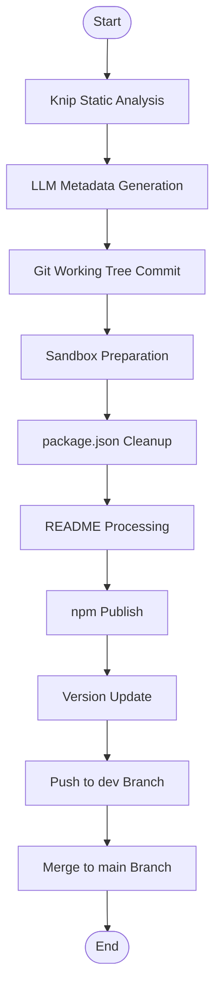

# @1-/dist : Monorepo package publishing automation and Git branch synchronization

## Functionality

- **Knip static analysis**
  Execute Knip before publishing to detect unused exports, missing declarations, redundant dependencies, and other issues across 15 issue categories including `files`, `dependencies`, `devDependencies`, `optionalPeerDependencies`, `unlisted`, `binaries`, `unresolved`, `exports`, `nsExports`, `types`, `nsTypes`, `enumMembers`, `namespaceMembers`, `duplicates`, and `catalog`.

- **LLM-powered metadata generation**
  Detect missing `description` or `keywords` in `package.json`.
  Use locally configured LLM service (via `~/.config/OPENAI.js`) to generate bilingual README and perform Markdown Mermaid syntax validation with automatic correction loop.

- **Git working tree management**
  Use `simple-git` to inspect repository status and automatically commit unstaged modifications for release consistency.

- **Sandboxed publishing environment**
  Create isolated temporary directory using `os.tmpdir()` with cryptographically random name (`crypto.randomUUID()`), copying only `src` directory contents.
  Clean `package.json` by removing `devDependencies`, `scripts`, `files`, and `lint-staged` fields.
  Rewrite relative paths in `exports`, `bin`, `files`, `main`, `module`, and `types` fields by replacing `./src/` with `./`.

- **Markdown template processing**
  Extract Markdown templates from `README.mdt` files and render them to Markdown.
  Convert local image paths to GitHub CDN links using `@1-/mdimg2cdn`.
  Update README files in source directory, temporary directory, and specified `src` directory.

- **Automated npm publishing**
  Execute `npm publish --access public` in the sandboxed directory.
  Increment patch version (e.g., `1.2.3` → `1.2.4`) upon successful release and update local `package.json`.
  Open npm package page in default browser using platform-appropriate commands (`open`, `cmd.exe`, or `xdg-open`).

- **Multi-branch Git synchronization**
  Automatically commit and push changes to `dev` branch with version commit message `"v1.2.4"`.
  Use `git clone --shared` for efficient, safe merging of `dev` into `main`, then push to remote.
  Automatically maintain `.gitignore` by adding `/tmp/` entry to prevent accidental commits.

## Usage demo

Install:

```bash
bun add @1-/dist -D
```

Publish a package:

```bash
dist walk
```

The CLI uses yargs and requires exactly one positional argument specifying the package directory name.

## Design rationale



The workflow follows strict sequential execution with error handling at each stage. Knip failures cause immediate process exit with detailed error reporting. All temporary directories are cleaned up in `finally` blocks.

## Tech stack

- **Bun**: Runtime and package manager
- **Simple Git**: Git operations library
- **Knip**: Static analysis tool for JavaScript/TypeScript projects
- **Yargs**: Command-line argument parsing
- **Eta**: Template engine
- **@1-/mdt**: Markdown template renderer
- **@1-/mdimg2cdn**: Markdown image CDN converter
- **@3-/log**: Logging utility
- **@1-/findgit**: Git root directory finder
- **@1-/github_cdn**: GitHub CDN upload wrapper
- **cersei_rs/logSession**: LLM session management
- **@1-/npmver**: npm version checking utility
- **@1-/vernext**: Semantic version incrementing utility

## Code structure

```text
src/
├── dist.js          # CLI entry point with yargs parsing
├── exec.js          # Subprocess command executor
├── gci.js           # Git working tree inspector
├── gitMerge.js      # Shared clone git merger
├── gitSync.js       # Git branch synchronization controller
├── knip.js          # Knip static analysis controller
├── prep.js          # Sandboxed folder preprocessor
├── publish.js       # npm publisher
├── readme.js        # Markdown renderer and resource processor
├── readmeGen.js     # LLM documentation generator
├── run.js           # Release process main controller
├── srcReplace.js    # Relative path rewriter (embedded in prep.js)
└── prompt/
    └── readme.eta   # README generation prompt template
```

## Historical story

Early Node.js package publishing relied on `npm publish` uploading entire directories, causing frequent leaks of sensitive files like `.env`, credentials, and test artifacts. While `.npmignore` and `files` arrays provided mitigation, configuration remained manual and error-prone.

Monorepo Git workflows required developers to manually manage multi-branch synchronization with `git checkout`, `pull`, `merge`, and `push` commands. Uncommitted local changes complicated these operations, increasing merge conflict risks and introducing dirty commits.

This tool addresses both challenges through Git shared clones (`git clone --shared`) and sandboxed publishing. Temporary directory isolation prevents accidental file inclusion, while automated Git synchronization ensures consistent, zero-configuration releases. The architecture evolved from simple shell script wrappers to a modular Bun-based system with dedicated modules for each concern, enabling reliable monorepo publishing at scale.
