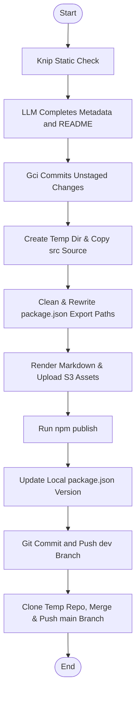

# @1-/dist : Minimalist monorepo package publishing and git synchronization tool

## Functionality

- **Static analysis and risk control**
  Execute Knip static analysis before publishing to detect unused exports, missing declarations, and redundant dependencies.

- **Metadata and documentation automation**
  Detect missing `description` or `keywords` in `package.json`.
  Invoke `opencode` LLM service to complete metadata and generate or update `README.md`.

- **Workspace automatic commit**
  Inspect Git working tree status.
  Automatically commit unstaged modifications via `gci` before publishing.

- **Publish directory sandbox restructuring**
  Create temporary directory under OS temp path.
  Copy only `src` source files.
  Strip development metadata (`devDependencies`, `scripts`, `files`, `lint-staged`) from `package.json`.
  Rewrite relative paths in fields like `exports`, `bin`, `main`, `module`, and `types`.

- **Mermaid diagram SVG rendering and CDN hosting**
  Extract Mermaid diagrams from `README.mdt`.
  Render diagrams to SVG, upload assets to S3 storage, and replace diagram blocks with CDN URLs.
  Generate standard `README.md` locally and HTML-compatible Markdown with embedded SVG URLs in release directory.

- **Automated npm publishing and browser preview**
  Execute public package publishing.
  Increment local patch version upon successful release.
  Automatically open package release page in default browser.

- **Safe multi-branch git synchronization**
  Commit and push changes to `dev` branch.
  Clone local repository to a temporary path via `git clone --shared`.
  Merge branch safely to `main` and push updates to remote.

## Usage demo

Specify target package folder name under monorepo:

```bash
dist <pkg_folder>
```

Example:

```bash
dist walk
```

## Design rationale



## Tech stack

- **Bun**: JS runtime and package manager
- **Simple Git**: Git command executor
- **Knip**: Unused exports and dependencies analyzer
- **Yargs**: Command-line parser
- **AWS S3 SDK**: Cloud storage client

## Code structure

```text
src/
├── dist.js          # CLI entry point
├── exec.js          # Subprocess command executor
├── gci.js           # Git working tree inspector and committer
├── gitMerge.js      # Shared clone git merger
├── gitSync.js       # Git branch synchronization controller
├── knip.js          # Knip static analysis controller
├── pkgJsonClean.js  # Cleans package.json and rewrites export paths
├── prep.js          # Sandboxed folder preprocessor
├── publish.js       # npm publisher and browser opener
├── readme.js        # Markdown renderer and Mermaid processor
├── readmeGen.js     # LLM documentation and metadata generator
├── run.js           # Release process main controller
├── srcReplace.js    # Relative path rewriter
└── svg.js           # SVG renderer and uploader
```

## Historical story

Early Node.js ecosystem published entire directories by default with `npm publish`. This frequently caused accidental leaks of configuration files like `.env`, local credentials, private test files, and redundant build cache. Although features like `.npmignore` and the `files` array in `package.json` were introduced, configuring them remains manual, tedious, and error-prone.

Regarding version control, managing multi-branch synchronization in monorepos typically requires developers to manually run checkout, pull, merge, and push operations. Active development tasks with uncommitted local changes further complicate these commands, increasing risk of merge conflicts and dirty commits.

This tool resolves these issues by utilizing Git shared clones (`git clone --shared`) and sandboxed publish directory restructuring. By compiling code into temporary structures, it eliminates the risk of publishing local files, while automating the git workflow to ensure a zero-configuration, secure release pipeline.