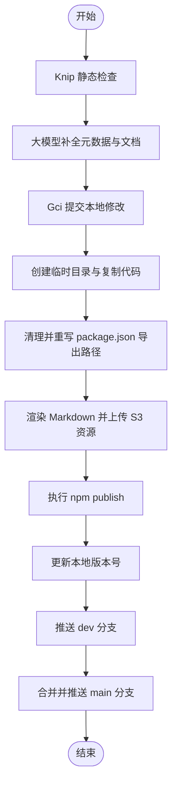

# @1-/dist : 极简 Monorepo 包发布与 Git 同步工具

## 功能介绍

- **静态分析与风险控制**
  发布前运行 Knip 静态分析，检测无用导出、缺失声明与冗余依赖。

- **元数据与文档自动化**
  检测 `package.json` 中的 `description` 与 `keywords` 字段缺失。
  调用 `opencode` 大语言模型服务补全元数据并生成或更新 `README.md`。

- **工作区自动提交**
  检测 Git 工作区状态。
  发布前自动调用 `gci` 提交未暂存修改。

- **发布目录沙箱重构**
  在系统临时目录创建隔离环境。
  仅复制 `src` 源码文件。
  剔除 `package.json` 中的开发字段（`devDependencies`、`scripts`、`files`、`lint-staged`）。
  重写 `exports`、`bin`、`main`、`module`、`types` 等字段中的相对路径。

- **Mermaid 图表 SVG 渲染与托管**
  解析 `README.mdt` 中的 Mermaid 流程图。
  渲染为 SVG 格式，上传至 S3 存储服务，并自动替换为 CDN 链接。
  本地生成标准 `README.md`，发布目录生成内嵌 SVG 链接的 HTML 兼容 Markdown。

- **自动化 npm 发布与浏览器预览**
  执行公开包发布。
  发布成功后自动递增本地修补版本号。
  在默认浏览器中自动打开已发布 npm 包的预览页面。

- **安全多分支 Git 同步**
  提交并推送当前 `dev` 分支变更。
  利用 `git clone --shared` 创建本地共享仓库。
  安全合并至 `main` 分支并推送到远端仓库。

## 使用演示

命令行指定要发布的包目录名称：

```bash
dist <pkg_folder>
```

示例：

```bash
dist walk
```

## 设计思路



## 技术栈

- **Bun**: JS 运行时与包管理器
- **Simple Git**: Git 命令执行器
- **Knip**: 无用导出与依赖静态分析器
- **Yargs**: 命令行参数解析器
- **AWS S3 SDK**: S3 存储服务客户端

## 代码结构

```text
src/
├── dist.js          # CLI 命令行入口
├── exec.js          # 封装子进程命令执行
├── gci.js           # 检测并提交未保存修改
├── gitMerge.js      # 共享仓库分支安全合并
├── gitSync.js       # Git 分支同步与合并主控制
├── knip.js          # Knip 静态分析检查
├── pkgJsonClean.js  # 清理 package.json 冗余字段并重写导出路径
├── prep.js          # 预处理沙箱发布目录与版本号
├── publish.js       # npm 发布与浏览器页面开启
├── readme.js        # Markdown 渲染与 Mermaid 转换
├── readmeGen.js     # 调用大模型生成文档与补全元数据
├── run.js           # 发布流程主控制流
├── srcReplace.js    # 相对路径重写工具
└── svg.js           # SVG 渲染与上传托管
```

## 历史故事

早期 Node.js 生态中，`npm publish` 默认打包并上传当前目录下的全部文件。这频繁导致 `.env` 敏感配置、本地私钥、测试脚本及本地临时文件泄露。虽然社区随后引入 `.npmignore` 与 `package.json` 中的 `files` 白名单机制，但配置过程依旧繁琐且容易遗漏。

在 Git 版本管理方面，Monorepo 架构下的多分支发布通常需要开发者频繁切换分支（`git checkout`）、拉取最新代码（`git pull`）、执行合并（`git merge`）与推送（`git push`）。在未提交本地修改时，这些操作不仅繁琐，且极易导致合并冲突或污染提交历史。

本工具借鉴了 Git 共享克隆（`git clone --shared`）技术与临时目录隔离发布设计。通过在临时沙箱目录重构包结构，从根本上杜绝了开发依赖与私有文件泄露；同时利用自动化的多分支同步流水线，实现零配置的安全发布体验。