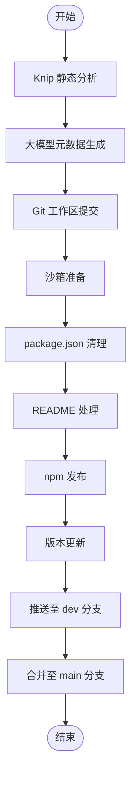

# @1-/dist : Monorepo 包发布与 Git 同步自动化

## 功能介绍

- **静态分析**
  发布前执行 Knip 静态分析，检测无用导出、缺失声明与冗余依赖。

- **元数据自动化**
  检测 `package.json` 中 `description` 与 `keywords` 字段缺失。
  使用大语言模型生成或更新 `README.md`。

- **Git 工作区管理**
  检测仓库状态。
  发布前自动提交未暂存修改。

- **沙箱化发布**
  在系统临时目录创建隔离环境。
  仅复制 `src` 源码文件。
  剔除 `package.json` 中开发相关字段。
  重写 `exports`、`bin`、`main`、`module`、`types` 字段中的相对路径。

- **Mermaid 图表处理**
  解析 `README.mdt` 中的 Mermaid 图表。
  渲染为 SVG 格式并上传至 S3 存储服务。
  替换图表块为 CDN 链接。
  生成标准 `README.md` 与内嵌 SVG 链接的 HTML 兼容 Markdown。

- **自动化发布**
  执行公开 npm 包发布。
  发布成功后自动递增本地修补版本号。
  在默认浏览器中打开已发布包的预览页面。

- **多分支 Git 同步**
  提交并推送变更至 `dev` 分支。
  使用 `git clone --shared` 安全合并。
  合并至 `main` 分支并推送到远端仓库。

## 使用演示

命令行指定要发布的包目录名称：

```bash
dist <pkg_folder>
```

示例：

```bash
dist walk
```

## 设计思路



## 技术栈

- **Bun**: 运行时与包管理器
- **Git CLI**: 版本控制操作
- **Knip**: 静态分析工具
- **Yargs**: 命令行参数解析
- **AWS S3 SDK**: 云存储集成
- **Mermaid**: 图表渲染

## 代码结构

```text
src/
├── dist.js          # CLI 命令行入口
├── exec.js          # 封装子进程命令执行
├── gci.js           # 检测并提交未保存修改
├── gitMerge.js      # 共享仓库分支安全合并
├── gitSync.js       # Git 分支同步与合并主控制
├── knip.js          # Knip 静态分析检查
├── pkgJsonClean.js  # 清理 package.json 冗余字段并重写导出路径
├── prep.js          # 预处理沙箱发布目录与版本号
├── publish.js       # npm 发布与浏览器页面开启
├── readme.js        # Markdown 渲染与 Mermaid 转换
├── readmeGen.js     # 调用大模型生成文档与补全元数据
├── run.js           # 发布流程主控制流
├── srcReplace.js    # 相对路径重写工具
└── svg.js           # SVG 渲染与上传托管
```

## 历史故事

早期 Node.js 包发布依赖 `npm publish` 上传整个目录，频繁导致 `.env` 敏感配置、凭证文件及测试资源泄露。尽管 `.npmignore` 和 `files` 白名单机制提供了缓解方案，但配置过程仍需手动操作且易出错。

Monorepo 架构下的 Git 工作流要求开发者手动管理多分支同步，包括 `git checkout`、`pull`、`merge` 和 `push` 等命令。未提交的本地修改使这些操作更加复杂，增加了合并冲突风险和污染提交历史的可能性。

本工具通过 Git 共享克隆（`git clone --shared`）与沙箱化发布解决上述挑战。临时目录隔离从根本上杜绝了意外文件包含，而自动化的 Git 同步流水线确保了零配置的安全发布体验。