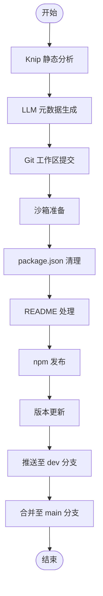

# @1-/dist : Monorepo 包发布自动化与 Git 分支同步

## 功能介绍

- **Knip 静态分析**
  发布前执行 Knip 检查，覆盖 `files`、`dependencies`、`devDependencies`、`optionalPeerDependencies`、`unlisted`、`binaries`、`unresolved`、`exports`、`nsExports`、`types`、`nsTypes`、`enumMembers`、`namespaceMembers`、`duplicates`、`catalog` 等 15 类问题，确保代码健康度。

- **大语言模型元数据生成**
  自动检测 `package.json` 中缺失的 `description` 与 `keywords` 字段。
  通过本地配置的 LLM（`~/.config/OPENAI.js`）生成双语 README，并执行 Mermaid 语法校验与自动修复循环。

- **Git 工作区管理**
  使用 `simple-git` 检测未暂存修改，自动提交以保障发布一致性。

- **沙箱化发布环境**
  创建隔离临时目录（`os.tmpdir()` + `crypto.randomUUID()`），仅复制 `src` 目录内容。
  清理 `package.json`，移除 `devDependencies`、`scripts`、`files`、`lint-staged` 字段。
  重写 `exports`、`bin`、`files`、`main`、`module`、`types` 字段中 `./src/` 为 `./`。

- **Markdown 模板处理**
  解析 `README.mdt` 模板，渲染为 Markdown。
  使用 `@1-/mdimg2cdn` 将本地图片路径转换为 GitHub CDN 链接。
  同步更新源目录、临时目录及指定 `src` 目录下的 README 文件。

- **自动化 npm 发布**
  在沙箱中执行 `npm publish --access public`。
  发布成功后递增修补版本号（`1.2.3` → `1.2.4`），并更新本地 `package.json`。
  跨平台打开 npm 包页面（`open` / `cmd.exe` / `xdg-open`）。

- **多分支 Git 同步**
  自动提交变更至 `dev` 分支（消息为 `"v1.2.4"`），并推送。
  使用 `git clone --shared` 安全高效地合并 `dev` 到 `main`，推送至远程。
  自动维护 `.gitignore`，添加 `/tmp/` 条目防止意外提交。

## 使用演示

安装：

```bash
bun add @1-/dist -D
```

发布指定包：

```bash
dist walk
```

CLI 使用 yargs，仅接受一个位置参数，指定包目录名称。

## 设计思路



工作流严格顺序执行，各阶段含错误处理。Knip 失败立即终止并报告。所有临时目录在 `finally` 块中清理。

## 技术栈

- **Bun**: 运行时与包管理器
- **Simple Git**: Git 操作库
- **Knip**: JavaScript/TypeScript 静态分析工具
- **Yargs**: 命令行参数解析
- **Eta**: 模板引擎
- **@1-/mdt**: Markdown 模板渲染器
- **@1-/mdimg2cdn**: Markdown 图片 CDN 转换器
- **@3-/log**: 日志记录工具
- **@1-/findgit**: Git 根目录查找器
- **@1-/github_cdn**: GitHub CDN 上传封装
- **cersei_rs/logSession**: LLM 会话管理
- **@1-/npmver**: npm 版本检查工具
- **@1-/vernext**: 语义化版本递增工具

## 代码结构

```text
src/
├── dist.js          # CLI 入口，yargs 参数解析
├── exec.js          # 子进程命令执行器
├── gci.js           # Git 工作区检查器
├── gitMerge.js      # 共享克隆 Git 合并器
├── gitSync.js       # Git 分支同步控制器
├── knip.js          # Knip 静态分析控制器
├── prep.js          # 沙箱目录预处理器
├── publish.js       # npm 发布器
├── readme.js        # Markdown 渲染与资源处理
├── readmeGen.js     # LLM 文档生成器
├── run.js           # 发布流程主控制器
├── srcReplace.js    # 相对路径重写器（内嵌于 prep.js）
└── prompt/
    └── readme.eta   # README 生成提示模板
```

## 历史故事

早期 Node.js 包发布依赖 `npm publish` 上传整个目录，频繁导致 `.env` 敏感配置、凭证文件及测试资源泄露。尽管 `.npmignore` 和 `files` 白名单机制提供了缓解方案，但配置过程仍需手动操作且易出错。

Monorepo 架构下的 Git 工作流要求开发者手动管理多分支同步，包括 `git checkout`、`pull`、`merge` 和 `push` 等命令。未提交的本地修改使这些操作更加复杂，增加了合并冲突风险和污染提交历史的可能性。

本工具通过 Git 共享克隆（`git clone --shared`）与沙箱化发布解决上述挑战。临时目录隔离从根本上杜绝了意外文件包含，而自动化的 Git 同步流水线确保了零配置的安全发布体验。架构从简单的 Shell 脚本包装器演变为模块化的 Bun 系统，各关注点分离，支持大规模 Monorepo 的可靠发布。
