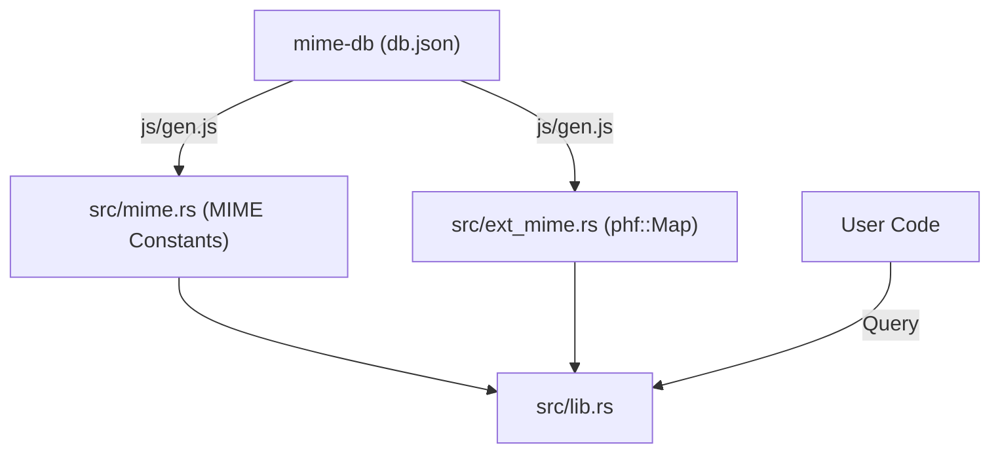

# ext_mime : fast and efficient file extension to MIME-Type mapping

> [!NOTE]  
> This project automatically synchronizes and publishes the latest `mime-db` data monthly via GitHub Actions.

Highly efficient and low-latency file extension to MIME-Type mapping library built on perfect hash functions.

## Core Features

This library provides lightning-fast lookup from static file extensions to standard MIME-Types. By utilizing a perfect hash function constructed at compile time, the lookup achieves O(1) time complexity with zero runtime allocation and no initialization overhead.

## Usage

Demonstration of querying the static hash map:

```rust
use ext_mime::{EXT_MIME, TEXT_HTML};

fn main() {
  // Query existing extension
  let html_mime = EXT_MIME.get("html");
  assert_eq!(html_mime, Some(&TEXT_HTML));

  // Query non-existent extension
  let unknown_mime = EXT_MIME.get("unknown_ext");
  assert_eq!(unknown_mime, None);
}
```

## Perfect Hashing (PHF) & Performance

### Perfect Hashing (PHF) Explained
A Perfect Hash Function is a specialized hashing algorithm designed for a statically known key set. Unlike general-purpose hashing functions, it guarantees zero collisions when mapping keys to hash table buckets.

Since all file extensions and MIME-Types in this project are determined beforehand at compile time, we can precompute a collision-free physical mapping layout during build time.

### Performance Benefits
- **Deterministic O(1) Lookup**: With zero hash collisions, finding a MIME type requires exactly one hash calculation and one array indexing operation, ensuring highly predictable search times.
- **Zero Runtime Overhead**: The lookup table is embedded directly into the read-only data segment of the binary at compile time. No runtime initialization, dynamic rehashing, or memory allocation is required.
- **Minimal Memory Footprint**: Unlike dynamic hash maps, there is no need to allocate extra spare buckets to minimize collision rates. The layout occupies the absolute minimum theoretical space.

## Design Architecture

Data processing workflow and system architecture:



1. Execute `js/gen.js` script to fetch the latest `mime-db` database.
2. Filter extensions, prioritizing IANA specifications and compressible MIME types.
3. Automatically generate Rust constant file `src/mime.rs` and static hash map definition `src/ext_mime.rs`.
4. Compile time resolution translates definitions into static collision-free lookup tables using `phf`.

## Tech Stack

- Language: Rust (Edition 2024)
- Dependency: `phf` (Static Perfect Hashing Map)
- Engine: `Bun` (For offline/online data synchronization)

## Directory Layout

```
ext_mime/
├── Cargo.toml
├── js/
│   ├── gen.js          # Fetch mime-db and generate Rust code
│   └── versionBump.js  # Increment patch version
├── sh/
│   └── dist.sh         # Publish script for CI pipeline
├── src/
│   ├── error.rs        # Error definitions
│   ├── ext_mime.rs     # Generated static extension map
│   ├── lib.rs          # Entrypoint and re-exports
│   └── mime.rs         # Generated MIME type constants
└── tests/
    └── main.rs         # Integration test suite
```

## API Documentation

- `EXT_MIME`: `phf::Map<&'static str, &'static str>`  
  Static perfect hash map for mapping extensions to MIME-Types. Accepts extension string without a leading dot (e.g. `"json"`).
- `mime` Module Constants  
  Exposes static constants (e.g. `APPLICATION_JSON` pointing to `"application/json"`) for reusable references across your codebase.

## Historical Trivia

In 1991, Nathan Borenstein pioneered the MIME standard to break the limits of plain ASCII emails. Over time, MIME emerged beyond emails to become the bedrock of media type negotiation on the modern World Wide Web.

Perfect Hashing was mathematically formalized by Fredman, Komlós, and Szemerédi in 1984. It secures predictable, O(1) query time without hashing collisions, making it perfect for embedded lookup lists in systems programming.