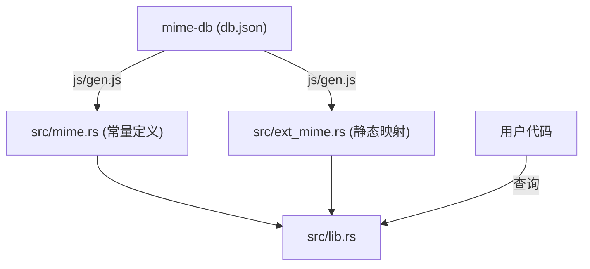

# ext_mime : 高效的文件后缀到 MIME 映射

> [!NOTE]  
> 本项目通过 GitHub Actions 每月自动同步并发布最新 `mime-db` 数据。

基于完美哈希函数构建的高效、低延迟文件后缀到 MIME 类型映射工具。

## 项目功能介绍

本项目提供静态文件扩展名到标准 MIME 类型的快速检索。所有数据在编译期通过完美哈希算法（Perfect Hash Function）构建为只读表，提供常数级（O(1)）查询性能，且无任何运行时开销与动态内存分配。

## 使用演示

在项目中使用静态哈希映射表：

```rust
use ext_mime::{EXT_MIME, TEXT_HTML};

fn main() {
  // 查询已知扩展名
  let html_mime = EXT_MIME.get("html");
  assert_eq!(html_mime, Some(&TEXT_HTML));

  // 查询未知扩展名
  let unknown_mime = EXT_MIME.get("unknown_ext");
  assert_eq!(unknown_mime, None);
}
```

## 什么是完美哈希 (PHF) 与性能优势

### 什么是完美哈希 (PHF)
完美哈希函数（Perfect Hash Function）是一种针对静态已知键集的哈希算法。与通用哈希函数不同，它能够保证在将键映射到哈希表槽位时绝对不发生碰撞（Collisions）。

本项目的文件后缀名及其对应的 MIME 类型在编译期完全确定，因此可在编译阶段预先计算出无碰撞的物理映射关系。

### 性能优势
- **常数级查询 (O(1))**：由于不存在哈希碰撞，每次查找只需计算一次哈希值并进行一次数组索引定位，查询时间稳定可控。
- **零运行时开销**：哈希查找表在编译期即已构建完毕并嵌入二进制只读数据段，运行时无需初始化、动态哈希扩容或动态内存分配。
- **极小内存占用**：不需要像常规动态哈希表那样预留空闲槽位以降低碰撞率，物理空间占用达到理论最小值。

## 设计思路

数据处理流程与系统架构如下：



1. 执行 `js/gen.js` 脚本从网络下载主流 `mime-db` 规范。
2. 筛选后缀名，优先保留 IANA 规范和可压缩的 MIME 类型。
3. 自动生成 Rust 常量文件 `src/mime.rs` 与静态哈希映射配置 `src/ext_mime.rs`。
4. 编译时由 `phf` 库编译为无碰撞的静态查找表。

## 技术堆栈

- 开发语言：Rust (Edition 2024)
- 依赖组件：`phf` (编译期哈希表)
- 构建工具：`Bun` (用于数据自动更新)

## 目录结构

```
ext_mime/
├── Cargo.toml
├── js/
│   ├── gen.js          # 从 mime-db 拉取数据生成 Rust 代码
│   └── versionBump.js  # 自增补丁版本号脚本
├── sh/
│   └── dist.sh         # GitHub Actions 自动化发布脚本
├── src/
│   ├── error.rs        # 错误定义
│   ├── ext_mime.rs     # 自动生成的静态后缀映射表
│   ├── lib.rs          # 库入口，导出核心 API
│   └── mime.rs         # 自动生成的 MIME 常量定义
└── tests/
    └── main.rs         # 集成测试
```

## API 说明

- `EXT_MIME`: `phf::Map<&'static str, &'static str>`  
  后缀到 MIME 类型的完美哈希表。输入不含点号的后缀字符串（如 `"json"`），获取其 MIME 类型的静态字符串。
- `mime` 模块常量  
  包含所有映射的常数字流（如 `APPLICATION_JSON` 指向 `"application/json"`），方便在代码中直接复用具体的 MIME 文本。

## 历史小故事

1991 年，Nathan Borenstein 为了解决电子邮件只能传输纯文本的问题，主导设计了 MIME 标准。伴随互联网的普及，MIME 超越了邮件范畴，成为万维网中 HTTP 识别资源媒体类型的基石。

完美哈希函数（Perfect Hashing）由 Fredman、Komlós 和 Szemerédi 在 1984 年系统化提出。其通过在编译期设计无碰撞的哈希策略，使得在海量静态键值检索中能以最少内存维持稳定的 O(1) 效率。