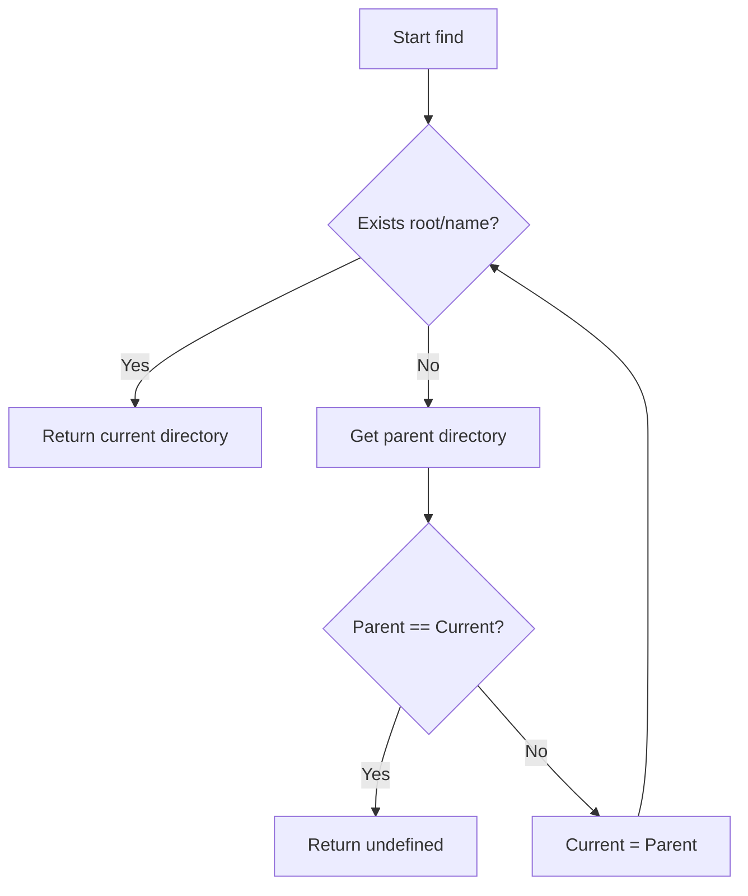
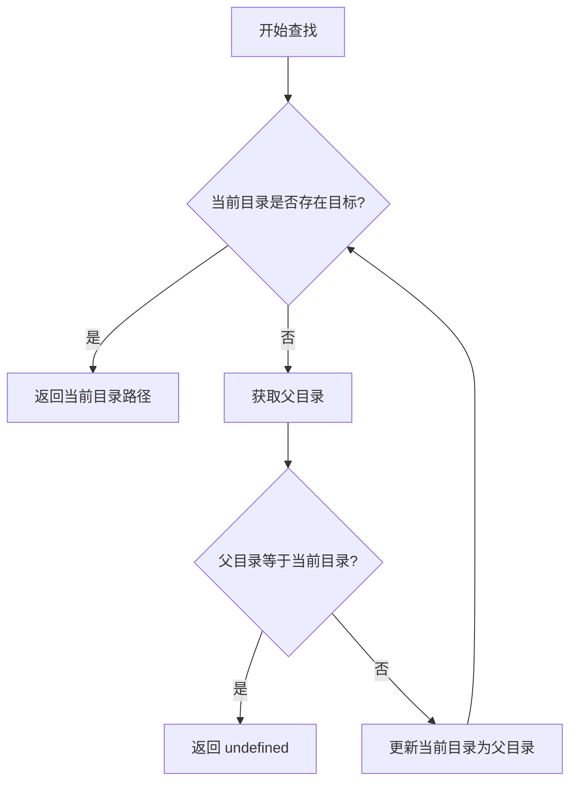

[English](#en) | [中文](#zh)

---

<a id="en"></a>
# @1-/find : Locate directory containing target file by walking up parent paths

## Features

- Walks up directory tree from specified starting path.
- Locates target file or folder.
- Returns containing directory path, or undefined if not found.
- Operates with zero dependencies using Node.js native modules.

## Usage

```javascript
import find from "@1-/find";

const rootDir = find(import.meta.dirname, "package.json");
console.log(rootDir); // Outputs directory path containing package.json
```

## Design

The module accepts starting directory path and target name. It checks for target existence at current level. If target is absent, it retrieves parent directory. When parent directory equals current directory (indicating root boundary), the loop terminates and returns undefined. Otherwise, the current directory updates to parent directory to repeat the lookup.



## Tech Stack

- JavaScript (ES Module)
- Bun (Test runner)
- Node.js native modules (`node:fs`, `node:path`)

## Directory Structure

```
.
├── src/
│   └── _.js            # Core implementation
├── tests/
│   └── _.test.js       # Test suite
├── readme/
│   ├── en/
│   │   └── README.md    # English documentation
│   └── zh/
│       └── README.md    # Chinese documentation
├── package.json
└── README.mdt
```

## History

Locating configuration files by traversing upward through the directory tree is a standard pattern in modern software tools. Tools such as Git (searching for `.git`) and npm (searching for `node_modules` or `package.json`) employ this lookup strategy. The technique dates back to early Unix hierarchical file system designs, resolving global configuration lookups inside nested paths efficiently.
../doc/en/about.md

---

<a id="zh"></a>
# @1-/find : 向上递归查找包含指定文件或文件夹的目录

## 功能介绍

- 从起点目录出发向上逐级查找。
- 定位目标文件或文件夹。
- 返回包含目标的目录路径，未找到时返回 undefined。
- 零依赖，使用 Node.js 原生模块。

## 使用演示

```javascript
import find from "@1-/find";

const rootDir = find(import.meta.dirname, "package.json");
console.log(rootDir); // 输出包含 package.json 的目录路径
```

## 设计思路

模块接收起点路径与目标名称。在循环中检测当前目录下是否存在目标。若不存在，获取父目录。若父目录与当前目录相同（说明已到达根目录），则退出循环并返回 undefined。否则，将当前目录更新为父目录并继续循环。



## 技术栈

- JavaScript (ES Module)
- Bun (测试运行器)
- Node.js 原生模块 (`node:fs`, `node:path`)

## 目录结构

```
.
├── src/
│   └── _.js            # 核心实现
├── tests/
│   └── _.test.js       # 测试文件
├── readme/
│   ├── en/
│   │   └── README.md    # 英文文档
│   └── zh/
│       └── README.md    # 中文文档
├── package.json
└── README.mdt
```

## 历史背景

通过向上递归查找配置文件是现代软件开发工具的经典设计模式。诸如 Git（寻找 `.git` 目录）与 npm（寻找 `node_modules` 或 `package.json`）均采用此类查找逻辑。该设计可追溯到早期 Unix 分层文件系统的检索机制，高效解决了在多层嵌套子目录中定位全局配置文件的难题。
../doc/zh/about.md
