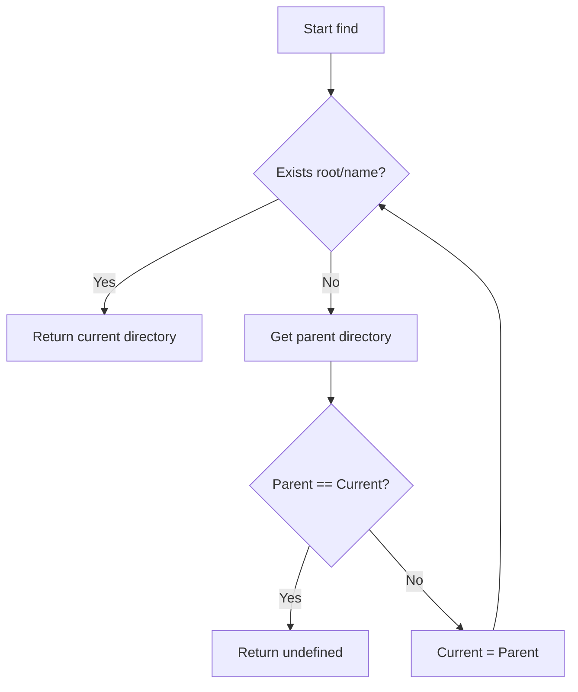
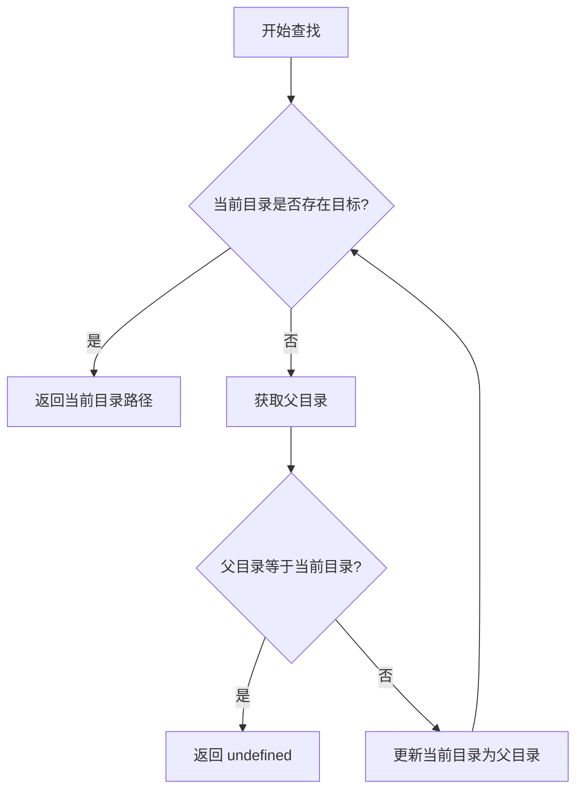

[English](#en) | [中文](#zh)

---

<a id="en"></a>
# @1-/find : Locate directory containing target file by walking up parent paths

- [@1-/find : Locate directory containing target file by walking up parent paths](#1-find-locate-directory-containing-target-file-by-walking-up-parent-paths)
  - [Features](#features)
  - [Usage](#usage)
  - [Design](#design)
  - [Tech Stack](#tech-stack)
  - [Code Structure](#code-structure)
  - [History](#history)
  - [About](#about)

## Features

Traverses directory tree upward from starting path.

Locates target file or folder.

Returns directory path containing target, or `undefined` if not found.

Zero dependencies, using Node.js native modules.

## Usage

```javascript
import find from "@1-/find";

const rootDir = find(import.meta.dirname, "package.json");
console.log(rootDir); // Outputs directory path containing package.json
```

## Design

The module accepts starting directory path and target name.

It checks for target existence at current level.

If target is absent, it retrieves parent directory.

When parent directory equals current directory (indicating root boundary), the loop terminates and returns `undefined`.

Otherwise, the current directory updates to parent directory to repeat the lookup.



## Tech Stack

- JavaScript (ES Module)
- Bun (Test runner)
- Node.js native modules (`node:fs`, `node:path`)

## Code Structure

```
.
├── src/
│   └── _.js            # Core implementation
├── test/
│   └── _.test.js       # Test suite
├── readme/
│   ├── en/
│   │   └── README.md    # English documentation
│   └── zh/
│       └── README.md    # Chinese documentation
├── package.json
└── README.mdt
```

## History

Traversing upward to locate configurations is standard practice in software engineering.

Tools like Git and npm employ this strategy to locate workspace roots.

The pattern dates back to Unix hierarchical file systems, solving configuration lookups in nested directories.

## About

This library is developed by [WebC.site](https://webc.site).

[WebC.site](https://webc.site): A new paradigm of web development for AI


---

<a id="zh"></a>
# @1-/find : 向上递归查找包含指定目标的目录

- [@1-/find : 向上递归查找包含指定目标的目录](#1-find-向上递归查找包含指定目标的目录)
  - [功能介绍](#功能介绍)
  - [使用演示](#使用演示)
  - [设计思路](#设计思路)
  - [技术栈](#技术栈)
  - [代码结构](#代码结构)
  - [历史故事](#历史故事)
  - [关于](#关于)

## 功能介绍

从起点目录出发，向上逐级检索。

定位目标文件或目录。

返回包含目标的目录路径，未找到时返回 `undefined`。

无需外部依赖，直接基于 Node.js 原生模块。

## 使用演示

```javascript
import find from "@1-/find";

const rootDir = find(import.meta.dirname, "package.json");
console.log(rootDir); // 输出包含 package.json 的目录路径
```

## 设计思路

模块接收起点路径与目标名称。

在循环中检测当前目录下是否存在目标。

若不存在目标，获取父目录。

若父目录与当前目录相同（说明已到达根目录），则退出循环并返回 `undefined`。

否则，更新当前目录为父目录并继续循环。



## 技术栈

- JavaScript (ES Module)
- Bun (测试运行器)
- Node.js 原生模块 (`node:fs`, `node:path`)

## 代码结构

```
.
├── src/
│   └── _.js            # 核心实现
├── test/
│   └── _.test.js       # 测试文件
├── readme/
│   ├── en/
│   │   └── README.md    # 英文文档
│   └── zh/
│       └── README.md    # 中文文档
├── package.json
└── README.mdt
```

## 历史故事

向上递归寻找配置是软件工程的常用设计。

Git 与 npm 等工具均采用此逻辑定位工作区根目录。

该设计源于 Unix 早期分层文件系统的检索机制，解决嵌套子路径定位全局配置的难题。

## 关于

本库由 [WebC.site](https://webc.site) 开发。

[WebC.site](https://webc.site) : 面向人工智能的网站开发新范式

