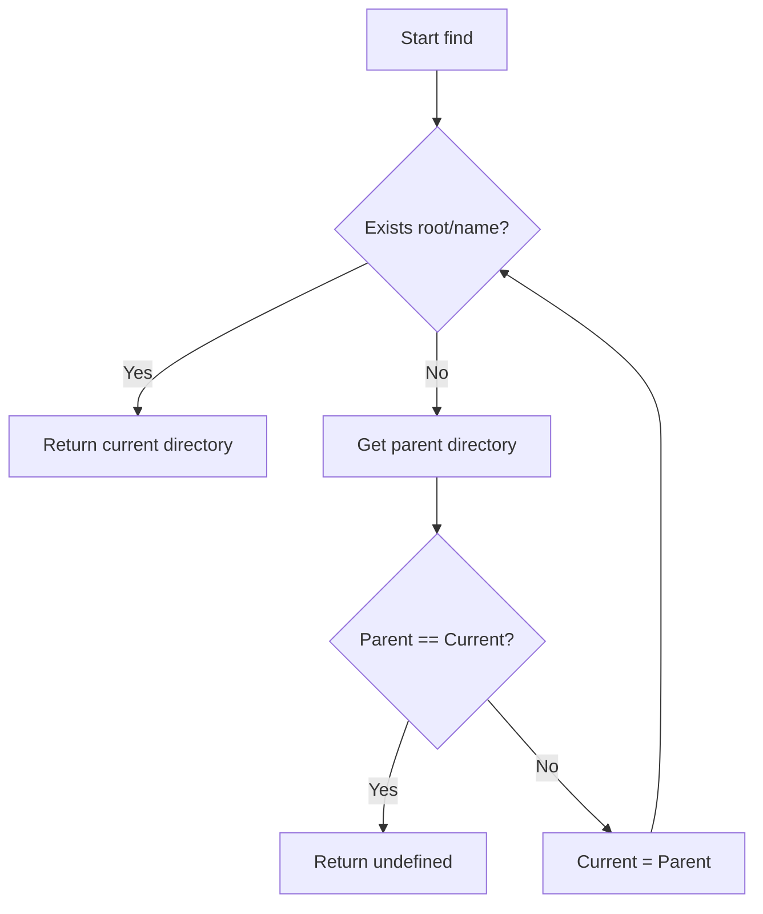

# @1-/find : Locate directory containing target file by walking up parent paths

## Features

Traverses directory tree upward from starting path.

Locates target file or folder.

Returns directory path containing target, or `undefined` if not found.

Zero dependencies, using Node.js native modules.

## Usage

```javascript
import find from "@1-/find";

const rootDir = find(import.meta.dirname, "package.json");
console.log(rootDir); // Outputs directory path containing package.json
```

## Design

The module accepts starting directory path and target name.

It checks for target existence at current level.

If target is absent, it retrieves parent directory.

When parent directory equals current directory (indicating root boundary), the loop terminates and returns `undefined`.

Otherwise, the current directory updates to parent directory to repeat the lookup.



## Tech Stack

- JavaScript (ES Module)
- Bun (Test runner)
- Node.js native modules (`node:fs`, `node:path`)

## Code Structure

```
.
├── src/
│   └── _.js            # Core implementation
├── tests/
│   └── _.test.js       # Test suite
├── readme/
│   ├── en/
│   │   └── README.md    # English documentation
│   └── zh/
│       └── README.md    # Chinese documentation
├── package.json
└── README.mdt
```

## History

Traversing upward to locate configurations is standard practice in software engineering.

Tools like Git and npm employ this strategy to locate workspace roots.

The pattern dates back to Unix hierarchical file systems, solving configuration lookups in nested directories.
