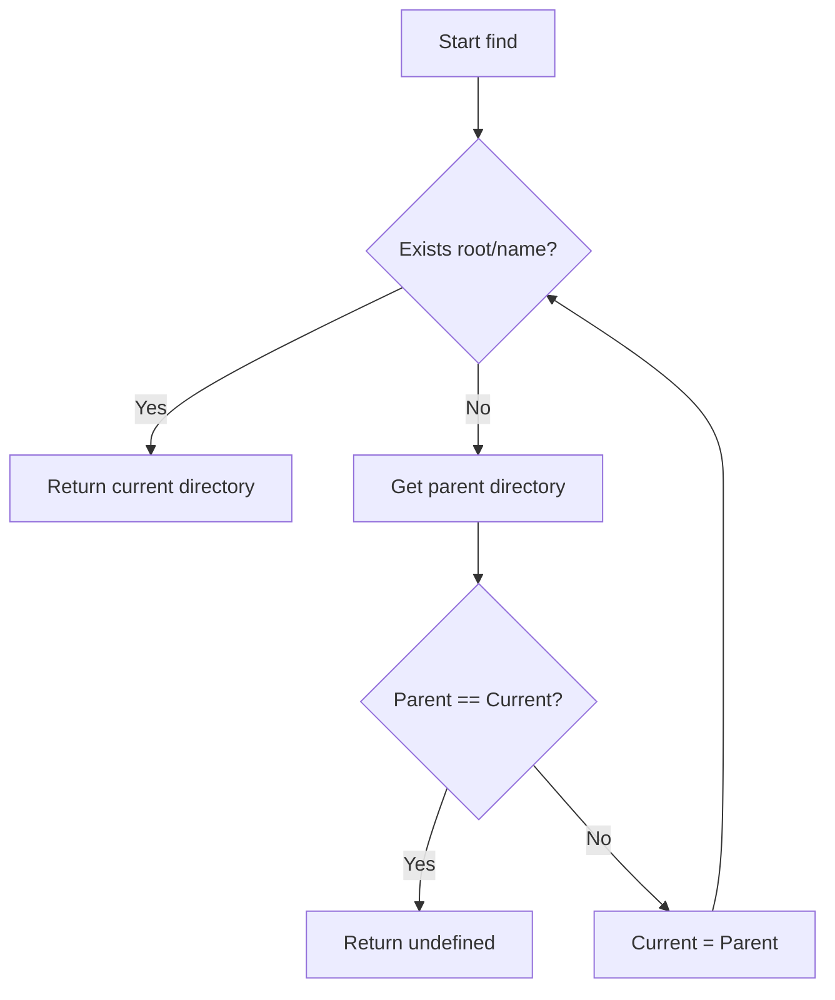

# @1-/find : Locate directory containing target file by walking up parent paths

## Features

- Walks up directory tree from specified starting path.
- Locates target file or folder.
- Returns containing directory path, or undefined if not found.
- Operates with zero dependencies using Node.js native modules.

## Usage

```javascript
import find from "@1-/find";

const rootDir = find(import.meta.dirname, "package.json");
console.log(rootDir); // Outputs directory path containing package.json
```

## Design

The module accepts starting directory path and target name. It checks for target existence at current level. If target is absent, it retrieves parent directory. When parent directory equals current directory (indicating root boundary), the loop terminates and returns undefined. Otherwise, the current directory updates to parent directory to repeat the lookup.



## Tech Stack

- JavaScript (ES Module)
- Bun (Test runner)
- Node.js native modules (`node:fs`, `node:path`)

## Directory Structure

```
.
├── src/
│   └── _.js            # Core implementation
├── tests/
│   └── _.test.js       # Test suite
├── readme/
│   ├── en/
│   │   └── README.md    # English documentation
│   └── zh/
│       └── README.md    # Chinese documentation
├── package.json
└── README.mdt
```

## History

Locating configuration files by traversing upward through the directory tree is a standard pattern in modern software tools. Tools such as Git (searching for `.git`) and npm (searching for `node_modules` or `package.json`) employ this lookup strategy. The technique dates back to early Unix hierarchical file system designs, resolving global configuration lookups inside nested paths efficiently.
