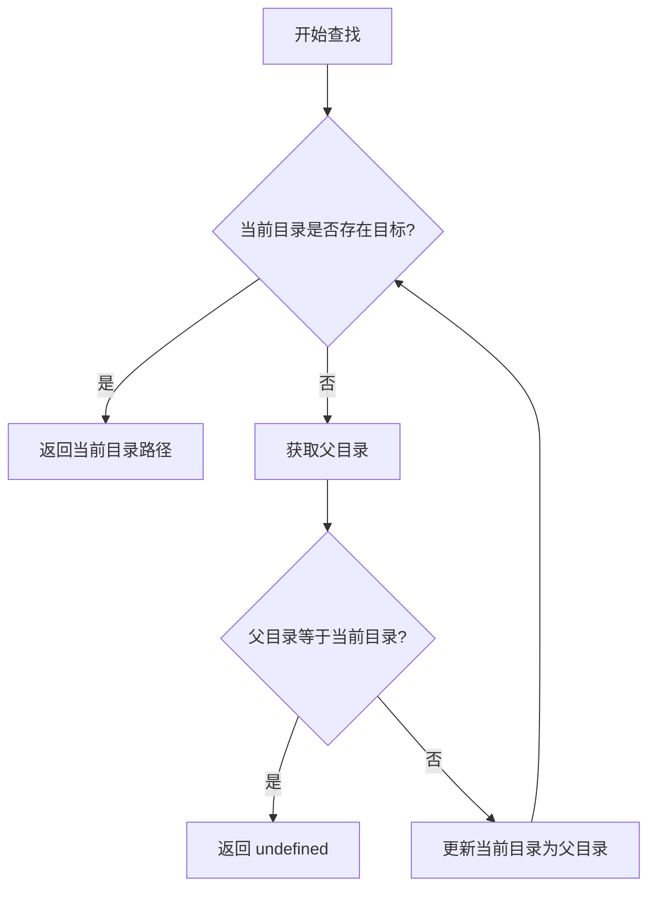

# @1-/find : 向上递归查找包含指定目标的目录

## 功能介绍

从起点目录出发，向上逐级检索。

定位目标文件或目录。

返回包含目标的目录路径，未找到时返回 `undefined`。

无需外部依赖，直接基于 Node.js 原生模块。

## 使用演示

```javascript
import find from "@1-/find";

const rootDir = find(import.meta.dirname, "package.json");
console.log(rootDir); // 输出包含 package.json 的目录路径
```

## 设计思路

模块接收起点路径与目标名称。

在循环中检测当前目录下是否存在目标。

若不存在目标，获取父目录。

若父目录与当前目录相同（说明已到达根目录），则退出循环并返回 `undefined`。

否则，更新当前目录为父目录并继续循环。



## 技术栈

- JavaScript (ES Module)
- Bun (测试运行器)
- Node.js 原生模块 (`node:fs`, `node:path`)

## 代码结构

```
.
├── src/
│   └── _.js            # 核心实现
├── tests/
│   └── _.test.js       # 测试文件
├── readme/
│   ├── en/
│   │   └── README.md    # 英文文档
│   └── zh/
│       └── README.md    # 中文文档
├── package.json
└── README.mdt
```

## 历史故事

向上递归寻找配置是软件工程的常用设计。

Git 与 npm 等工具均采用此逻辑定位工作区根目录。

该设计源于 Unix 早期分层文件系统的检索机制，解决嵌套子路径定位全局配置的难题。
