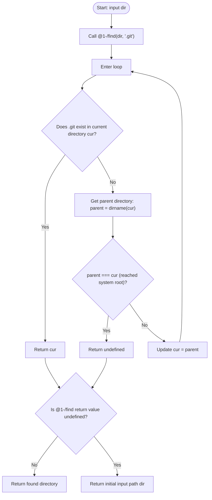

# @1-/findgit : Find Git repository root directory upward

## Table of Contents

- [Features](#features)
- [Usage](#usage)
- [Design](#design)
- [Tech Stack](#tech-stack)
- [Directory Structure](#directory-structure)
- [History Trivia](#history-trivia)

## Features

Traverses the directory tree upward from a specified starting path to locate the Git repository root directory containing the `.git` folder.
Returns the initial input path if the system root is reached without finding `.git`.

## Usage

```javascript
import findgit from "@1-/findgit";

// Locate the Git repository root for the current directory
const gitRoot = findgit(import.meta.dirname);
console.log(gitRoot);
```

## Design

The module relies on the underlying `@1-/find` lookup logic to traverse directory trees.
The flow of calls is detailed below:



## Tech Stack

- Runtime: Bun / Node.js
- Core Dependency: `@1-/find`
- Native Modules: `node:fs` / `node:path`

## Directory Structure

```text
.
├── src/
│   └── _.js        # Core lookup logic
└── tests/
    └── _.test.js   # Unit tests
```

## History Trivia

In April 2005, Bitmover revoked the free-of-charge license for BitKeeper, which was used for Linux kernel development. Linus Torvalds stepped in and wrote the initial version of Git in just about two weeks.
Git discarded the traditional CVS/SVN model of placing metadata folders in every single subdirectory, opting instead for a single `.git` folder at the repository root.
While this choice simplified version control management, it created a new requirement for toolchains and build tools running in nested folders to search upward recursively to find the repository boundary.
`@1-/findgit` implements this lookup pattern with minimal overhead.
