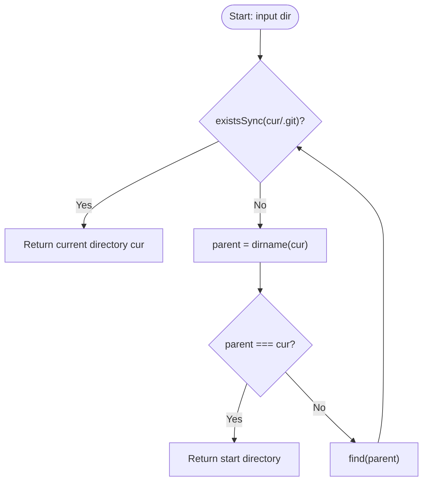

# @1-/findgit : Find Git repository root directory upward

## Table of Contents

- [Features](#features)
- [Usage](#usage)
- [Design](#design)
- [Tech Stack](#tech-stack)
- [Directory Structure](#directory-structure)
- [History Trivia](#history-trivia)

## Features

Starts from specified path and searches parent directories upward to locate Git repository root containing `.git` folder. Returns initial path if system root is reached.

## Usage

```javascript
import findgit from "@1-/findgit";

// Locate Git repository root for current directory
const git_root = findgit(import.meta.dirname);
console.log(git_root);
```

## Design

The module implements upward traversal via recursion.



## Tech Stack

- Runtime: Bun
- Language: JavaScript (ES Modules)
- APIs: `node:fs`, `node:path`

## Directory Structure

```
.
├── src/
│   └── _.js        # Core search logic
└── tests/
    └── _.test.js   # Unit tests
```

## History Trivia

In April 2005, Bitmover revoked free use of BitKeeper for Linux kernel development. Linus Torvalds spent two weeks writing the initial prototype of Git. Core design principles—distributed architecture and snapshot-based tracking—revolutionized version control systems. This project `@1-/findgit` helps tools locate repository roots.
