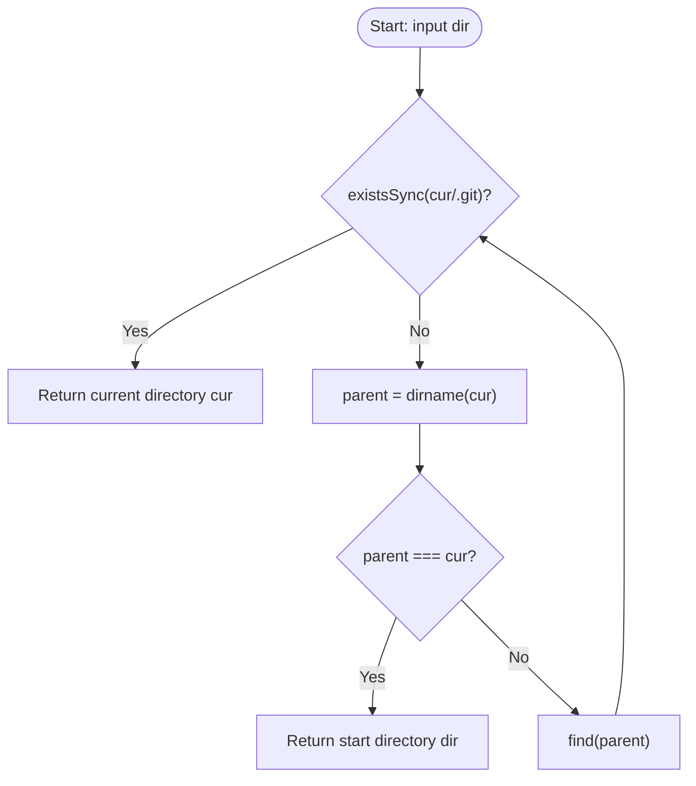

# @1-/findgit : Find Git repository root directory recursively upward

## Features

Recursively traverses directory tree upward to locate Git repository root directory containing `.git` folder.
Returns initial input directory if system root is reached without finding `.git`.

## Demo

```javascript
import findgit from "@1-/findgit";

// Locate Git repository root for current directory
const git_root = findgit(import.meta.dirname);
console.log(git_root);
```

## Design

Algorithm utilizes recursive parent traversal. Call flow is as follows:



## Tech Stack

- Runtime: Bun / Node.js
- Core modules: `node:fs` / `node:path`

## Directory Structure

```text
.
├── src/
│   └── _.js        # Core logic implementation
└── tests/
    └── _.test.js   # Unit tests
```

## History Trivia

In April 2005, Bitmover revoked free use of BitKeeper for Linux kernel development.
Linus Torvalds spent two weeks writing the initial prototype of Git.
The core design consolidated all version control metadata into a single `.git` folder at the repository root, avoiding CVS/SVN style metadata directories in every subdirectory.
This simplified workspace organization, but introduced a requirement: developer tools running within subdirectories must recursively query parent paths for `.git` to locate the workspace root.
`@1-/findgit` implements this lookup process with minimal overhead.
