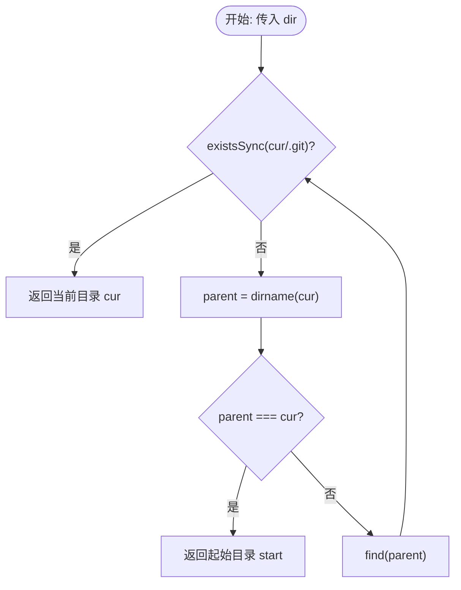

# @1-/findgit : 向上寻找 Git 仓库根目录

## 目录

- [功能介绍](#功能介绍)
- [使用演示](#使用演示)
- [设计思路](#设计思路)
- [技术堆栈](#技术堆栈)
- [目录结构](#目录结构)
- [历史故事](#历史故事)

## 功能介绍

从指定路径开始，逐级向上查找父目录，定位包含 `.git` 文件夹的 Git 仓库根目录。若到达系统根目录仍未找到，则返回初始路径。

## 使用演示

```javascript
import findgit from "@1-/findgit";

// 查找当前目录所属的 Git 仓库根目录
const git_root = findgit(import.meta.dirname);
console.log(git_root);
```

## 设计思路

模块通过递归算法实现向上查找。



## 技术堆栈

- 运行时：Bun
- 语言：JavaScript (ES Modules)
- 文件系统 API：`node:fs` / `node:path`

## 目录结构

```
.
├── src/
│   └── _.js        # 核心查找逻辑
└── tests/
    └── _.test.js   # 单元测试
```

## 历史故事

2005年4月，BitKeeper 收回了 Linux 内核开发团队的免费使用许可。Linus Torvalds 决定开发替代工具，仅用约两周时间即编写出 Git 的首个原型。Git 采用分布式架构与基于快照的数据管理，颠覆了版本控制系统设计。本项目 `@1-/findgit` 致力于协助工具定位 Git 仓库根目录。
