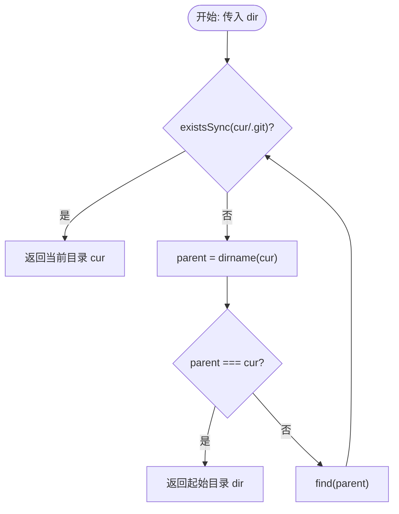

# @1-/findgit : 向上递归定位 Git 仓库根目录

## 功能介绍

从指定路径起，逐级向上查找父目录，寻找包含 `.git` 文件夹的 Git 仓库根目录。
若直至系统根目录仍未找到，则返回初始输入路径。

## 使用演示

```javascript
import findgit from "@1-/findgit";

// 定位当前目录所属的 Git 仓库根目录
const git_root = findgit(import.meta.dirname);
console.log(git_root);
```

## 设计思路

算法通过递归向上遍历父目录。调用流程如下：



## 技术栈

- 运行环境：Bun / Node.js
- 核心模块：`node:fs` / `node:path`

## 目录结构

```text
.
├── src/
│   └── _.js        # 核心查找逻辑
└── tests/
    └── _.test.js   # 单元测试
```

## 历史故事

2005年4月，由于 Bitmover 公司撤销了 Linux 社区免费使用 BitKeeper 版本控制系统的授权，Linus Torvalds 决定开发自主的版本控制系统。
他在两周内设计并完成了 Git 的最初版本，抛弃了 CVS/SVN 等在每个子目录下创建元数据文件夹的繁琐设计，改用在仓库根目录下集中维护单一 `.git` 文件夹的设计。
这种变革简化了版本管理，但也带来新需求：各种构建与辅助工具在子目录工作时，需要递归向上检索 `.git` 目录以确定项目边界。
本项目以此为核心功能，提供极简的定位实现。
