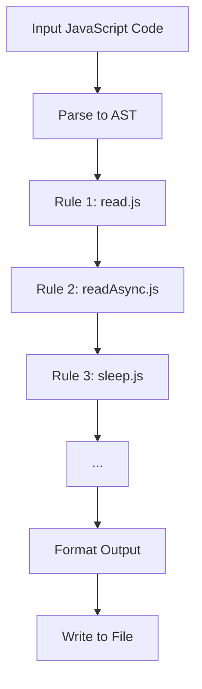
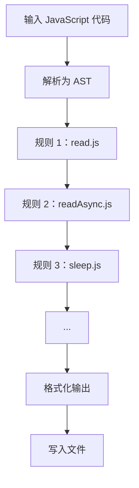

[English](#en) | [中文](#zh)

---

<a id="en"></a>
# fix : JavaScript code transformation tool

- [fix : JavaScript code transformation tool](#fix-javascript-code-transformation-tool)
  - [Functionality](#functionality)
  - [Usage demonstration](#usage-demonstration)
  - [Design approach](#design-approach)
  - [Technology stack](#technology-stack)
  - [Code structure](#code-structure)
  - [Historical context](#historical-context)
  - [About](#about)

## Functionality

Automatically refactors JavaScript source code by safely converting common legacy patterns into modern equivalents. All transformations operate on the AST to guarantee semantic preservation, improving readability and maintainability.

## Usage demonstration

Install as a development dependency:

```bash
npm install --save-dev @1-/fix
```

Run on current directory:

```bash
npx @1-/fix
```

Run on specific files:

```bash
npx @1-/fix src/index.js src/utils.js
```

## Design approach

The tool uses a single-pass, multi-rule AST pipeline architecture. Each rule receives the current code and AST, and returns modified code. If a change occurs, the AST is reparsed and subsequent rules are applied — continuing until no further changes occur or all rules are exhausted.



## Technology stack

- Runtime: Node.js or Bun
- AST parser: `yuku-parser`
- Code formatter: `oxfmt`
- Core utilities: `@3-/log`, `@3-/read`, `@3-/write`, `@1-/walk`

## Code structure

```
src/
├── fix.js          # CLI entry point; handles args and file discovery
├── run.js          # Main loop for batch file processing
├── rule.js         # Rule orchestrator; applies all transforms in sequence
├── lib/            # Generic AST utility functions
│   ├── TYPE.js     # AST node type constants
│   ├── walk.js     # Depth-first AST walker
│   ├── applyEdits.js # Position-based text replacement
│   ├── importAdd.js # Smart import statement injection
│   └── createReplace.js # Rule template: detect + replace + import management
└── replace/        # Concrete transformation implementations
    ├── read.js        # fs.readFileSync → read
    ├── readAsync.js   # fs.readFile → readAsync
    ├── sleep.js       # Promise + setTimeout → sleep
    ├── constMerge.js  # Merge consecutive const declarations
    ├── env.js         # process.env → env
    ├── utf8e.js       # new TextEncoder().encode() → utf8e()
    └── while.js       # while(true) → for(;;)
```

## Historical context

The concept of codemod traces back to Program Transformation Systems of the 1970s (e.g., ELI, DMS). Facebook’s jscodeshift, released in 2015, brought AST-driven JavaScript refactoring into mainstream developer workflows. This tool continues that tradition, focusing on lightweight, precise, zero-configuration optimizations for everyday use.

## About

This library is developed by [WebC.site](https://webc.site).

[WebC.site](https://webc.site): A new paradigm of web development for AI


---

<a id="zh"></a>
# fix : JavaScript 代码转换工具

- [fix : JavaScript 代码转换工具](#fix-javascript-代码转换工具)
  - [功能介绍](#功能介绍)
  - [使用演示](#使用演示)
  - [设计思路](#设计思路)
  - [技术栈](#技术栈)
  - [代码结构](#代码结构)
  - [历史故事](#历史故事)
  - [关于](#关于)

## 功能介绍

自动重构 JavaScript 源码，将常见遗留模式安全转换为现代等效形式。所有转换均基于 AST 分析，确保语义不变，提升可读性与可维护性。

## 使用演示

作为开发依赖安装：

```bash
npm install --save-dev @1-/fix
```

在当前目录运行：

```bash
npx @1-/fix
```

指定文件运行：

```bash
npx @1-/fix src/index.js src/utils.js
```

## 设计思路

工具采用单次遍历、多规则串联的 AST 管道架构。每个规则接收原始代码与 AST，返回修改后代码；若发生变更，则重新解析 AST 并继续后续规则，直至无变化或规则耗尽。



## 技术栈

- 运行时：Node.js 或 Bun
- AST 解析器：`yuku-parser`
- 代码格式化：`oxfmt`
- 核心工具库：`@3-/log`、`@3-/read`、`@3-/write`、`@1-/walk`

## 代码结构

```
src/
├── fix.js          # CLI 入口，处理命令行参数与文件发现
├── run.js          # 批量文件处理主循环
├── rule.js         # 规则调度器，按序应用全部转换规则
├── lib/            # 通用 AST 工具函数
│   ├── TYPE.js     # AST 节点类型常量
│   ├── walk.js     # 深度优先 AST 遍历器
│   ├── applyEdits.js # 基于位置的文本替换
│   ├── importAdd.js # 智能导入语句注入
│   └── createReplace.js # 规则模板：检测 + 替换 + 导入管理
└── replace/        # 具体转换规则实现
    ├── read.js        # fs.readFileSync → read
    ├── readAsync.js   # fs.readFile → readAsync
    ├── sleep.js       # Promise + setTimeout → sleep
    ├── constMerge.js  # 合并连续 const 声明
    ├── env.js         # process.env → env
    ├── utf8e.js       # new TextEncoder().encode() → utf8e()
    └── while.js       # while(true) → for(;;)
```

## 历史故事

现代 codemod 概念可追溯至 1970 年代的 Program Transformation Systems（如 ELI、DMS）。2015 年 Facebook 推出 jscodeshift，首次将 AST 驱动的 JavaScript 重构带入主流开发流程。本工具延续该范式，聚焦轻量、精准、零配置的日常优化场景。

## 关于

本库由 [WebC.site](https://webc.site) 开发。

[WebC.site](https://webc.site) : 面向人工智能的网站开发新范式

