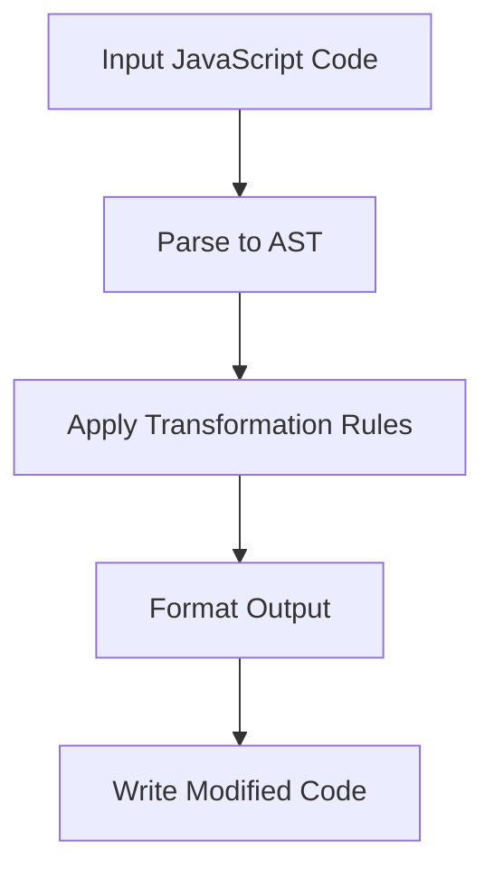
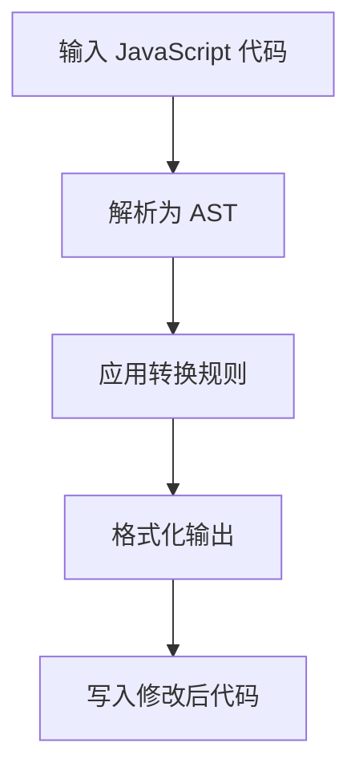

[English](#en) | [中文](#zh)

---

<a id="en"></a>

# fix : JavaScript code transformation tool

- [fix : JavaScript code transformation tool](#fix-javascript-code-transformation-tool)
  - [Functionality](#functionality)
  - [Usage demonstration](#usage-demonstration)
  - [Design approach](#design-approach)
  - [Technology stack](#technology-stack)
  - [Code structure](#code-structure)
  - [Historical context](#historical-context)
  - [About](#about)

## Functionality

Transforms JavaScript code by applying automated refactorings to modernize syntax and improve readability. Converts legacy patterns to cleaner, more maintainable equivalents without changing program behavior.

## Usage demonstration

Install as a development dependency:

```bash
npm install --save-dev @3-/fix
```

Run on current directory:

```bash
npx @3-/fix
```

Run on specific files:

```bash
npx @3-/fix src/index.js src/utils.js
```

## Design approach

The tool follows a pipeline architecture where each transformation rule operates on the AST representation of the code. Rules are applied sequentially until no further changes occur.



## Technology stack

- JavaScript runtime (Bun or Node.js)
- yuku-parser for AST parsing
- oxfmt for code formatting
- Custom transformation rules implemented in JavaScript

## Code structure

```
src/
├── fix.js          # Command-line entry point
├── run.js          # Core processing logic
├── rule.js         # Rule orchestration
├── lib/            # Utility functions
│   ├── TYPE.js     # AST node type constants
│   ├── applyEdits.js # Apply text replacements
│   └── ...         # Other utilities
└── replace/        # Individual transformation rules
    ├── sleep.js    # setTimeout → sleep conversion
    ├── read.js     # fs.readFileSync → read conversion
    ├── readAsync.js # fs.readFile → readAsync conversion
    ├── constMerge.js # Merge consecutive const declarations
    └── ...         # Other transformation rules
```

## Historical context

Code transformation tools trace their origins to early compiler optimizations in the 1960s. Modern JavaScript codemods evolved from Facebook's jscodeshift in 2015, enabling large-scale refactoring across codebases. This tool continues that tradition by providing focused, safe transformations for common JavaScript patterns.

## About

This library is developed by [WebC.site](https://webc.site).

[WebC.site](https://webc.site): A new paradigm of web development for AI

---

<a id="zh"></a>

# fix : JavaScript 代码转换工具

- [fix : JavaScript 代码转换工具](#fix-javascript-代码转换工具)
  - [功能介绍](#功能介绍)
  - [使用演示](#使用演示)
  - [设计思路](#设计思路)
  - [技术栈](#技术栈)
  - [代码结构](#代码结构)
  - [历史故事](#历史故事)
  - [关于](#关于)

## 功能介绍

自动重构 JavaScript 代码，将传统语法模式转换为更简洁、可维护的现代等效形式。在不改变程序行为的前提下提升代码可读性与可维护性。

## 使用演示

作为开发依赖安装：

```bash
npm install --save-dev @3-/fix
```

在当前目录运行：

```bash
npx @3-/fix
```

指定文件运行：

```bash
npx @3-/fix src/index.js src/utils.js
```

## 设计思路

工具采用管道式架构，每个转换规则基于代码抽象语法树（AST）进行操作。规则按顺序应用，直至代码不再发生变化。



## 技术栈

- JavaScript 运行时（Bun 或 Node.js）
- yuku-parser 进行 AST 解析
- oxfmt 进行代码格式化
- 使用 JavaScript 实现的自定义转换规则

## 代码结构

```
src/
├── fix.js          # 命令行入口文件
├── run.js          # 核心处理逻辑
├── rule.js         # 规则协调器
├── lib/            # 工具函数
│   ├── TYPE.js     # AST 节点类型常量
│   ├── applyEdits.js # 应用文本替换
│   └── ...         # 其他工具函数
└── replace/        # 独立转换规则
    ├── sleep.js    # setTimeout → sleep 转换
    ├── read.js     # fs.readFileSync → read 转换
    ├── readAsync.js # fs.readFile → readAsync 转换
    ├── constMerge.js # 合并连续 const 声明
    └── ...         # 其他转换规则
```

## 历史故事

代码转换工具起源于 20 世纪 60 年代早期编译器优化技术。现代 JavaScript codemod 工具始于 Facebook 2015 年推出的 jscodeshift，支持大规模代码库重构。本工具延续这一传统，专注于常见 JavaScript 模式的精准、安全转换。

## 关于

本库由 [WebC.site](https://webc.site) 开发。

[WebC.site](https://webc.site) : 面向人工智能的网站开发新范式
