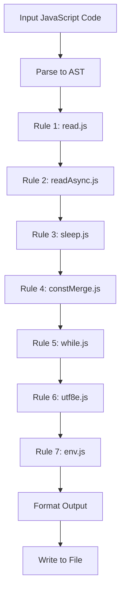
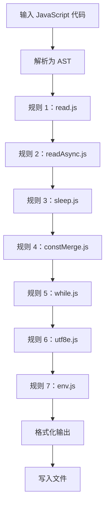

[English](#en) | [中文](#zh)

---

<a id="en"></a>
# fix : JavaScript code transformation tool

- [fix : JavaScript code transformation tool](#fix-javascript-code-transformation-tool)
  - [Functionality](#functionality)
  - [Usage demonstration](#usage-demonstration)
  - [Design approach](#design-approach)
  - [Technology stack](#technology-stack)
  - [Code structure](#code-structure)
  - [Historical context](#historical-context)
  - [About](#about)

## Functionality

Safely and automatically refactors JavaScript source code by converting common legacy patterns into modern equivalents. All transformations operate on the Abstract Syntax Tree (AST) to guarantee semantic preservation, improving code readability and maintainability.

## Usage demonstration

Install as a development dependency:

```bash
npm install --save-dev @1-/fix
```

Run on current directory (Bun or Node.js):

```bash
npx @1-/fix
```

Run on specific files:

```bash
npx @1-/fix src/index.js src/utils.js
```

## Design approach

The tool uses a single-pass, multi-rule AST pipeline architecture. Each rule receives the current code and AST, and returns modified code. If a change occurs, the AST is reparsed and subsequent rules are applied — continuing until no further changes occur or all rules are exhausted.


```mermaid
graph TD
A[Input JavaScript Code] --> B[Parse to AST]
B --> C[Rule 1: read.js]
C --> D[Rule 2: readAsync.js]
D --> E[Rule 3: sleep.js]
E --> F[Rule 4: constMerge.js]
F --> G[Rule 5: while.js]
G --> H[Rule 6: utf8e.js]
H --> I[Rule 7: env.js]
I --> J[Format Output]
J --> K[Write to File]
```

## Technology stack

- Runtime: Bun or Node.js
- AST parser: `yuku-parser`
- Code formatter: `oxfmt`
- Core utilities: `@3-/log`, `@3-/read`, `@3-/write`, `@1-/walk`

## Code structure

```
src/
├── fix.js          # CLI entry point; uses yargs for args and @1-/walk for .js file discovery
├── run.js          # Main loop for batch file processing; uses @3-/read/@3-/write for I/O
├── rule.js         # Rule orchestrator; applies all transforms in sequence and formats output with oxfmt
├── lib/            # Generic AST utility functions
│   ├── TYPE.js     # AST node type constants (ARROW_FUNCTION_EXPRESSION, CALL_EXPRESSION, etc.)
│   ├── walk.js     # Depth-first AST walker supporting nested objects and arrays
│   ├── applyEdits.js # Position-based text replacement with descending sort order
│   ├── importAdd.js # Smart import statement injection detecting missing imports
│   └── createReplace.js # Rule template: AST pattern matching + text replacement + import management
└── replace/        # Concrete transformation implementations
    ├── read.js        # fs.readFileSync → read (with @3-/read import)
    ├── readAsync.js   # fs.readFile → readAsync (with @1-/read import)
    ├── sleep.js       # new Promise((r) => setTimeout(r, ...)) → sleep(...) (complex AST pattern matching)
    ├── constMerge.js  # Merge consecutive const declarations (intelligent whitespace handling)
    ├── while.js       # while(true) → for(;;) (literal value matching)
    ├── utf8e.js       # new TextEncoder().encode(...) → utf8e(...) (member expression matching)
    └── env.js         # process.env → env (member expression matching with import injection)
```

## Historical context

The concept of codemod traces back to Program Transformation Systems of the 1970s (e.g., ELI, DMS). Facebook's jscodeshift, released in 2015, brought AST-driven JavaScript refactoring into mainstream developer workflows. This tool continues that tradition, focusing on lightweight, precise, zero-configuration optimizations for everyday use, employing a functional architecture where each rule is a pure function ensuring predictability and testability.

## About

This library is developed by [WebC.site](https://webc.site).

[WebC.site](https://webc.site): A new paradigm of web development for AI


---

<a id="zh"></a>
# fix : JavaScript 代码转换工具

- [fix : JavaScript 代码转换工具](#fix-javascript-代码转换工具)
  - [功能介绍](#功能介绍)
  - [使用演示](#使用演示)
  - [设计思路](#设计思路)
  - [技术栈](#技术栈)
  - [代码结构](#代码结构)
  - [历史故事](#历史故事)
  - [关于](#关于)

## 功能介绍

安全地自动重构 JavaScript 源码，将常见遗留模式转换为现代等效形式。所有转换均基于抽象语法树（AST）分析，确保语义不变，提升代码可读性与可维护性。

## 使用演示

作为开发依赖安装：

```bash
npm install --save-dev @1-/fix
```

在当前目录运行（Bun 或 Node.js）：

```bash
npx @1-/fix
```

指定文件运行：

```bash
npx @1-/fix src/index.js src/utils.js
```

## 设计思路

工具采用单次遍历、多规则串联的 AST 管道架构。每个规则接收当前代码与 AST，返回修改后代码；若发生变更，则重新解析 AST 并继续后续规则，直至无变化或规则耗尽。


```mermaid
graph TD
A[输入 JavaScript 代码] --> B[解析为 AST]
B --> C[规则 1：read.js]
C --> D[规则 2：readAsync.js]
D --> E[规则 3：sleep.js]
E --> F[规则 4：constMerge.js]
F --> G[规则 5：while.js]
G --> H[规则 6：utf8e.js]
H --> I[规则 7：env.js]
I --> J[格式化输出]
J --> K[写入文件]
```

## 技术栈

- 运行时：Bun 或 Node.js
- AST 解析器：`yuku-parser`
- 代码格式化：`oxfmt`
- 核心工具库：`@3-/log`、`@3-/read`、`@3-/write`、`@1-/walk`

## 代码结构

```
src/
├── fix.js          # CLI 入口，使用 yargs 解析参数，用 @1-/walk 发现 .js 文件
├── run.js          # 批量文件处理主循环，使用 @3-/read/@3-/write 读写文件
├── rule.js         # 规则调度器，按序应用全部转换规则，并用 oxfmt 格式化最终输出
├── lib/            # 通用 AST 工具函数
│   ├── TYPE.js     # AST 节点类型常量（ARROW_FUNCTION_EXPRESSION、CALL_EXPRESSION等）
│   ├── walk.js     # 深度优先 AST 遍历器，支持嵌套对象和数组
│   ├── applyEdits.js # 基于位置的文本替换，按起始位置降序排序
│   ├── importAdd.js # 智能导入语句注入，检测并添加缺失导入
│   └── createReplace.js # 规则模板：AST模式匹配 + 文本替换 + 导入管理
└── replace/        # 具体转换规则实现
    ├── read.js        # fs.readFileSync → read（带 @3-/read 导入）
    ├── readAsync.js   # fs.readFile → readAsync（带 @1-/read 导入）
    ├── sleep.js       # new Promise((r) => setTimeout(r, ...)) → sleep(...)（复杂AST模式匹配）
    ├── constMerge.js  # 合并连续 const 声明（智能空白处理）
    ├── while.js       # while(true) → for(;;)（字面量匹配）
    ├── utf8e.js       # new TextEncoder().encode(...) → utf8e(...)（成员表达式匹配）
    └── env.js         # process.env → env（成员表达式匹配，带导入注入）
```

## 历史故事

现代 codemod 概念可追溯至 1970 年代的 Program Transformation Systems（如 ELI、DMS）。2015 年 Facebook 推出 jscodeshift，首次将 AST 驱动的 JavaScript 重构带入主流开发流程。本工具延续该范式，聚焦轻量、精准、零配置的日常优化场景，采用函数式架构设计，每个规则都是纯函数，确保可预测性和可测试性。

## 关于

本库由 [WebC.site](https://webc.site) 开发。

[WebC.site](https://webc.site) : 面向人工智能的网站开发新范式

