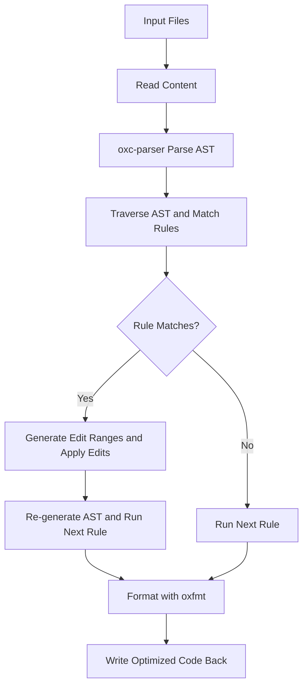

# @1-/fix : Git hook for automatic JavaScript code optimization and formatting

## 1. Features

Optimizes JavaScript code via AST analysis and rewriting, then formats with `oxfmt`.

Optimization rules:

- Replaces `fs.readFileSync(filepath, "utf8")` or `fs.readFileSync(filepath, "utf-8")` with `read(filepath)` and imports `@3-/read`. Clears unused `fs` imports.
- Replaces `fs.promises.readFile(filepath, "utf8")`, `fs.promises.readFile(filepath, "utf-8")`, `readFile(filepath, "utf8")` or `readFile(filepath, "utf-8")` with `read(filepath)` and imports `@1-/read`. Clears unused imports.
- Replaces `new Promise(resolve => setTimeout(resolve, delay))` with `sleep(delay)` and imports `@3-/sleep`.
- Replaces `while (true)` with `for (;;)`.
- Replaces `new TextEncoder().encode(str)` with `utf8e(str)` and imports `@3-/utf8/utf8e.js`.
- Replaces `process.env` with `env` and imports `{ env }` from `node:process`.
- Merges contiguous `const` and `export const` declarations into comma-separated format.

## 2. Demo

Optimize specified JavaScript files via command line:

```bash
bun x @1-/fix src/index.js
```

### Original Code

```javascript
import { readFileSync } from "fs";

const a = 1;
const b = 2;

const run = async () => {
  const data = readFileSync("a.txt", "utf8");
  await new Promise((resolve) => setTimeout(resolve, 100));
  while (true) {
    console.log(new TextEncoder().encode("hello"));
  }
};
```

### Optimized Code

```javascript
import { env } from "node:process";
import utf8e from "@3-/utf8/utf8e.js";
import sleep from "@3-/sleep";
import read from "@3-/read";

const a = 1,
  b = 2;

const run = async () => {
  const data = read("a.txt");
  await sleep(100);
  for (;;) {
    console.log(utf8e("hello"));
  }
};
```

## 3. Design Concept

Processes files in a pipeline. Each rule traverses AST independently and records code transformation ranges. Edits apply atomically after rule traversal.



## 4. Tech Stack

- **Bun**: Runtime environment and testing framework
- **oxc-parser**: High-performance JavaScript AST parser
- **oxfmt**: Rust-based code formatter
- **yargs**: Command-line argument parser

## 5. Code Structure

```
src/
├── fix.js       # CLI entry point
├── run.js       # File batch processing logic
├── rule.js      # Rule pipeline scheduler
├── lib/         # Helper utilities
│   ├── TYPE.js  # AST node type constants
│   ├── walk.js  # AST traversal utility
│   ├── applyEdits.js # Range replacement applicator
│   ├── createReplace.js # Rule creation utility
│   ├── importAdd.js # Import statement addition utility
│   └── readReplace.js # Read operation replacement utility
└── replace/     # Specific replacement rules
    ├── sleep.js # Replaces setTimeout promise with sleep
    ├── read.js  # Replaces readFileSync with read
    ├── readAsync.js # Replaces readFile with read async
    ├── while.js # Replaces while(true) with for(;;)
    ├── utf8e.js # Replaces TextEncoder.encode with utf8e
    ├── constMerge.js # Merges contiguous const declarations
    └── env.js # Replaces process.env with imported env
```

## 6. Historical Story

In early JavaScript engines, compilers could not optimize `while (true)` structures efficiently. Conversely, `for (;;)` directly maps to a jump instruction (JMP) in the generated assembly, avoiding evaluation steps. Consequently, libraries like jQuery and React standardly adopted `for (;;)` instead of `while (true)` for performance and compression. With modern AST compilers and minifiers, this micro-optimization became standard practice. This project adopts this philosophy, utilizing Oxc to deliver millisecond-level code transformation.
