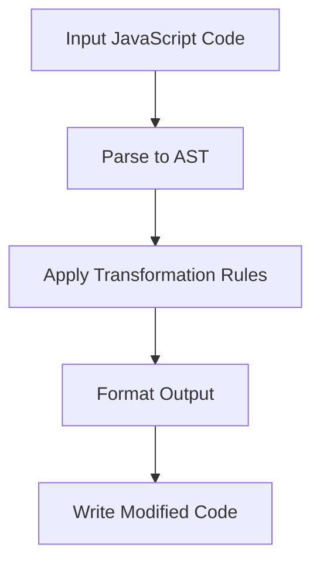

# fix : JavaScript code transformation tool

## Functionality

Transforms JavaScript code by applying automated refactorings to modernize syntax and improve readability. Converts legacy patterns to cleaner, more maintainable equivalents without changing program behavior.

## Usage demonstration

Install as a development dependency:

```bash
npm install --save-dev @3-/fix
```

Run on current directory:

```bash
npx @3-/fix
```

Run on specific files:

```bash
npx @3-/fix src/index.js src/utils.js
```

## Design approach

The tool follows a pipeline architecture where each transformation rule operates on the AST representation of the code. Rules are applied sequentially until no further changes occur.



## Technology stack

- JavaScript runtime (Bun or Node.js)
- yuku-parser for AST parsing
- oxfmt for code formatting
- Custom transformation rules implemented in JavaScript

## Code structure

```
src/
├── fix.js          # Command-line entry point
├── run.js          # Core processing logic
├── rule.js         # Rule orchestration
├── lib/            # Utility functions
│   ├── TYPE.js     # AST node type constants
│   ├── applyEdits.js # Apply text replacements
│   └── ...         # Other utilities
└── replace/        # Individual transformation rules
    ├── sleep.js    # setTimeout → sleep conversion
    ├── read.js     # fs.readFileSync → read conversion
    ├── readAsync.js # fs.readFile → readAsync conversion
    ├── constMerge.js # Merge consecutive const declarations
    └── ...         # Other transformation rules
```

## Historical context

Code transformation tools trace their origins to early compiler optimizations in the 1960s. Modern JavaScript codemods evolved from Facebook's jscodeshift in 2015, enabling large-scale refactoring across codebases. This tool continues that tradition by providing focused, safe transformations for common JavaScript patterns.
