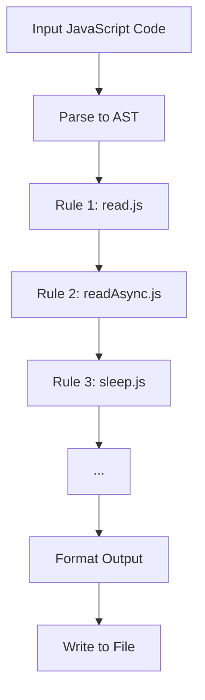

# fix : JavaScript code transformation tool

## Functionality

Automatically refactors JavaScript source code by safely converting common legacy patterns into modern equivalents. All transformations operate on the AST to guarantee semantic preservation, improving readability and maintainability.

## Usage demonstration

Install as a development dependency:

```bash
npm install --save-dev @1-/fix
```

Run on current directory:

```bash
npx @1-/fix
```

Run on specific files:

```bash
npx @1-/fix src/index.js src/utils.js
```

## Design approach

The tool uses a single-pass, multi-rule AST pipeline architecture. Each rule receives the current code and AST, and returns modified code. If a change occurs, the AST is reparsed and subsequent rules are applied — continuing until no further changes occur or all rules are exhausted.



## Technology stack

- Runtime: Node.js or Bun
- AST parser: `yuku-parser`
- Code formatter: `oxfmt`
- Core utilities: `@3-/log`, `@3-/read`, `@3-/write`, `@1-/walk`

## Code structure

```
src/
├── fix.js          # CLI entry point; handles args and file discovery
├── run.js          # Main loop for batch file processing
├── rule.js         # Rule orchestrator; applies all transforms in sequence
├── lib/            # Generic AST utility functions
│   ├── TYPE.js     # AST node type constants
│   ├── walk.js     # Depth-first AST walker
│   ├── applyEdits.js # Position-based text replacement
│   ├── importAdd.js # Smart import statement injection
│   └── createReplace.js # Rule template: detect + replace + import management
└── replace/        # Concrete transformation implementations
    ├── read.js        # fs.readFileSync → read
    ├── readAsync.js   # fs.readFile → readAsync
    ├── sleep.js       # Promise + setTimeout → sleep
    ├── constMerge.js  # Merge consecutive const declarations
    ├── env.js         # process.env → env
    ├── utf8e.js       # new TextEncoder().encode() → utf8e()
    └── while.js       # while(true) → for(;;)
```

## Historical context

The concept of codemod traces back to Program Transformation Systems of the 1970s (e.g., ELI, DMS). Facebook’s jscodeshift, released in 2015, brought AST-driven JavaScript refactoring into mainstream developer workflows. This tool continues that tradition, focusing on lightweight, precise, zero-configuration optimizations for everyday use.