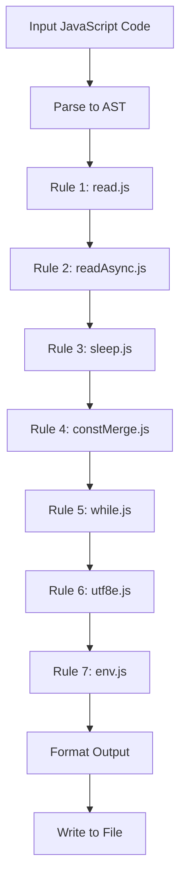

# fix : JavaScript code transformation tool

## Functionality

Safely and automatically refactors JavaScript source code by converting common legacy patterns into modern equivalents. All transformations operate on the Abstract Syntax Tree (AST) to guarantee semantic preservation, improving code readability and maintainability.

## Usage demonstration

Install as a development dependency:

```bash
npm install --save-dev @1-/fix
```

Run on current directory (Bun or Node.js):

```bash
npx @1-/fix
```

Run on specific files:

```bash
npx @1-/fix src/index.js src/utils.js
```

## Design approach

The tool uses a single-pass, multi-rule AST pipeline architecture. Each rule receives the current code and AST, and returns modified code. If a change occurs, the AST is reparsed and subsequent rules are applied — continuing until no further changes occur or all rules are exhausted.


```mermaid
graph TD
A[Input JavaScript Code] --> B[Parse to AST]
B --> C[Rule 1: read.js]
C --> D[Rule 2: readAsync.js]
D --> E[Rule 3: sleep.js]
E --> F[Rule 4: constMerge.js]
F --> G[Rule 5: while.js]
G --> H[Rule 6: utf8e.js]
H --> I[Rule 7: env.js]
I --> J[Format Output]
J --> K[Write to File]
```

## Technology stack

- Runtime: Bun or Node.js
- AST parser: `yuku-parser`
- Code formatter: `oxfmt`
- Core utilities: `@3-/log`, `@3-/read`, `@3-/write`, `@1-/walk`

## Code structure

```
src/
├── fix.js          # CLI entry point; uses yargs for args and @1-/walk for .js file discovery
├── run.js          # Main loop for batch file processing; uses @3-/read/@3-/write for I/O
├── rule.js         # Rule orchestrator; applies all transforms in sequence and formats output with oxfmt
├── lib/            # Generic AST utility functions
│   ├── TYPE.js     # AST node type constants (ARROW_FUNCTION_EXPRESSION, CALL_EXPRESSION, etc.)
│   ├── walk.js     # Depth-first AST walker supporting nested objects and arrays
│   ├── applyEdits.js # Position-based text replacement with descending sort order
│   ├── importAdd.js # Smart import statement injection detecting missing imports
│   └── createReplace.js # Rule template: AST pattern matching + text replacement + import management
└── replace/        # Concrete transformation implementations
    ├── read.js        # fs.readFileSync → read (with @3-/read import)
    ├── readAsync.js   # fs.readFile → readAsync (with @1-/read import)
    ├── sleep.js       # new Promise((r) => setTimeout(r, ...)) → sleep(...) (complex AST pattern matching)
    ├── constMerge.js  # Merge consecutive const declarations (intelligent whitespace handling)
    ├── while.js       # while(true) → for(;;) (literal value matching)
    ├── utf8e.js       # new TextEncoder().encode(...) → utf8e(...) (member expression matching)
    └── env.js         # process.env → env (member expression matching with import injection)
```

## Historical context

The concept of codemod traces back to Program Transformation Systems of the 1970s (e.g., ELI, DMS). Facebook's jscodeshift, released in 2015, brought AST-driven JavaScript refactoring into mainstream developer workflows. This tool continues that tradition, focusing on lightweight, precise, zero-configuration optimizations for everyday use, employing a functional architecture where each rule is a pure function ensuring predictability and testability.