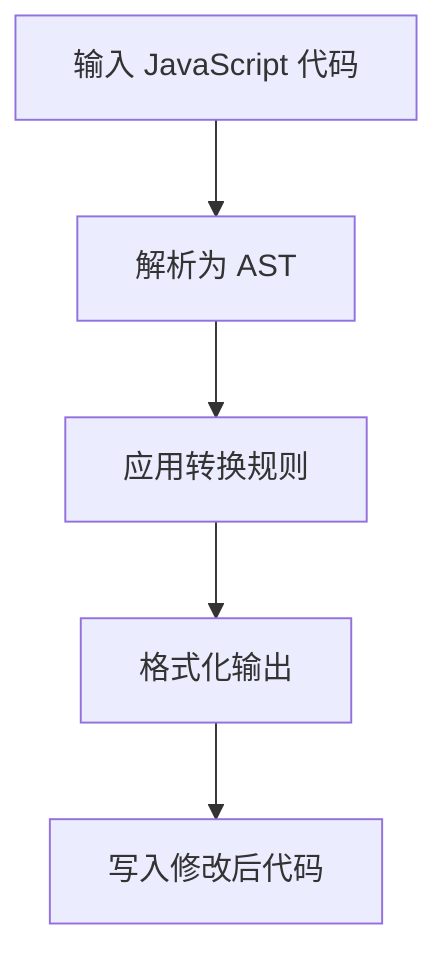

# fix : JavaScript 代码转换工具

## 功能介绍

自动重构 JavaScript 代码，将传统语法模式转换为更简洁、可维护的现代等效形式。在不改变程序行为的前提下提升代码可读性与可维护性。

## 使用演示

作为开发依赖安装：

```bash
npm install --save-dev @3-/fix
```

在当前目录运行：

```bash
npx @3-/fix
```

指定文件运行：

```bash
npx @3-/fix src/index.js src/utils.js
```

## 设计思路

工具采用管道式架构，每个转换规则基于代码抽象语法树（AST）进行操作。规则按顺序应用，直至代码不再发生变化。



## 技术栈

- JavaScript 运行时（Bun 或 Node.js）
- yuku-parser 进行 AST 解析
- oxfmt 进行代码格式化
- 使用 JavaScript 实现的自定义转换规则

## 代码结构

```
src/
├── fix.js          # 命令行入口文件
├── run.js          # 核心处理逻辑
├── rule.js         # 规则协调器
├── lib/            # 工具函数
│   ├── TYPE.js     # AST 节点类型常量
│   ├── applyEdits.js # 应用文本替换
│   └── ...         # 其他工具函数
└── replace/        # 独立转换规则
    ├── sleep.js    # setTimeout → sleep 转换
    ├── read.js     # fs.readFileSync → read 转换
    ├── readAsync.js # fs.readFile → readAsync 转换
    ├── constMerge.js # 合并连续 const 声明
    └── ...         # 其他转换规则
```

## 历史故事

代码转换工具起源于 20 世纪 60 年代早期编译器优化技术。现代 JavaScript codemod 工具始于 Facebook 2015 年推出的 jscodeshift，支持大规模代码库重构。本工具延续这一传统，专注于常见 JavaScript 模式的精准、安全转换。
