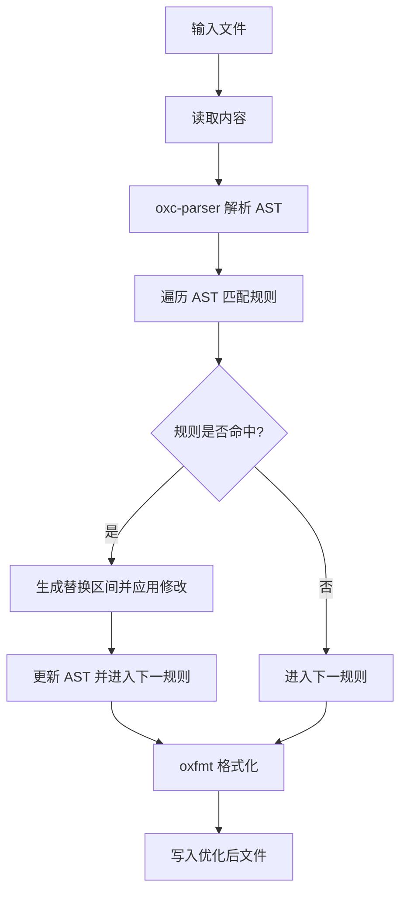

# @1-/fix : 自动优化与格式化 JavaScript 代码的工具

## 1. 功能介绍

基于 AST（抽象语法树）分析与重写，自动优化并格式化 JavaScript 代码。

优化规则：

- 替换 `fs.readFileSync(filepath, "utf8")` 或 `fs.readFileSync(filepath, "utf-8")` 为 `read(filepath)`，自动导入 `@3-/read`，并清理无用 `fs` 导入
- 替换 `fs.promises.readFile(filepath, "utf8")`、`fs.promises.readFile(filepath, "utf-8")`、`readFile(filepath, "utf8")` 或 `readFile(filepath, "utf-8")` 为 `read(filepath)`，自动导入 `@1-/read`，并清理无用导入
- 替换 `new Promise(resolve => setTimeout(resolve, delay))` 为 `sleep(delay)`，自动导入 `@3-/sleep`
- 替换 `while (true)` 为 `for (;;)`
- 替换 `new TextEncoder().encode(str)` 为 `utf8e(str)`，自动导入 `@3-/utf8/utf8e.js`
- 替换 `process.env` 为导入的 `env`，自动导入 `node:process`
- 合并相邻 `const` 与 `export const` 声明为逗号分隔格式

## 2. 使用演示

通过命令行对指定 JavaScript 文件进行优化：

```bash
bun x @1-/fix src/index.js
```

### 优化前代码

```javascript
import { readFileSync } from "fs";

const a = 1;
const b = 2;

const run = async () => {
  const data = readFileSync("a.txt", "utf8");
  await new Promise((resolve) => setTimeout(resolve, 100));
  while (true) {
    console.log(new TextEncoder().encode("hello"));
  }
};
```

### 优化后代码

```javascript
import utf8e from "@3-/utf8/utf8e.js";
import sleep from "@3-/sleep";
import read from "@3-/read";

const a = 1,
  b = 2;

const run = async () => {
  const data = read("a.txt");
  await sleep(100);
  for (;;) {
    console.log(utf8e("hello"));
  }
};
```

## 3. 设计思路

系统采用流水线处理模式，每个规则独立遍历 AST 并记录修改区间。修改在单次规则遍历完成后统一应用，避免干扰后续遍历。



## 4. 技术栈

- **Bun**: 运行环境与测试框架
- **oxc-parser**: 高性能 JavaScript AST 解析器
- **oxfmt**: 基于 Rust 的代码格式化工具
- **yargs**: 命令行参数解析库

## 5. 代码结构

```
src/
├── fix.js       # 命令行入口
├── run.js       # 批量处理逻辑
├── rule.js      # 规则流水线调度
├── lib/         # 辅助库
│   ├── TYPE.js  # AST 节点类型常量
│   ├── walk.js  # AST 深度遍历工具
│   ├── applyEdits.js # 替换区间修改应用工具
│   ├── createReplace.js # 创建替换规则的工具
│   ├── importAdd.js # 导入语句添加工具
│   └── readReplace.js # 读取操作替换工具
└── replace/     # 具体重写规则
    ├── sleep.js # 替换 setTimeout Promise 为 sleep
    ├── read.js  # 替换 readFileSync 为 read 同步读取
    ├── readAsync.js # 替换 readFile 为 read 异步读取
    ├── while.js # 替换 while(true) 为 for(;;)
    ├── utf8e.js # 替换 TextEncoder 为 utf8e
    ├── constMerge.js # 合并相邻 const 声明
    └── env.js # 替换 process.env 为导入的 env
```

## 6. 历史故事

在早期 JavaScript 引擎中，编译器对 `while (true)` 结构优化并不彻底。而 `for (;;)` 在底层汇编生成时直接对应为跳转指令（JMP），省去了条件表达式求值步骤。因此，jQuery、React 等主流类库为追求极限性能与压缩率，普遍使用 `for (;;)` 替代 `while (true)`。随着现代 AST 编译器与压缩工具的发展，此类微优化已成为标准重写规则。本项目继承极简主义优化理念，借助 Oxc 编译器的高性能，实现毫秒级代码转换。