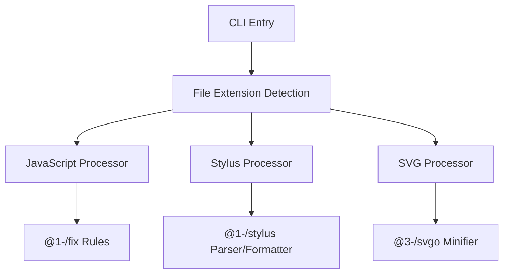

# @1-/format : Lightweight modular code formatter for JavaScript, Stylus, and SVG

## Functionality
Format code consistently across multiple languages using language-specific processors. Supports:
- JavaScript: AST-based formatting with custom rules (read, readAsync, sleep, constMerge, while, utf8e, env)
- Stylus: Parser-driven formatting using @1-/stylus
- SVG: SVGO-based minification with custom plugin configuration

## Usage demonstration
Install globally:
```bash
npm install -g @1-/format
```

Format files:
```bash
format file.js file.styl image.svg
```

Or use as a module:
```javascript
import format from '@1-/format';

const formatted = await format('path/to/file.js');
```

## Design philosophy
The formatter follows a strict dispatcher architecture where file extension determines processor selection. Each processor operates independently with language-specific tooling, enabling precise control without cross-language interference.



## Technology stack
- Runtime: Node.js with ES modules
- JavaScript: yuku-parser + oxfmt + custom rules
- Stylus: @1-/stylus parser and formatter
- SVG: SVGO with custom preset configuration
- CLI: yargs
- Utilities: @3-/read, @3-/write, @3-/log

## Code structure
```
src/
├── _.js          # Main dispatcher routing by file extension
├── bin.js        # CLI executable with yargs integration
├── js.js         # JavaScript formatter delegating to @1-/fix
├── styl.js       # Stylus formatter using @1-/stylus
└── svg.js        # SVG formatter using @3-/svgo
```

## Historical context
Code formatting evolved from simple text transformations to AST-based tools. @1-/format represents the modern micro-architecture approach: small, focused libraries composed together rather than monolithic solutions. This enables targeted improvements and avoids the complexity bloat of universal formatters.