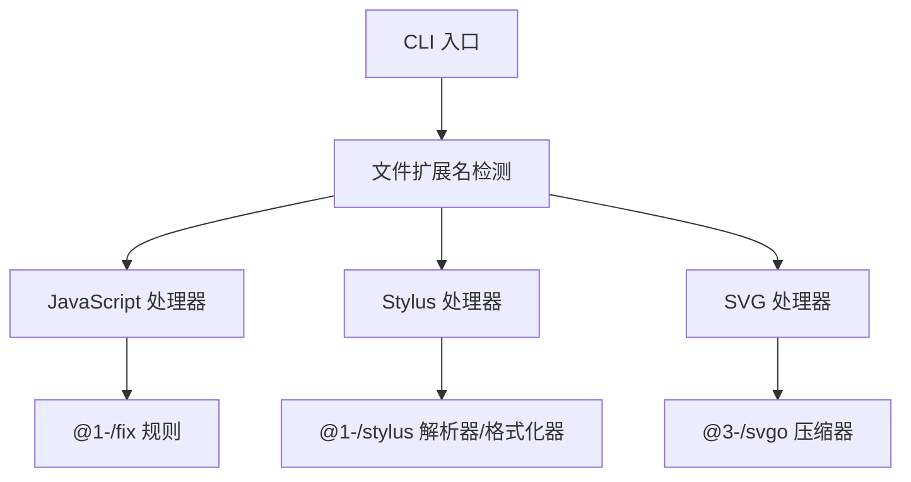

# @1-/format : 轻量级模块化代码格式化工具，支持 JavaScript、Stylus 和 SVG

## 功能介绍
使用语言特定处理器一致地格式化多种语言代码。支持：
- JavaScript：基于 AST 的格式化，包含自定义规则（read、readAsync、sleep、constMerge、while、utf8e、env）
- Stylus：解析器驱动的格式化，使用 @1-/stylus
- SVG：基于 SVGO 的压缩，采用自定义插件配置

## 使用演示
全局安装：
```bash
npm install -g @1-/format
```

格式化文件：
```bash
format file.js file.styl image.svg
```

或作为模块使用：
```javascript
import format from '@1-/format';

const formatted = await format('path/to/file.js');
```

## 设计思路
格式化器采用严格的分发器架构，文件扩展名决定处理器选择。每个处理器独立运行，使用语言特定工具，实现精确控制且避免跨语言干扰。



## 技术栈
- 运行时：Node.js ES 模块
- JavaScript：yuku-parser + oxfmt + 自定义规则
- Stylus：@1-/stylus 解析器和格式化器
- SVG：SVGO 与自定义预设配置
- CLI：yargs
- 工具库：@3-/read、@3-/write、@3-/log

## 代码结构
```
src/
├── _.js          # 主分发器，按文件扩展名路由
├── bin.js        # CLI 可执行文件，集成 yargs
├── js.js         # JavaScript 格式化器，委托给 @1-/fix
├── styl.js       # Stylus 格式化器，使用 @1-/stylus
└── svg.js        # SVG 格式化器，使用 @3-/svgo
```

## 历史故事
代码格式化从简单的文本转换发展为基于 AST 的工具。@1-/format 代表现代微架构方法：小型、专注的库组合使用，而非单体解决方案。这种方法支持针对性改进，避免通用格式化器的复杂性膨胀。