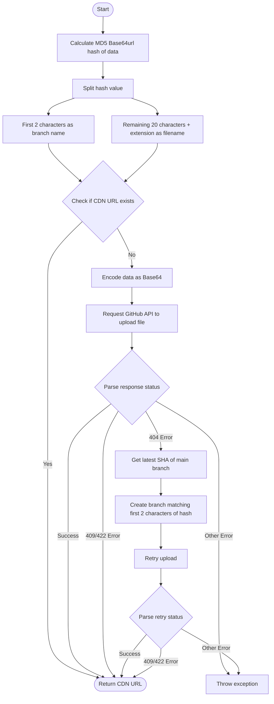

[English](#en) | [中文](#zh)

---

<a id="en"></a>
# @1-/github_cdn : Branch-sharded file CDN storage based on GitHub and jsDelivr

- [@1-/github_cdn : Branch-sharded file CDN storage based on GitHub and jsDelivr](#1-github_cdn-branch-sharded-file-cdn-storage-based-on-github-and-jsdelivr)
  - [Features](#features)
  - [Usage](#usage)
  - [Design Concept](#design-concept)
  - [Tech Stack](#tech-stack)
  - [Code Structure](#code-structure)
  - [History Story](#history-story)
  - [About](#about)

## Features

This module provides file storage and distribution capabilities based on GitHub repositories and jsDelivr CDN.

- **De-duplication**: Uses MD5 Base64url encoding as the hash, preventing duplicate uploads.
- **Branch Sharding**: Uses the first two characters of the hash as the GitHub branch name and the rest as the filename. This reduces the number of files per branch, bypassing single-directory and single-branch storage limits of GitHub.
- **On-demand Branching**: Automatically creates the corresponding branch based on the main branch if it does not exist during upload.
- **Fast Response**: Checks if the CDN link exists before uploading; if it does, returns the link directly to save network requests.

## Usage

```javascript
import cdnUpload from "@1-/github_cdn";

// Initialize the upload function
const upload = cdnUpload(process.env.GITHUB_TOKEN, "owner/repo");

// Upload data
const buf = Buffer.from("hello world");
const url = await upload(buf, "txt");

console.log(url);
// Output: //fastly.jsdelivr.net/gh/owner/repo@39/bW84b3JpZ2luYWw.txt
```

## Design Concept

Uses Git branch isolation and file hashing to achieve high-availability, unlimited-capacity static resource distribution.



## Tech Stack

- **Runtime**: Bun
- **CDN**: jsDelivr (Fastly node)
- **API**: GitHub REST API
- **Dependencies**:
  - `@3-/base64url`: Safe encoding of hash values
  - `@1-/url_exist`: Online status check for CDN resources
  - `@3-/req`: Lightweight request library

## Code Structure

```
src/
├── _.js           # Core upload control flow
├── cdn.js         # jsDelivr URL generator
├── createBranch.js# GitHub branch creation
├── ensureMain.js  # Ensures the main branch exists and gets its SHA
├── ifElse.js      # Try-catch and control flow wrapper
├── putContent.js  # Writes file content to the repository
└── req.js         # Encapsulates GitHub API request context
```

## History Story

GitHub limits repository sizes to 1GB - 5GB, and storing too many files in a single directory degrades Git retrieval performance significantly.

In the early days, developers hosting assets or images on GitHub often received warnings from GitHub due to excessive repository size.

This solution implements a branch-sharding mechanism, distributing files across 256 different branches.
Because Git branch pointers are extremely lightweight and each branch maintains an independent history, this design avoids performance bottlenecks and capacity constraints caused by file accumulation in a single branch, offering a reliable, decentralized approach to static resource hosting.


## About

This library is developed by [WebC.site](https://webc.site).

[WebC.site](https://webc.site): A new paradigm of web development for AI


---

<a id="zh"></a>
# @1-/github_cdn : 基于 GitHub 与 jsDelivr 分支分片的文件 CDN 存储方案

- [@1-/github_cdn : 基于 GitHub 与 jsDelivr 分支分片的文件 CDN 存储方案](#1-github_cdn-基于-github-与-jsdelivr-分支分片的文件-cdn-存储方案)
  - [功能介绍](#功能介绍)
  - [使用演示](#使用演示)
  - [设计思路](#设计思路)
  - [技术栈](#技术栈)
  - [代码结构](#代码结构)
  - [历史故事](#历史故事)
  - [关于](#关于)

## 功能介绍

本模块提供基于 GitHub 仓库和 jsDelivr CDN 的文件存储与分发功能。

- **去重机制**：使用 MD5 Base64url 编码作为散列值，自动避免重复上传。
- **分支分片**：将散列值前两位作为 GitHub 分支名，其余部分作为文件名。通过分支分片减少单分支文件数量，避免 GitHub 单目录及单分支存储限制。
- **按需建支**：上传时如分支不存在，自动基于主分支创建对应分支。
- **极速响应**：上传前检测 CDN 链接是否存在，若已存在则直接返回，避免重复网络请求。

## 使用演示

```javascript
import cdnUpload from "@1-/github_cdn";

// 初始化上传函数
const upload = cdnUpload(process.env.GITHUB_TOKEN, "owner/repo");

// 上传数据
const buf = Buffer.from("hello world");
const url = await upload(buf, "txt");

console.log(url);
// 输出: //fastly.jsdelivr.net/gh/owner/repo@39/bW84b3JpZ2luYWw.txt
```

## 设计思路

使用 Git 分支隔离和文件散列，实现高可用、无容量上限的静态资源分发。


## 技术栈

- **Runtime**: Bun
- **CDN**: jsDelivr (Fastly 节点)
- **API**: GitHub REST API
- **依赖库**:
  - `@3-/base64url`: 散列值安全编码
  - `@1-/url_exist`: 检测 CDN 资源在线状态
  - `@3-/req`: 轻量级请求库

## 代码结构

```
src/
├── _.js           # 上传核心流程控制
├── cdn.js         # jsDelivr 链接生成器
├── createBranch.js# GitHub 分支创建
├── ensureMain.js  # 确保主分支存在并获取其 SHA
├── ifElse.js      # 异常分支与流程控制包装器
├── putContent.js  # 写入文件内容至仓库
└── req.js         # 封装 GitHub API 请求上下文
```

## 历史故事

GitHub 限制单仓库大小通常为 1GB 至 5GB，且单目录文件过多会导致 Git 检索性能严重下降。

早期开发者尝试使用 GitHub 存储图片或资源时，常因仓库过大收到 GitHub 官方警告。

本方案采用分支分片机制，将文件打散存入 256 个不同的分支中。
由于 Git 的分支指针极其轻量，且各分支历史记录相互独立，此设计彻底规避了单分支文件堆积导致的性能瓶颈与容量限制，为静态资源托管提供了稳定可靠的去中心化思路。


## 关于

本库由 [WebC.site](https://webc.site) 开发。

[WebC.site](https://webc.site) : 面向人工智能的网站开发新范式

