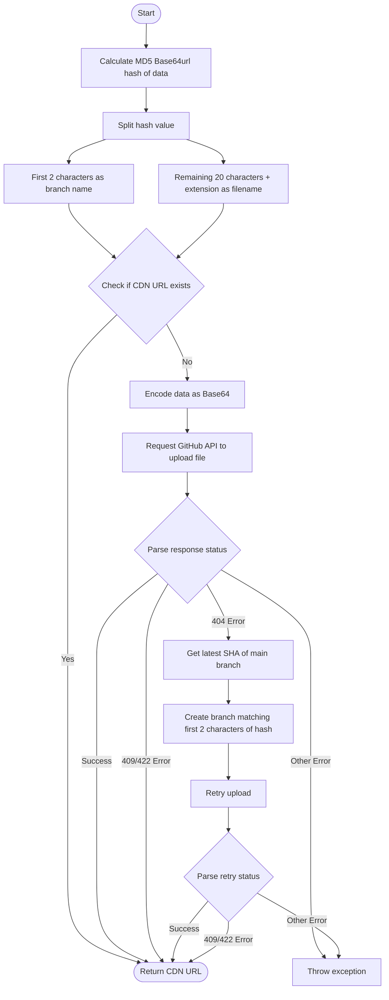

# @1-/github_cdn : Branch-sharded file CDN storage based on GitHub and jsDelivr

## Features

This module provides file storage and distribution capabilities based on GitHub repositories and jsDelivr CDN.

- **De-duplication**: Uses MD5 Base64url encoding as the hash, preventing duplicate uploads.
- **Branch Sharding**: Uses the first two characters of the hash as the GitHub branch name and the rest as the filename. This reduces the number of files per branch, bypassing single-directory and single-branch storage limits of GitHub.
- **On-demand Branching**: Automatically creates the corresponding branch based on the main branch if it does not exist during upload.
- **Fast Response**: Checks if the CDN link exists before uploading; if it does, returns the link directly to save network requests.

## Usage

```javascript
import cdnUpload from "@1-/github_cdn";

// Initialize the upload function
const upload = cdnUpload(process.env.GITHUB_TOKEN, "owner/repo");

// Upload data
const buf = Buffer.from("hello world");
const url = await upload(buf, "txt");

console.log(url);
// Output: //fastly.jsdelivr.net/gh/owner/repo@39/bW84b3JpZ2luYWw.txt
```

## Design Concept

Uses Git branch isolation and file hashing to achieve high-availability, unlimited-capacity static resource distribution.



## Tech Stack

- **Runtime**: Bun
- **CDN**: jsDelivr (Fastly node)
- **API**: GitHub REST API
- **Dependencies**:
  - `@3-/base64url`: Safe encoding of hash values
  - `@1-/url_exist`: Online status check for CDN resources
  - `@3-/req`: Lightweight request library

## Code Structure

```
src/
├── _.js           # Core upload control flow
├── cdn.js         # jsDelivr URL generator
├── createBranch.js# GitHub branch creation
├── ensureMain.js  # Ensures the main branch exists and gets its SHA
├── ifElse.js      # Try-catch and control flow wrapper
├── putContent.js  # Writes file content to the repository
└── req.js         # Encapsulates GitHub API request context
```

## History Story

GitHub limits repository sizes to 1GB - 5GB, and storing too many files in a single directory degrades Git retrieval performance significantly.

In the early days, developers hosting assets or images on GitHub often received warnings from GitHub due to excessive repository size.

This solution implements a branch-sharding mechanism, distributing files across 256 different branches.
Because Git branch pointers are extremely lightweight and each branch maintains an independent history, this design avoids performance bottlenecks and capacity constraints caused by file accumulation in a single branch, offering a reliable, decentralized approach to static resource hosting.
