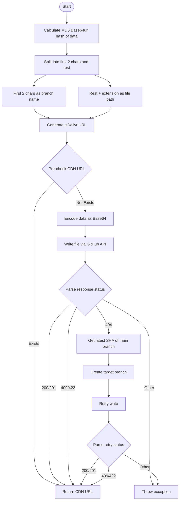

# @1-/github_cdn : Branch-sharded file CDN storage based on GitHub and jsDelivr

## Features

This module provides deduplicated, highly available static resource distribution using GitHub repositories and jsDelivr CDN.

- **Content-Addressed Deduplication**: Uses MD5 Base64url hash as a unique identifier; skips upload if the resource already exists.
- **Branch-Sharded Storage**: First two characters of the hash form the GitHub branch name; the remainder plus extension forms the file path. Distributes files across 256 lightweight branches to bypass single-branch performance and capacity limits.
- **Intelligent Branch Management**: Automatically creates the target branch from the main branch’s latest commit if missing. Falls back to detecting and setting the repository’s default branch if `main` is absent.
- **Fast Response**: Pre-checks CDN URL existence via HTTP HEAD request before upload; returns immediately if present, avoiding redundant network traffic and writes.

## Usage

```bash
npm install @1-/github_cdn
```

```javascript
import cdnUpload from "@1-/github_cdn";

// Initialize the upload function
const upload = cdnUpload(process.env.GITHUB_TOKEN, "owner/repo");

// Upload data
const buf = Buffer.from("hello world");
const url = await upload(buf, "txt");

console.log(url);
// Output: //cdn.jsdmirror.com/gh/owner/repo@39/bW84b3JpZ2luYWw.txt
```

## Design Concept

The system uses Git branches as isolation units and file content hashes as routing keys, enabling stateless, horizontally scalable static asset hosting.



## Tech Stack

- **Runtime**: Bun
- **CDN**: jsDelivr
- **API**: GitHub REST API (`/repos/{owner}/{repo}/contents/{path}`, `/repos/{owner}/{repo}/git/refs`)
- **Core Dependencies**:
  - `@3-/base64url`: Secure hashing and encoding
  - `@1-/url_exist`: CDN resource liveness detection
  - `@3-/req`: Lightweight HTTP request wrapper

## Code Structure

```
src/
├── _.js           # Main upload flow: hashing, pre-check, writing, branch fallback
├── cdn.js         # jsDelivr URL generator
├── createBranch.js# GitHub branch creation logic
├── ensureMain.js  # Main branch detection and fallback creation
├── ifElse.js      # Unified error handling and control flow wrapper
├── putContent.js  # GitHub file content write encapsulation
└── req.js         # GitHub API request context initialization
```

## History Story

GitHub enforces strict limits on repository size (typically 1–5 GB) and file count per directory. Early developers committing large numbers of images or build artifacts directly to the `main` branch experienced severe Git performance degradation, failed clones, and official GitHub warnings.

This solution employs branch sharding: each file’s hash deterministically maps to a dedicated branch. Because Git branches are lightweight pointers and histories are fully decoupled, this design eliminates single-point bottlenecks without increasing storage overhead—providing open-source projects with a stable, infinite-capacity static asset hosting infrastructure.
