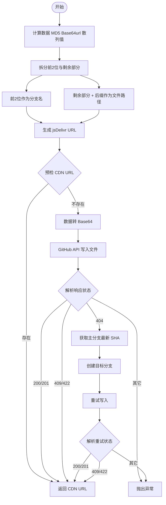

# @1-/github_cdn : 基于 GitHub 与 jsDelivr 分支分片的文件 CDN 存储方案

## 功能介绍

本模块提供基于 GitHub 仓库和 jsDelivr CDN 的去重、高可用静态资源分发服务。

- **内容寻址去重**：使用 MD5 Base64url 散列值作为唯一标识，自动跳过已存在的资源。
- **分支分片存储**：散列值前两位作为 GitHub 分支名，剩余部分与后缀组成文件路径，将文件均匀分布至 256 个轻量分支，规避单分支性能瓶颈与容量限制。
- **智能分支管理**：上传时若目标分支不存在，自动基于主分支最新提交创建；主分支缺失时，自动探测并设置默认分支。
- **极速响应**：上传前通过 HTTP HEAD 请求预检 CDN 链接，存在则直接返回，避免冗余网络请求与写入操作。

## 使用演示

```bash
npm install @1-/github_cdn
```

```javascript
import cdnUpload from "@1-/github_cdn";

// 初始化上传函数
const upload = cdnUpload(process.env.GITHUB_TOKEN, "owner/repo");

// 上传数据
const buf = Buffer.from("hello world");
const url = await upload(buf, "txt");

console.log(url);
// 输出: //cdn.jsdmirror.com/gh/owner/repo@39/bW84b3JpZ2luYWw.txt
```

## 设计思路

系统以 Git 分支为隔离单元，以文件内容散列为路由键，实现无状态、可水平扩展的静态资源托管。



## 技术栈

- **Runtime**: Bun
- **CDN**: jsDelivr
- **API**: GitHub REST API (`/repos/{owner}/{repo}/contents/{path}`, `/repos/{owner}/{repo}/git/refs`)
- **核心依赖**:
  - `@3-/base64url`: 安全散列与编码
  - `@1-/url_exist`: CDN 资源在线性检测
  - `@3-/req`: 轻量级 HTTP 请求封装

## 代码结构

```
src/
├── _.js           # 上传主流程：散列、预检、写入、分支容错
├── cdn.js         # jsDelivr URL 生成器
├── createBranch.js# GitHub 分支创建逻辑
├── ensureMain.js  # 主分支探测与兜底创建
├── ifElse.js      # 统一错误处理与流程分支包装
├── putContent.js  # GitHub 文件内容写入封装
└── req.js         # GitHub API 请求上下文初始化
```

## 历史故事

GitHub 对单仓库大小（通常 1–5 GB）和单目录文件数量有严格限制。早期开发者直接将大量图片或构建产物提交至 `main` 分支，导致 Git 操作缓慢、克隆失败，甚至收到 GitHub 官方警告。

本方案采用分支分片（branch sharding）策略，将每个文件散列映射至独立分支。由于 Git 分支仅为轻量指针，且各分支历史完全解耦，此设计在不增加存储开销的前提下，彻底消除了单点性能瓶颈，为开源项目提供了稳定、无限容量的静态资源托管基础设施。
