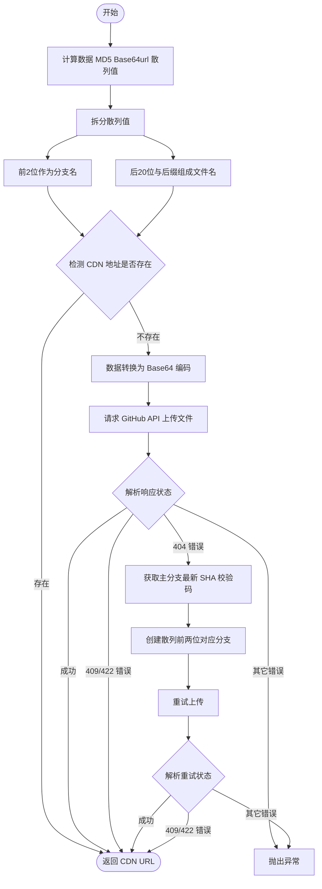

# @1-/github_cdn : 基于 GitHub 与 jsDelivr 分支分片的文件 CDN 存储方案

## 功能介绍

本模块提供基于 GitHub 仓库和 jsDelivr CDN 的文件存储与分发功能。

- **去重机制**：使用 MD5 Base64url 编码作为散列值，自动避免重复上传。
- **分支分片**：将散列值前两位作为 GitHub 分支名，其余部分作为文件名。通过分支分片减少单分支文件数量，避免 GitHub 单目录及单分支存储限制。
- **按需建支**：上传时如分支不存在，自动基于主分支创建对应分支。
- **极速响应**：上传前检测 CDN 链接是否存在，若已存在则直接返回，避免重复网络请求。

## 使用演示

```javascript
import cdnUpload from "@1-/github_cdn";

// 初始化上传函数
const upload = cdnUpload(process.env.GITHUB_TOKEN, "owner/repo");

// 上传数据
const buf = Buffer.from("hello world");
const url = await upload(buf, "txt");

console.log(url);
// 输出: //fastly.jsdelivr.net/gh/owner/repo@39/bW84b3JpZ2luYWw.txt
```

## 设计思路

使用 Git 分支隔离和文件散列，实现高可用、无容量上限的静态资源分发。



## 技术栈

- **Runtime**: Bun
- **CDN**: jsDelivr (Fastly 节点)
- **API**: GitHub REST API
- **依赖库**:
  - `@3-/base64url`: 散列值安全编码
  - `@1-/url_exist`: 检测 CDN 资源在线状态
  - `@3-/req`: 轻量级请求库

## 代码结构

```
src/
├── _.js           # 上传核心流程控制
├── cdn.js         # jsDelivr 链接生成器
├── createBranch.js# GitHub 分支创建
├── ensureMain.js  # 确保主分支存在并获取其 SHA
├── ifElse.js      # 异常分支与流程控制包装器
├── putContent.js  # 写入文件内容至仓库
└── req.js         # 封装 GitHub API 请求上下文
```

## 历史故事

GitHub 限制单仓库大小通常为 1GB 至 5GB，且单目录文件过多会导致 Git 检索性能严重下降。

早期开发者尝试使用 GitHub 存储图片或资源时，常因仓库过大收到 GitHub 官方警告。

本方案采用分支分片机制，将文件打散存入 256 个不同的分支中。
由于 Git 的分支指针极其轻量，且各分支历史记录相互独立，此设计彻底规避了单分支文件堆积导致的性能瓶颈与容量限制，为静态资源托管提供了稳定可靠的去中心化思路。
